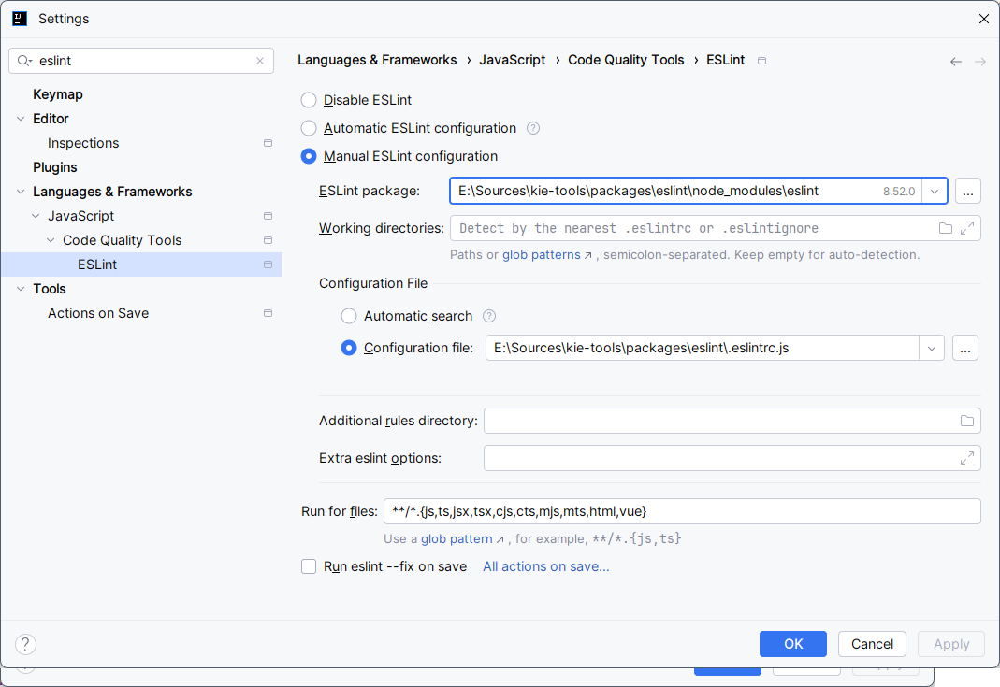
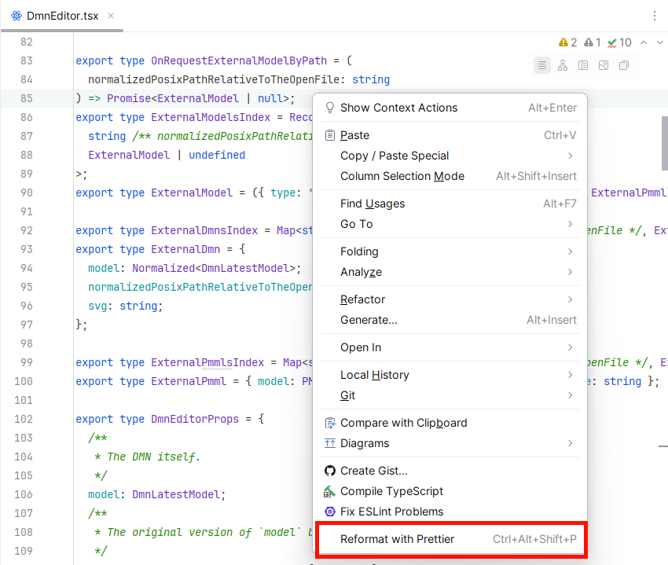
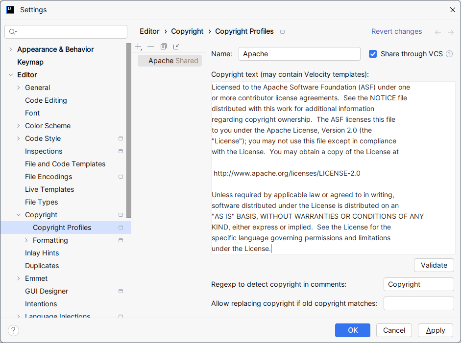
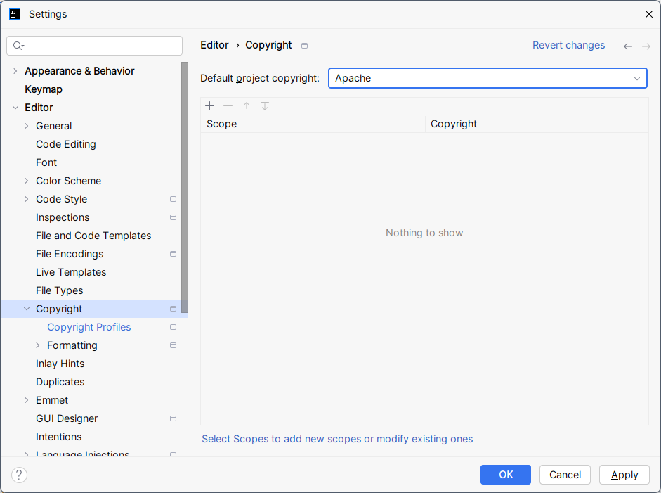

<!--
   Licensed to the Apache Software Foundation (ASF) under one
   or more contributor license agreements.  See the NOTICE file
   distributed with this work for additional information
   regarding copyright ownership.  The ASF licenses this file
   to you under the Apache License, Version 2.0 (the
   "License"); you may not use this file except in compliance
   with the [docs](docs)License.  You may obtain a copy of the License at
     http://www.apache.org/licenses/LICENSE-2.0
   Unless required by applicable law or agreed to in writing,
   software distributed under the License is distributed on an
   "AS IS" BASIS, WITHOUT WARRANTIES OR CONDITIONS OF ANY
   KIND, either express or implied.  See the License for the
   specific language governing permissions and limitations
   under the License.
-->

---

The **[KIE Community](http://kie.org)** is a home for leading Open Source projects that play a role in delivering solutions around Business Automation and Artificial Intelligence in the Cloud.

# Contributing

All contributions are welcome!
But if you want to contribute to the project, there are some guidelines you should follow to prevent issues that may delay your progress.

## Code style

Basically we use the "standard" code-style of all languages and this is ensured by [Prettier](https://prettier.io/) that run automatically when you build any package.
You can also integrate [Prettier](https://prettier.io/) with your favorite IDE to ensure that you are following the rules before commiting.

## Setting up IntelliJ IDEA

Here is a few steps that you can follow in order to configure IntelliJ IDEA to make your contributions follow the standards of the project.

> **ℹ️ NOTE**
>
> All settings bellow are per project, so if you open another project with different root folder, **you'll have to do those setting again!**

### ESLint

ESLint is a static code analysis tool for identifying problematic patterns found in JavaScript code. It also works with TypeScript using a transpiler.
IntelliJ IDEA has native support to [ESLint](https://eslint.org/) to analyze JavaScript and TypeScript files, but it requires a few changes to work with our packages.

1. In IntelliJ, open the project you are working
2. Go to `File > Settings`
3. Type `eslint` in search box
4. Go to `Languages & Frameworks > JavaScript > Code Quality Tools > ESLint`
5. Click in `Manual ESLint configuration`
6. In `ESLint package`, select `sources\kie-tools\packages\eslint\node_modules\eslint`, where `sources\kie-tools` is the root of your local clone.
7. In `Configuration File`, select `sources\kie-tools\packages\eslint\.eslintrc.js`, where `sources\kie-tools` is the root of your local clone.

   

### Prettier

[Prettier](https://prettier.io/) is a tool for format code despite any IDE that you use and unify coding format between different setups.

IntelliJ also has native support to Prettier, you just need to enable it without any further setting.

To setup Prettier:

1. In IntelliJ, open the project you are working
2. Go to `File > Settings`
3. Type `prettier` in search box
4. Go to `Languages & Frameworks > JavaScript > Prettier`
5. Click in `Automatic Prettier configuration`

   > **ℹ️ NOTE**
   >
   > Be aware that after setting up Prettier you are using the correct key binding to format your code. The default IntelliJ IDEA binding will format the code using IntelliJ standards **not** Prettier!
   > In Windows, the default key binding to format with Prettier is CTRL + ALT + SHIFT + P.
   > You can also format it using context menu. Check the default key bindings in the OS that you are using.
   >
   > 

### Copyright

Every file submitted to this repository needs to have the Apache Copyright header.

To setup Copyright in IntelliJ IDEA:

1. In IntelliJ, open the project you are working
2. Go to `File > Settings`
3. Type `copyright` in search box
4. Go to `Editor > Copyright > Copyright Profiles`
5. Click in `Add profile`
6. Type `Apache` (or any other name you want)
7. In the `Copyright text`, delete everything and copy-paste the text bellow:

   > Licensed to the Apache Software Foundation (ASF) under one
   > or more contributor license agreements. See the NOTICE file
   > distributed with this work for additional information
   > regarding copyright ownership. The ASF licenses this file
   > to you under the Apache License, Version 2.0 (the
   > "License"); you may not use this file except in compliance
   > with the License. You may obtain a copy of the License at
   >
   > http://www.apache.org/licenses/LICENSE-2.0
   >
   > Unless required by applicable law or agreed to in writing,
   > software distributed under the License is distributed on an
   > "AS IS" BASIS, WITHOUT WARRANTIES OR CONDITIONS OF ANY
   > KIND, either express or implied. See the License for the
   > specific language governing permissions and limitations
   > under the License.

   

8. Now, still in the Settings, navigate to `Editor > Copyright`
9. In `Default project copyright` select `Apache` (or any other name that you defined for the copyright profile).
   

   > **ℹ️ TIP**
   >
   > In existing files that does not have the copyright set yet, you can use the ALT + Insert (in Windows) to open the "Generate menu" and click in "Copyright" to automatically fill the copyright in the current file.

With all those settings above, you should be ready to contribute using IntelliJ.

Happy coding!
