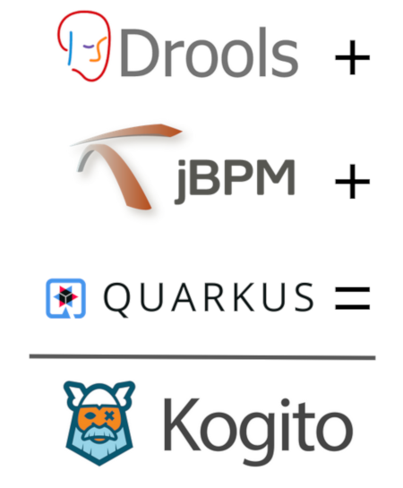

# Kogito Tooling

**[Kogito](http://kogito.kie.org)** is the next generation of business automation platform focused on cloud-native development, deployment and execution.

This repository contains all the tooling artifacts of the Kogito project.

## Documentation

- _Work in progress 🔨_

## Contribute

- _Work in progress 🔨_

## Build from source

To start building the KIE Tooling Core project, you're going to need:

- Node `>= 16.2.0` _(To install, follow these instructions: https://nodejs.org/en/download/package-manager/)_
- Yarn `1.22.10` _(To install, run `npm install -g yarn@1.22.10`)_
- Lerna `4.0.0` _(To install, run `npm install -g lerna@4.0.0`)_
- Maven `3.8.1` _(To install, run `xxx`)_
- Java `11` _(To install, run `xxx`)_
- (optional) Go `1.16` _(To install, run `xxx`)_
- (optional) Make `x.x.x` _(To install, run `xxx`)_
- (optional) Docker `x.x.x` _(To install, run `xxx`)_

After installing the tools above, you'll need to download the dependencies and link the packages locally. Simply run:

- `yarn bootstrap`

To build it, you'll have two choices:

- `yarn build:dev` - This is fast, but not as strict. It skips tests, linters, and some type checks. Be prepared for the CI to fail on your PRs.
- `yarn build:prod` - The default command to build production-ready packages. Use that to make sure your changes are correct.

**NOTE:** The Kogito Tooling build is parameterized by several Environment Variables. For an extensive list of these variables, please see `packages/build-env/README.md` ([link](/packages/build-env/README.md)).

Final artifacts will be on `packages/*/dist` directories.

## Applications

The Kogito Tooling project contains several applications. To develop each one of them individually, refer to the instructions below.

#### VS Code Extension

1. After you've successfully built the project following the instructions above, open the `packages/vscode-extension-pack-kogito-kie-editors` folder on VS Code. Use a new VS Code window so that the `packages/vscode-extension-pack-kogito-kie-editors` folder shows up as root in the VS Code explorer.
2. From there, you can Run the extension or the integration tests by using the `Debug` menu/section. You can also use the respective shortcuts (F5 to start debugging, for instance).
3. **NOTE:** To run the VS Code extension in development mode, you need `webpack` and `webpack-cli` to be globally installed on NPM. Normally you can do that with `npm install -g webpack@4.41.2 webpack-cli@3.3.10`, but `sudo` may be required depending on your installation.
4. **Remember!** If you make changes to packages other than `packages/vscode-extension-pack-kogito-kie-editors`, you have to manually rebuild them before relaunching the extension on VS Code.

#### Chrome Extension

1. After you've successfully built the project following the instructions above, open the `packages/chrome-extension-pack-kogito-kie-editors` folder on your favourite IDE. You can import the entire repo as well if you want to make changes to other packages.
2. Run `yarn build:dev` on `packages/chrome-extension-pack-kogito-kie-editors`. This will create a version of the Chrome Extension that fetches the envelope locally.
3. Open a terminal and run `yarn run serve-envelope` on `packages/chrome-extension-pack-kogito-kie-editors`. This will start a `webpack serve` instance with the editors and their envelope. We use that because we don't pack the Chrome Extension bundle with the editors inside. Instead, we fetch them from GitHub pages.
4. You also have to enable invalid certificates for resources loaded from localhost in your browser. To do that, go to `chrome://flags/#allow-insecure-localhost` in your Chrome browser and enable this flag. Alternativelly, you can go to `https://localhost:9001` and add an exception.
5. Open Chrome and go to `chrome://extensions`. Enable "Developer mode" in the top-right corner and click on "Load unpacked". Choose the `packages/chrome-extension-pack-kogito-kie-editors/dist` folder.
6. From now on you can use the development version of the extension. **Remember!** After each change, you have to rebuild the changed modules and hit the "Refresh" button of the extension card.

#### Online Editor

1. After you've successfully built the project following the instructions above, go to `packages/online-editor`.
2. Open a terminal and run `yarn start`. This will start a `webpack serve` instance with the Online Editor resources.
3. From now on you can use the development version of the Online Editor by accessing `https://localhost:9001`.

#### Desktop and Hub

1. After you've successfully built the project following the instructions above, go to `packages/desktop` or `packages/hub`. They work exactly the same.
2. To start the application in development mode, you can run `yarn start`. If you make changes and want to reload the app, run `yarn run build:dev && yarn start`. This will recompile the module and restart the Electron app. Remember: if you make changes to other modules, you have to build them too!
3. To build and package the application for production (i.e. generating an executable), you can run `yarn run build:prod`. This will pack the application for the current OS. If you want to pack the application for a different OS, run `yarn run pack:linux`, for example. See `package.json` for more details.

#### Standalone Editors

1. After you've successfully built the project following the instructions above, go to `packages/kie-editors-standalone`.
2. Open a terminal and run `yarn start`. This will start a `webpack serve` instance with the Standalone Editors test page.
3. From now on you can use the development version of the Standalone DMN Editor by accessing `https://localhost:9001/resources/dmn` and the Standalone BPMN Editor by accessing `https://localhost:9001/resources/bpmn`.
