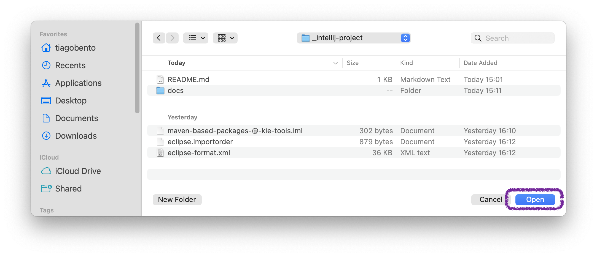

<!--
   Licensed to the Apache Software Foundation (ASF) under one
   or more contributor license agreements.  See the NOTICE file
   distributed with this work for additional information
   regarding copyright ownership.  The ASF licenses this file
   to you under the Apache License, Version 2.0 (the
   "License"); you may not use this file except in compliance
   with the License.  You may obtain a copy of the License at
     http://www.apache.org/licenses/LICENSE-2.0
   Unless required by applicable law or agreed to in writing,
   software distributed under the License is distributed on an
   "AS IS" BASIS, WITHOUT WARRANTIES OR CONDITIONS OF ANY
   KIND, either express or implied.  See the License for the
   specific language governing permissions and limitations
   under the License.
-->

# KIE Tools @ IntelliJ IDEA

To make it easier for developing Java-, Maven-based packages, this folder contains an IntelliJ IDEA project configured for select packages. It currently includes all Maven-based packages of KIE Tools. Two additional IntelliJ IDEA project modules are included too, given their "global" nature on the KIE Tools repository -- `scripts` and `root-env`.

### Importing this project on IntelliJ IDEA

After cloning `kie-tools` locally:
1. Bootstrap the repository with `pnpm bootstrap [pnpm-filter?]` command to wire everything together and configure `.mvn/maven.config` files for all packages. You only need to do it once per clone or when you change the dependency graph on `package.json` files.
2. Build the repository in development mode with `pnpm [pnpm-filter?] build:dev` to make sure your local Maven repository (Usually `~/.m2/repository`) is populated.

It's recommended to that before opening IntelliJ IDEA to make indexing faster once you do.

Once prompted by IntelliJ IDEA, select "Open" and choose this folder.

---

After you're done importing the project, please also configure the code formatter (or Code Style, in IntelliJ IDEA terminology.)

Apache KIE uses an Eclipse Formatter XML, so please install https://plugins.jetbrains.com/plugin/6546-adapter-for-eclipse-code-formatter and configure it like in the screenshot below:

---

You should now be able to develop all Java- and Maven-based projects normally.

---

> For more information on Maven-based packages on KIE Tools, please refere to the [KIE Tools :: Manual](../repo/docs/MANUAL.md).

