# jBPM Compact Architecture Quarkus Example

## Description

This example showcases a basic implementation of the **Hiring** process that drives a _Candidate_ through different
interviews until he gets hired.

This quickstart project shows a simple example user task orchestration including the use of DMN decisions to
generate the candidate offer and tºimers to skip User Tasks.

This example also demonstrates how to configure the whole _Kogito_ environment using the new _Compact Architecture_ that
enable simplifying the communication among _Kogito_ services removing the need of events (Kafka/HTTP) between them. This can
be achieved using the following _Quarkus_ addons:

- `kogito-addons-quarkus-data-index-persistence-postgresql`: enables the _Kogito Runtime_ persisting directly into the
  _Data-Index_ database.
- `kogito-addons-quarkus-jobs`: enables collocating the _Jobs Service_ inside the _Kogito Runtime_.

## The Java models

The **Hiring** process uses two POJOs to handle the process data, both of them can be found in the _org.kie.kogito.hr_ package.

The `CandidateData` POJO is the input of the process. It represents the person that wants to get the job.

```java
public class CandidateData {

    private String name; // Name of the candidate
    private String lastName; // Last name of the candidate
    private String email; // Email of the candidate
    private Integer experience; // Years of experience
    private List<String> skills; // List of technical skills

    // Constructors, setters, getters...
}
```

The `Offer` POJO is the output of the process and represents the job offer that will be sent to the candidate.
It will be automatically calculated during the process execution depending on the candidate years of experience & skills.

```java
public class Offer {

    private String category; // Job category based on the candidate experience
    private Integer salary; // Salary based on the candidate experience and skills

    // Constructors, setters, getters...
}
```

## The _New Hiring Offer_ DMN

This example makes use of the _New Hiring Offer_ DMN to generate a base offer for the `Candidate`. The DMN looks like this:

In this simple DMN we have an `Offer` _Decision_, that will generate the candidate offer, which
has a requirement of a `CandidateData` _Input Data_.

<div style="text-align:center">
   <figure>
      
      <figcaption>New Hiring Offer DMN diagram</figcaption>
   </figure>
</div>

The DMN defines the following data types (`tCandidateData` & `tOffer` ) matching the POJOs defined in the project
(`CandidateData.java` & `Offer.java`):

<div style="text-align:center">
   <figure>
      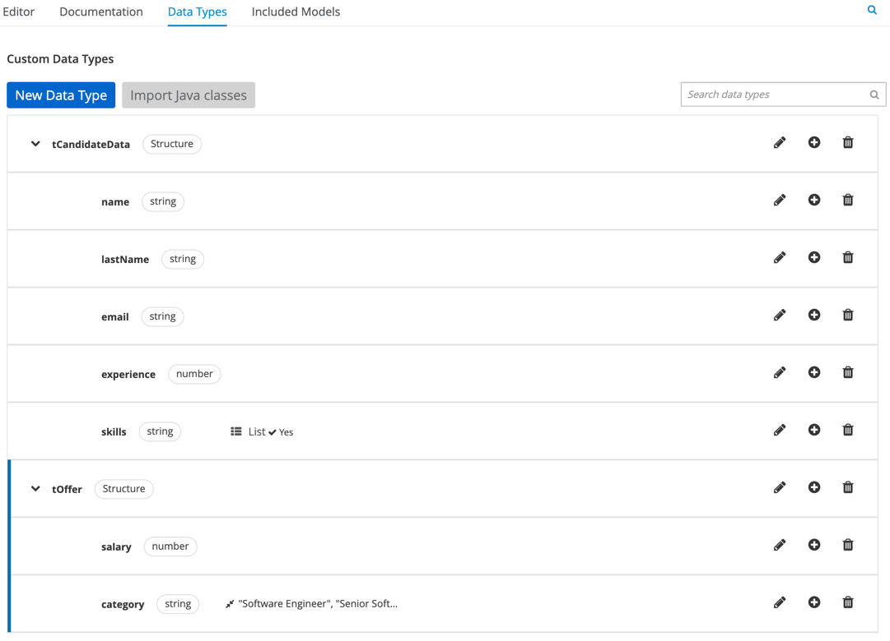
      <figcaption>New Hiring Offer DMN types</figcaption>
   </figure>
</div>

As expected, `CandidateData` _Input Data_ & `Offer` _Decision_ have a `tCandidateData` data

The `Offer` decision uses the following _Boxed Expression_ to generate the `tOffer`:

<div style="text-align:center">
   <figure>
      
      <figcaption>New Hiring Offer DMN decision</figcaption>
   </figure>
</div>

## The Hiring Process

### Process variables

The process handles the following _Variables_:

| Variable          | Type                              | Tags         | Description                                       |
| ----------------- | --------------------------------- | ------------ | ------------------------------------------------- |
| **candidateData** | `org.kie.kogito.hr.CandidateData` | **input**    | The candidate data                                |
| **offer**         | `org.kie.kogito.hr.Offer`         | **output**   | The generated candidate offer                     |
| **hr_approval**   | `Boolean`                         | **internal** | Determines that HR department approves the hiring |
| **it_approval**   | `Boolean`                         | **internal** | Determines that IT department approves the hiring |

### The BPMN Process

<div style="text-align:center">
   <figure>
      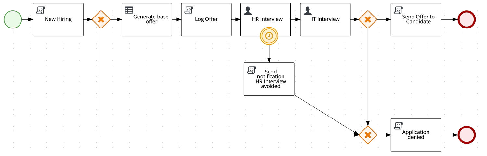
      <figcaption>Hiring Process Diagram</figcaption>
   </figure>
</div>

The process starts receiving the `CandidateData` as an input and storing it into the `candidateData` variable, and if the
candidate meets two minimal requirements, the process will continue and reach the **Generate base offer**, otherwise the
candidate application will be denied and the process will complete without sending the `offer` to the candidate.

The **Generate base offer** is a _Business Rule Task_ that will use the _New Hiring Offer_ decision defined in the
`NewHiringOffer.dmn` to generate the an `Offer` based on the candidate experience and skills. The task takes the `candidateData`
as an input and will produce an instance of `org.kie.kogito.hr.Offer` that will be stored in the `offer` variable.

<div style="text-align:center">
   <figure>
      
      <figcaption><b>Generate base Offer</b> data assignments</figcaption>
   </figure>
</div>

After the `offer` has been generated, the process will jump into the **HR Interview** _User Task_, where the candidate we'll
be interviewed by the _HR_ department. The task takes the `candidateData` and `offer` as inputs and as an output will produce
the `hr_approve` boolean and an updated `offer`.

<div style="text-align:center">
   <figure>
      
      <figcaption><b>HR Interviewr</b> task data assignments</figcaption>
   </figure>
</div>

The **HR Interview** _User Task_ also has a _Boundary Timer Event_ that will prevent the task to delay and will cancel the
task after certain time (for example purpose just 3 minutes). This _Boundary Timer Event_ will schedule a Job in the Jobs Service
that when trigger will notify the _Kogito Runtime_ to cancel the task and deny the application.

If **HR Interview** successfully completed, the process will jump into the **IT Interview** _User Task_. Again the candidate
we'll have a second interview with the _IT_ department. Again, this task will take the `candidateData` and `offer` as inputs
but as an output will produce the `it_approve` boolean.

<div style="text-align:center">
   <figure>
      
      <figcaption><b>IT Interviewr</b> task data assignments</figcaption>
   </figure>
</div>

Once both tasks are completed, if the candidate got the approvals from _HR_ & _IT_ (both `hr_interview` & `hr_interview` being true)
the process will jump into the **Send Offer to Candidate** _Script Task_ that will notify the candidate about the offer
and the process will end.

> **NOTE:** for simplicity, all the _User Tasks_ in this example are assigned to the _jdoe_ user present in the keycloak configuration

## Running the example

### Prerequisites

- Java 17+ installed
- Environment variable JAVA_HOME set accordingly
- Maven 3.9.3+ installed
- Docker and Docker Compose to run the required example infrastructure.

And when using native image compilation, you will also need:

- GraalVM 20.3+ installed
- Environment variable GRAALVM_HOME set accordingly
- GraalVM native image needs as well native-image extension: https://www.graalvm.org/reference-manual/native-image/
- Note that GraalVM native image compilation typically requires other packages (glibc-devel, zlib-devel and gcc) to be installed too, please refer to GraalVM installation documentation for more details.

### Infrastructure Services

This quickstart provides a docker compose template that starts all the required services. This setup ensures that all services are connected with a default configuration.

- PostgreSQL: 5432
- Management Console: 8280
- Task Console: 8380
- Keycloak: 8480
- PgAdmin: 8055
- Kogito Example Service: 8080

To help bootstraping the Infrastructure Services, the example provides the `startServices.sh` script inside the _docker-compose_
folder.

> **_NOTE_**: the docker compose template requires using _extra_hosts_ to allow the services use the host network, this may
> carry some issues if you are using a **podman** version older than **4.7**.

### Building & Running the example

To build the example, on a Terminal, run the following command:

```shell
mvn clean package -Pcontainer
```

This will build the example quarkus application and create a Docker image that will be started in the `docker-compose` template.

To execute the full example (including consoles), open a Terminal and run the following command inside the `docker-compose` folder:

```shell
sh startServices.sh
```

> **_IMPORTANT:_** if you are running this example on MacOs and you are not using **Docker Desktop**, please append
> the following entry in your `/etc/hosts` file to enable a good communication between al components.
>
> ```
> 127.0.0.1 kubernetes.docker.internal
> ```

Additionally, if you want to start only the example and the minimal Infrastructure Services (PostgreSQL, Data-Index and Jobs Service),
you can run the same `startServices.sh` script but passing the `example` argument

```shell
sh startServices.sh example
```

> **_NOTE:_** starting the Infrastructure Services, please consider running a `mvn clean package -Pcontainer`
> command on the project root before running the `startServices.sh` script for the first time or any time you modify the project.

### Running the example in Development mode

To run the example in Development mode, just run the following command in a Terminal:

```shell
mvn clean package quarkus:dev -Pdevelopment
```

The Development Mode will embed all the needed Infrastructure Services (PostgreSQL, Data-Index & Jobs Service) and won't
require any extra step.

The `development` profile includes the **Runtime Tools Quarkus Extension** that exposes a new section in the **Quarkus Dev-UI**
unifying the **Management Console** & **Task Console** functionalities. **Quarkus Dev-UI** is available at http://localhost:8080/q/dev

> **_NOTE:_** For more information about how to work with Kogito Runtime Tools Quarkus Extension, please refer to the [Kogito Documentation](https://docs.kogito.kie.org/latest/html_single/#con-runtime-tools-dev-ui_kogito-developing-process-services) page.

### Starting an instance of the Hiring Process

Once the service is up and running you can make use of the **Hiring** application by a sending request to `http://localhost:8080/hiring`.

Sending the following valid `CandidateData` will start a process instance that will land into the _HR Interview_ task:

```json
{
  "candidateData": {
    "name": "Jon",
    "lastName": "Snow",
    "email": "jon@snow.org",
    "experience": 5,
    "skills": ["Java", "Kogito", "Fencing"]
  }
}
```

In a Terminal you can execute this curl command to start a **Hiring** process:

```bash
curl -H "Content-Type: application/json" -H "Accept: application/json" -X POST http://localhost:8080/hiring -d '{"candidateData": { "name": "Jon", "lastName": "Snow", "email": "jon@snow.org", "experience": 5, "skills": ["Java", "Kogito", "Fencing"]}}'
```

If everything went well you may get a response like:

```json
{
  "id": "628e679f-4deb-4abc-9f28-668914c64ef9",
  "offer": {
    "category": "Senior Software Engineer",
    "salary": 40450
  }
}
```

In the server log You may find a trace like:

```
New Hiring has been created for candidate: Jon Snow
###################################
Generated offer for candidate: Jon Snow
Job Category: Senior Software Engineer
Base salary: 40450
###################################
```

Use the following `CandidateData` that don't match the minimal candidate requirements, to start a process that will automatically end:

```json
{
  "candidateData": {
    "name": "Jon",
    "lastName": "Snow",
    "email": "jon@snow.org",
    "experience": 0,
    "skills": []
  }
}
```

In a Terminal you can execute this curl command to start a **Hiring** process:

```bash
curl -H "Content-Type: application/json" -H "Accept: application/json" -X POST http://localhost:8080/hiring -d '{"candidateData": { "name": "Jon", "lastName": "Snow", "email": "jon@snow.org", "experience": 0, "skills": []}}'
```

If everything went well you may get a response like:

```json
{
  "id": "3659601a-bb59-458d-859e-7892621ad5b7",
  "offer": null
}
```

In the server log You may find a trace like:

```
New Hiring has been created for candidate: Jon Snow
###################################
Candidate Jon Snow don't meet the requirements for the position but we'll keep it on records for the future!
###################################
```

### Using Keycloak as Authentication Server

In this Quickstart we'll be using [Keycloak](https://www.keycloak.org/) as _Authentication Server_ for _Kogito Task Console_. It will be started
as a part of the project _Infrastructure Services_, you can check the configuration on the project [docker-compose.yml](docker-compose/docker-compose.yml) in [docker-compose](docker-compose) folder.

It will install the _Kogito Realm_ that comes with a predefined set of users:

| Login | Password | Roles               |
| ----- | -------- | ------------------- |
| admin | admin    | _admin_, _managers_ |
| alice | alice    | _user_              |
| jdoe  | jdoe     | _managers_          |

Once Keycloak is started, you should be able to access your _Keycloak Server_ at [localhost:8480/auth](http://localhost:8480/auth) with _admin_ user.

> **_NOTE:_** This example uses keycloak authentication to enable security only in the _Kogito Task Console_ not for the Kogito Runtime.

### Using the Kogito Runtime Consoles to interact with the Hiring Process

The following _step-by-step_ guides will show how to take advantage of both _Kogito Management Console_ and _Kogito Task Console_
to operate with the instances of _Hiring_ process.

To be able to follow the guides, please make sure that the example has been built using the `container` and all the _Infractructure Services_
are started as explained in the [Building & Running the example](#building--running-the-example) section.

> **_NOTE_**: For more information about how to operate with the _Kogito Runtime Consoles_, please refer to the
> [Management Console](https://docs.kogito.kie.org/latest/html_single/#con-management-console_kogito-developing-process-services) & [Task Console](https://docs.kogito.kie.org/latest/html_single/#con-task-console_kogito-developing-process-services) documentation.

#### Show active Hiring process instance at Kogito Management Console

_Kogito Management Console_ is the tool that enables the user to view and administrate process instances in our _Kogito application_.

In this guide we'll see how to use the _Kogito Management Console_ to view the state of the Hiring process instances.

1. With the example built and all the _Infrastructure Services_ running, let's start an instance of the _Hiring_ process. To do so, in a Terminal just run:

   ```bash
   curl -H "Content-Type: application/json" -H "Accept: application/json" -X POST http://localhost:8080/hiring -d '{"candidateData": { "name": "Jon", "lastName": "Snow", "email": "jon@snow.org", "experience": 5, "skills": ["Java", "Kogito", "Fencing"]}}'
   ```

   If everything went well, you should get a response like:

   ```json
   {
     "id": "064a6372-b5bb-4eff-a059-d7b24d4ac64a",
     "offer": { "category": "Senior Software Engineer", "salary": 40450 }
   }
   ```

   Which indicates that a new process instance with id **064a6372-b5bb-4eff-a059-d7b24d4ac64a** has been started.

2. Now let's check the process instance state with the _Kogito Management Console_. To do so, in your browser navigate
   to http://localhost:8280 and you'll be redirected to the **Process Instances** page in the _Kogito Management Console_.
   There where you should be able to see the started process instance in active state.

   <div style="text-align:center;">
      <figure>
         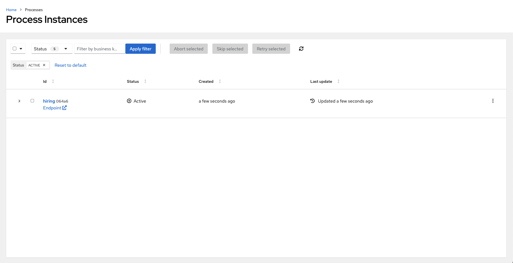
         <figcaption><b>Process List</b> in <i>Kogito Management Console</i></figcaption>
      </figure>
   </div>

3. Click on the instance **id** to navigate into the _Process Details_ page. In there you'll be able to see different panels
   displaying relevant information about the instance state, such as the _Diagram_, _Timeline_, _Details_, _Variables_, _Jobs_...

   <div style="text-align:center">
      <figure>
         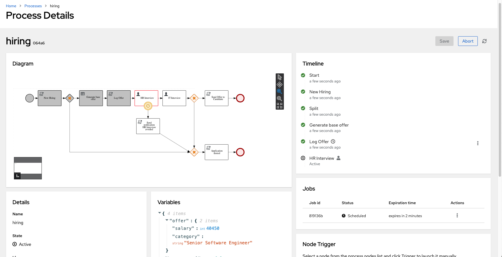
         <figcaption><b>Process Instance Details</b> page</figcaption>
      </figure>
   </div>

   Now check the **Diagram** panel, in there you'll se the instance execution path. Notice that it's stopped _HR Interview_ _User Task_ waiting for some input from the user.
   The task has _Timer_ that will skip the task if it's not completed in a given time (3 minutes in this example). You should be able to see the
   associated _Job_ in the **Jobs** panel. Now, let's wait 3 minutes to see the timer in action.

4. After 3 minutes, the scheduled _Job_ should have been executed, making the process instance skip the _HR Interview_ task.
   In the **Process Details** page, click the _Refresh_ button to see the process instance state.

   <div style="text-align:center">
      <figure>
         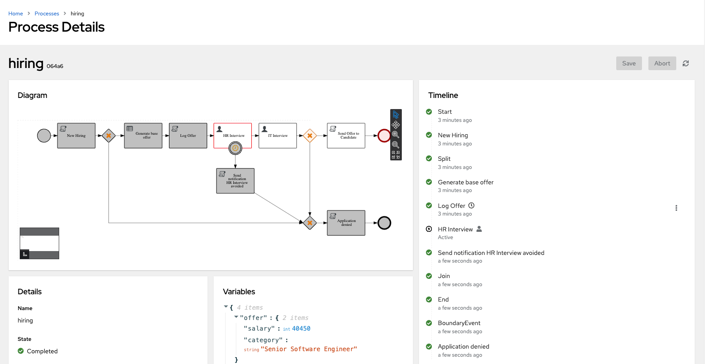
         <figcaption>Process Instance completed after the timer execution.</figcaption>
      </figure>
   </div>

   Again, check the _Diagram_ panel to see the process instance execution path and the _HR Interview_ task
   should have been skipped and the process instance continued its execution by following the _Application denied_ path
   reaching the _Completed_ state.

   Notice in the _Jobs_ panel that the associated _Job_ has the **Executed** status.

#### Complete Hiring process instances using Kogito Task Console

When a _Kogito_ process reaches a _User Task_, the process execution stops waiting for the user input
that will enable the _User Task_ to finish and allowing the process execution to continue.

_Kogito Task Console_ is the tool that enables the user interacting with the process _User Tasks_ and provide the necesary data
for the process to continue (usually wiht forms).

In this guide, we'll see how to complete the process _User Tasks_ using the _Kogito Task Console_ to interact with the process _User Tasks_
using the engine autogenerated forms.

> **_NOTE_**: For simplicity, all the _User Tasks_ are assigned to the user _jdoe_. Please make sure you use the _jdoe_/_jdoe_ credentials
> when logging in the _Task Console_

1. With the example built and all the _Infrastructure Services_ running, let's start an instance of the _Hiring_ process. To do so, in a Terminal just run:

   ```bash
   curl -H "Content-Type: application/json" -H "Accept: application/json" -X POST http://localhost:8080/hiring -d '{"candidateData": { "name": "Jon", "lastName": "Snow", "email": "jon@snow.org", "experience": 5, "skills": ["Java", "Kogito", "Fencing"]}}'
   ```

   If everything went well, you should get a response like:

   ```json
   {
     "id": "3cf0d58f-a824-4046-ba6c-c2e79edc1df7",
     "offer": { "category": "Senior Software Engineer", "salary": 40450 }
   }
   ```

   Which indicates that a new process instance with id **3cf0d58f-a824-4046-ba6c-c2e79edc1df7** has been started.

2. Let's check the process instance state. Again browse to http://localhost:8280 to access the _Kogito Management Console_,
   and in the **Process List** click the **Id** column to open the **Process Details** page.

   <div style="text-align:center;">
      <figure>
         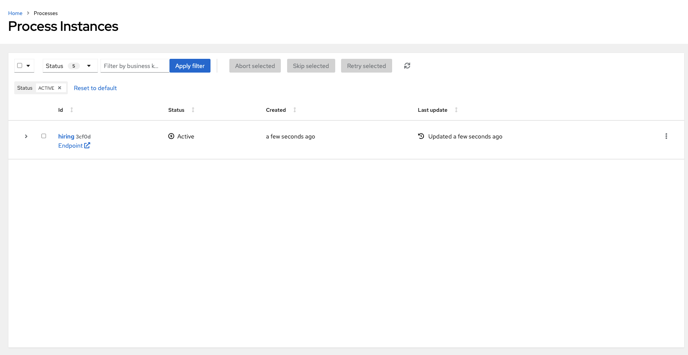
         <figcaption>Process List in <i>Kogito Management Console</i></figcaption>
      </figure>
   </div>

   <div style="text-align:center">
      <figure>
         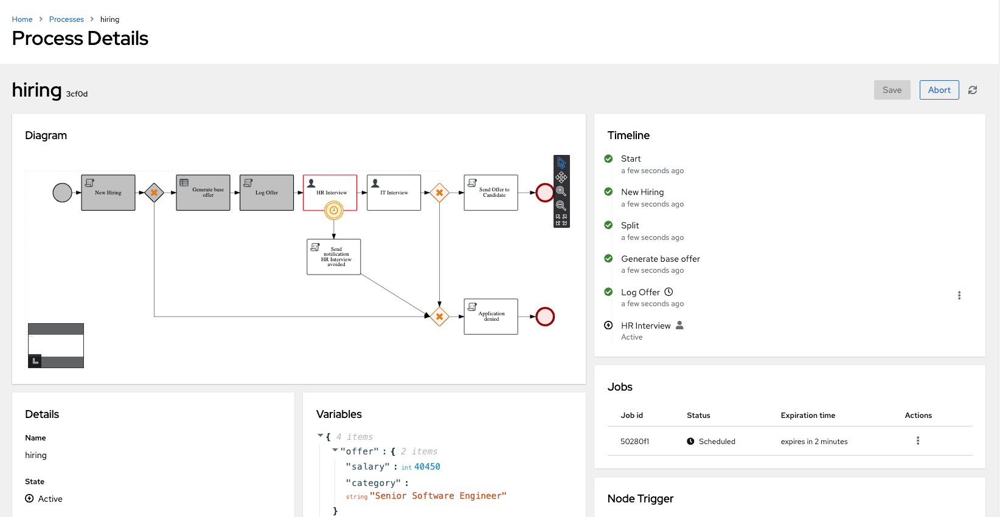
         <figcaption>Process instance Details page.</figcaption>
      </figure>
   </div>

   As expected, the process instance is stopped in the _HR Interview_ task waiting for some input from the user. Let's try to
   complete the task.

3. Now open the _Kogito Task Console_ by browsing to http://localhost:8380 and login using the **jdoe/jdoe** credentials.
   After logging in, you'll be redirected to the **Task Inbox** page, which contains the list of _Active_ tasks assigned to the
   logged user. In this case you should be able to see only the new _HR Interview_ task.

   <div style="text-align:center;">
      <figure>
         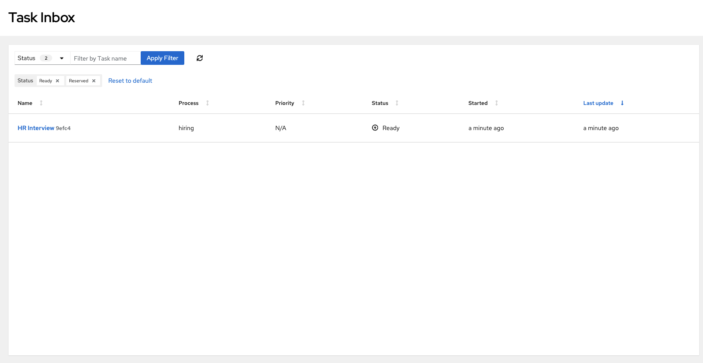
         <figcaption><b>Task Inbox</b> in <i>Kogito Task Console</i></figcaption>
      </figure>
   </div>

   Click on the **HR Interview** task to open the form and complete it!

4. The **Task Form** is the main component to interact with User Tasks, it allows the user to provide the data required by
   the task and transition it to the next phase, allowing the Process to continue. The **Task Form** is autogenerated based
   on the _User Task_ data assignments.

   <div style="text-align:center;">
      <figure>
         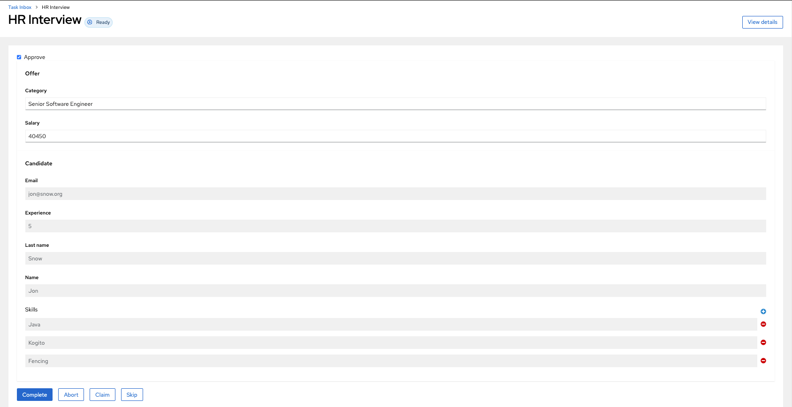
         <figcaption><i>HR Interview</i> <b>Task Form</b></figcaption>
      </figure>
   </div>

   _HR Interview_ Form allows you to edit the actual **Offer** that will be sent to the _Candidate_ and also approve or deny
   the job application with the **Approve** checkbox.

   Now, check the **Approve** checkbox click the **Complete** button in order to submit the form and complete the task. If the
   task could be successfully completed, a notification should appear in the screen and the form will stay in Read-Only mode.

   <div style="text-align:center;">
      <figure>
         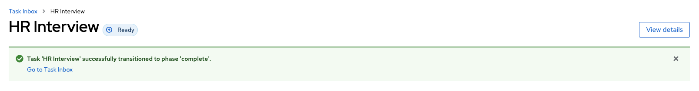
         <figcaption><i>HR Interview</i> Success notification!</figcaption>
      </figure>
   </div>

   With the _HR Interview_ task successfully completed the process has moved forward and reached the _IT Interview_ task.

   Optionally, you can check the process instance state in the **Kogito Management Console** and verify the current
   execution path.

   <div style="text-align:center;">
      <figure>
         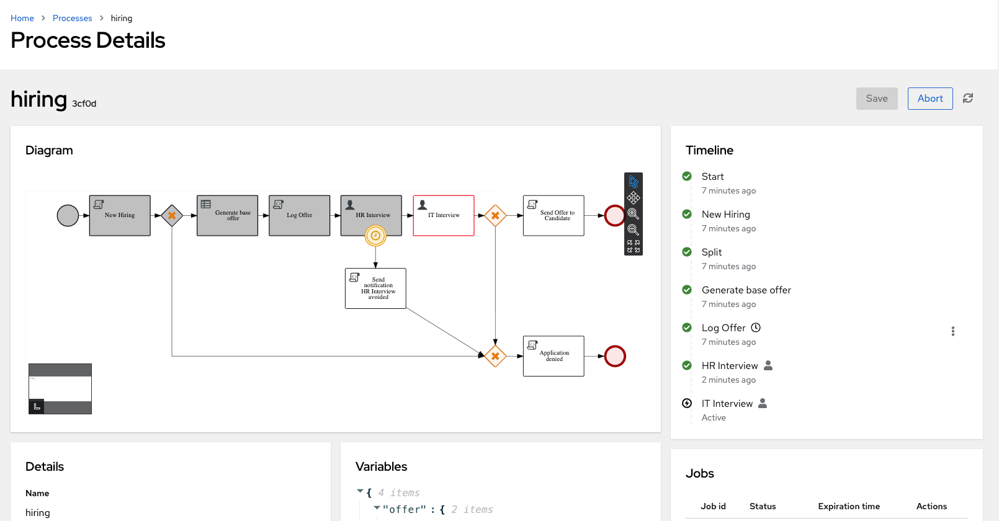
         <figcaption>Process Instance details stopped in <i>IT Interview</i></figcaption>
      </figure>
   </div>

5. Now is time to complete the **IT Interview** task and complete this Hiring process instance. In **Task Console**, go
   back to **Task Inbox** and as expected, there you'll see that **HR Interview** is no longer available and a new
   **IT Interview** has appeared.

   <div style="text-align:center;">
      <figure>
         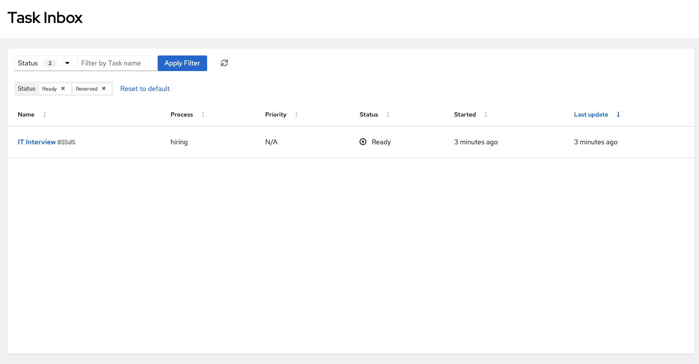
         <figcaption><i>IT Interview</i> in <b>Task Inbox</b></figcaption>
      </figure>
   </div>

   As done in Step #3, click in the **IT Interview** task to open the task form. _IT Interview_ task only needs the
   candidate **Approval** to be submitted. Please, check the **Approval** field and click the **Complete** button to
   submit the form.

   <div style="text-align:center;">
      <figure>
         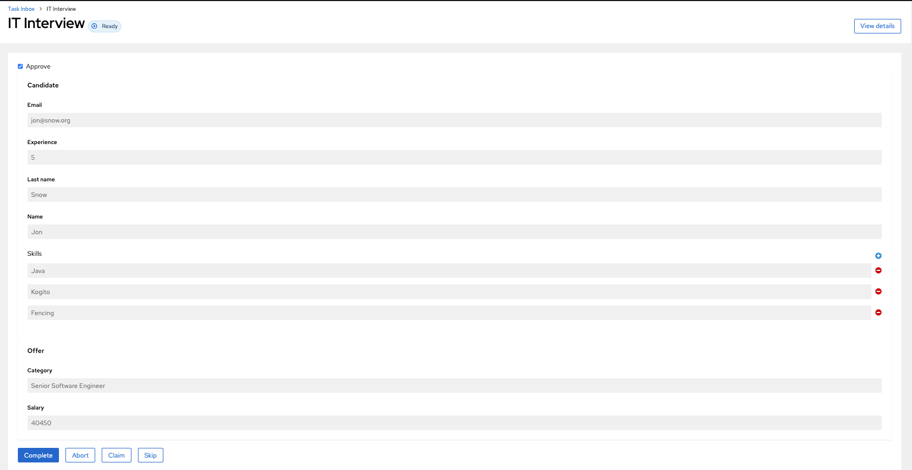
         <figcaption><i>IT Interview</i> <b>Task Form</b></figcaption>
      </figure>
   </div>

6. After the form is submitted the _IT Task_ should be completed and the process should continue, notifying the _Candidate_
   that he has succesfully finished the Hiring process. Please go back to **Task Inbox** to verify there are no other active tasks
   waiting for you.

   <div style="text-align:center;">
      <figure>
         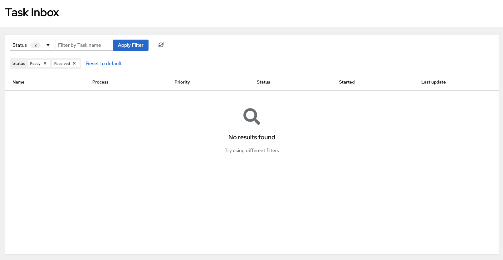
         <figcaption>Empty **Task Inbox** after completing the *IT Interview* Task</figcaption>
      </figure>
   </div>

   You can also open use _Kogito Management Console_ to check the state of the process instance and verify that the
   instance has been successfully completed.

   <div style="text-align:center;">
      <figure>
         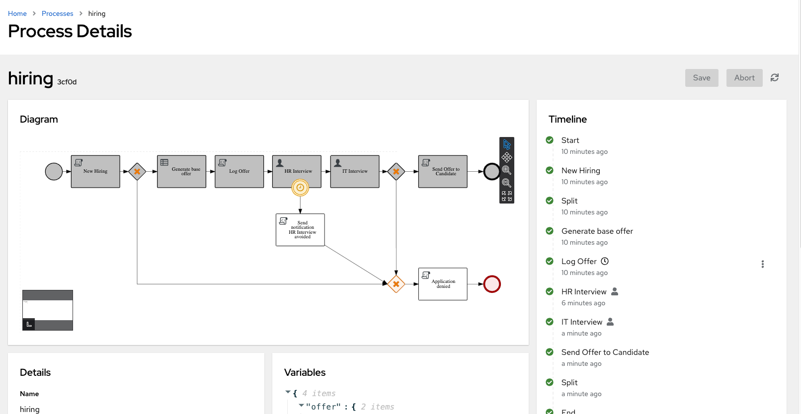
         <figcaption>Hiring Process sucessfully completed</figcaption>
      </figure>
   </div>
