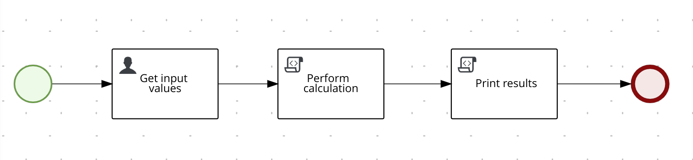
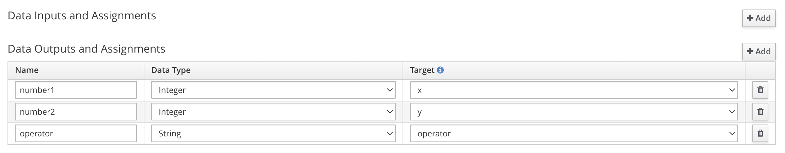
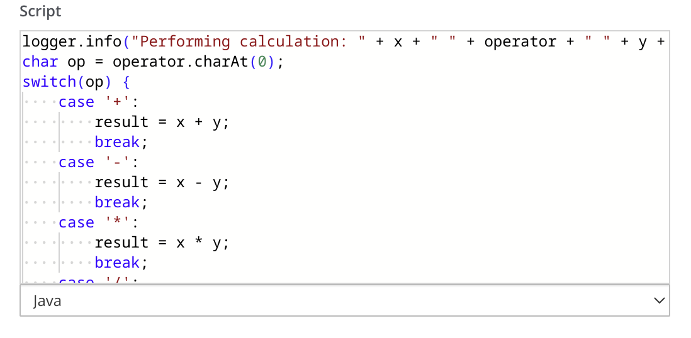

<!--
   Licensed to the Apache Software Foundation (ASF) under one
   or more contributor license agreements.  See the NOTICE file
   distributed with this work for additional information
   regarding copyright ownership.  The ASF licenses this file
   to you under the Apache License, Version 2.0 (the
   "License"); you may not use this file except in compliance
   with the License.  You may obtain a copy of the License at
     http://www.apache.org/licenses/LICENSE-2.0
   Unless required by applicable law or agreed to in writing,
   software distributed under the License is distributed on an
   "AS IS" BASIS, WITHOUT WARRANTIES OR CONDITIONS OF ANY
   KIND, either express or implied.  See the License for the
   specific language governing permissions and limitations
   under the License.
-->

# Process Configuration Accelerator Example

This example focuses on the recommended configuration of a process application based on Apache KIE.

Note that although this example contains a BPMN process file for demo purposes, the main focus is on the configuration of the application itself.

1. [Setting up the database using the provided schema (DDL)](#setting-up-the-database-using-the-provided-schema)
2. [Disabling automatic database schema generation through KIE Flyway](#disabling-automatic-database-schema-generation-through-flyway)
3. [Enabling persistence for all sub-systems](#enabling-persistence-for-all-sub-systems) (Runtime Engine, User Tasks, Data-Audit, Data-Index, Jobs Service)
4. [Enabling transaction support](#enabling-transaction-support)
5. [Enabling OpenID Connect (OIDC) and securing endpoints](#enabling-openid-connect-oidc-and-securing-endpoints)
6. [Enabling events](#enabling-events)
7. [Configuring Jobs Service](#configuring-jobs-service)
8. [Externalizing configuration properties](#externalizing-configuration-properties)
9. [Configuring log levels](#configuring-log-levels)

---

If you want to jump straight ahead to running this example, go to

10. [Running](#running)

---

## Setting up the database using the provided schema

Apache KIE provides Data Definition Language (DDL) scripts for creating the database schema in a PostgreSQL instance. The generated tables are be used by the persistence layer of the following sub-systems:

- Runtime Engine
- User Tasks
- Data-Index
- Data-Audit
- Job Services

The SQL files are available in the `docker-compose/sql` folder and support PostgreSQL database only. Apache KIE 10 supports PostgreSQL version 16.

The SQL files, are automatically used during container startup.

#### Setting up the schema when using docker compose

Refer to the **Prerequisites** section of this document for more information on how to leverage docker init scripts to set up the database schema automatically. If successful, the complete schema should be created inside the `kie` database.

## Disabling automatic database schema generation through Flyway

When the database schema is set up using scripts, it is important to disable the automatic schema creation functionality through Flyway. Flyway is an external framework that automatically generates the required tables during application startup. While this is convenient in particular during the development process, this approach is usually not considered feasible in an environment with stricter database access restrictions. Therefore, the following property should be set to `false` in your project’s `application.properties` file:

- `kie.flyway.enabled=false` (default is false)

Apache KIE uses a "sandboxed" Flyway setup, meaning that if you want to use Flyway for your own persistence layer, you can, and there won't be any conflicts between your Flyway usage, and Apache KIE's subsystems Flyway usage.

## Enabling persistence for all sub-systems

Persistence is enabled through settings in `application.properties` as well as the required dependencies in the project's `pom.xml` file:

- Persistence related settings in `application.properties`:

```properties
# persistence type
kogito.persistence.type=jdbc

# datasource properties
quarkus.datasource.db-kind=postgresql
quarkus.datasource.username=kie-user
quarkus.datasource.password=kie-pass
quarkus.datasource.jdbc.url=jdbc:postgresql://0.0.0.0:5432/kie
quarkus.datasource.reactive.url=postgresql://0.0.0.0:5432/kie
```

- Persistence related dependencies in `pom.xml`:

```xml
<!-- Persistence -->
<dependency>
  <groupId>io.quarkus</groupId>
  <artifactId>quarkus-jdbc-postgresql</artifactId>
</dependency>
<dependency>
  <groupId>io.quarkus</groupId>
  <artifactId>quarkus-agroal</artifactId>
</dependency>
<dependency>
  <groupId>org.kie</groupId>
  <artifactId>kie-addons-quarkus-persistence-jdbc</artifactId>
</dependency>

<!-- Data-Index Addon -->
<dependency>
  <groupId>org.kie</groupId>
  <artifactId>kogito-addons-quarkus-data-index-jpa</artifactId>
</dependency>

<!-- Jobs Service -->
<dependency>
  <groupId>org.kie</groupId>
  <artifactId>kogito-addons-quarkus-jobs</artifactId>
</dependency>
<dependency>
  <groupId>org.kie.kogito</groupId>
  <artifactId>jobs-service-storage-jpa</artifactId>
</dependency>

<!-- Data-Audit -->
<dependency>
  <groupId>org.kie</groupId>
  <artifactId>kogito-addons-quarkus-data-audit</artifactId>
</dependency>
<dependency>
  <groupId>org.kie</groupId>
  <artifactId>kogito-addons-quarkus-data-audit-jpa</artifactId>
</dependency>

<!-- User Task persistence -->
<dependency>
  <groupId>org.jbpm</groupId>
  <artifactId>jbpm-addons-quarkus-usertask-storage-jpa</artifactId>
</dependency>
```

## Enabling transaction support

Apache KIE provides configurable transaction support for the endpoint provided by its sub-systems. This includes endpoints for the Process API as well as the User Tasks API. Transactions are enabled by default, and are configurable at both the global application level as well as on the individual sub-system level if required:

- `kogito.transactionEnabled=true`
  - Enables transactions for the entire application and all sub-systems (default: `true`)
- `kogito.processes.transactionEnabled=true`
  - Enables transactions for the Process sub-system (default: `true`)
- `kogito.usertasks.transactionEnabled=true`
  - Enables transactions for the User Tasks sub-system (default: `true`)

Note: The global property has precedence over the per sub-system ones.

## Enabling OpenID Connect (OIDC) and securing endpoints

To enable OIDC we must configure our project by adding properties to the `src/main/resources/application.properties` file.

```properties
# Enabling OIDC
quarkus.oidc.enabled=true
quarkus.oidc.auth-server-url=http://127.0.0.1:8180/realms/kogito
quarkus.oidc.discovery-enabled=true
quarkus.oidc.tenant-enabled=true
quarkus.oidc.client-id=kogito-app
quarkus.oidc.credentials.secret=secret
quarkus.oidc.application-type=service

# Configuring secured endpoints
quarkus.http.auth.permission.authenticated.paths=/*
quarkus.http.auth.permission.authenticated.policy=authenticated
quarkus.http.auth.permission.public.paths=/q/*,/docs/*,/kogito/security/oidc/*
quarkus.http.auth.permission.public.policy=permit
```

For a complete setup of the security features, please refer to the `process-security` example.

## Enabling Events

To enable Events we must configure our project by adding properties to the `src/main/resources/application.properties` file.

```properties
# Enabling Events
# Incoming channel mapping
mp.messaging.incoming.data_in.connector=smallrye-kafka
mp.messaging.incoming.data_in.value.deserializer=org.apache.kafka.common.serialization.StringDeserializer
# Outgoing channel mapping
mp.messaging.outgoing.data_out.connector=smallrye-kafka
mp.messaging.outgoing.data_out.value.serializer=org.apache.kafka.common.serialization.StringSerializer
```

Additionally, it's possible fine tunning the thread pool and queue size to enhance the performance.

```
# Thread pool size, default 10
kogito.quarkus.events.threads.poolSize=10
# Thread queue size, default 1
kogito.quarkus.events.threads.queueSize=1
```

For a complete setup of the security features, please refer to the `process-event-driven` example.

## Configuring Jobs Service

Apache KIE's Jobs Service is capable of automatically managing
overdue timers that failed to trigger as expected because of database unavailability, network connection issues or other unforeseen problems. To enable this automatism the following properties should be properly configured in your project's
application.properties file:

- `kogito.jobs-service.schedulerChunkInMinutes`
  - The current chunk size in minutes the scheduler handles. It is used to keep a limit number of jobs scheduled in the in-memory scheduler. Default: 10 (min)
- `kogito.jobs-service.loadJobIntervalInMinutes`
  - The interval the job loading method runs to fetch the persisted jobs from the repository. Default: 10 (min)
- `kogito.jobs-service.loadJobFromCurrentTimeIntervalInMinutes`
  - The interval based on the current time the job loading method uses to fetch jobs `"FROM (now - loadJobFromCurrentTimeIntervalIn Minutes) TO schedulerChunkInMinutes"`. Default: 0 (min)
- `kogito.jobs-service.loadJobRetries`
  - Number of retries configured for the periodic jobs loading procedure. Every time the procedure is started this value is considered. Default: 3
- `kogito.jobs-service.loadJobErrorStrategy`
  - Error strategy to apply when the periodic jobs loading procedure has exceeded the `jobLoadRetries`. Default: `NONE`. Available strategies are:
    - `NONE` – Nothing happens
    - `FAIL_SERVICE` – An error event is thrown

In order for the periodic job loading to also include overdue jobs that failed to be triggered, it is
necessary to set `kogito.jobs-service.loadJobFromCurrentTimeIntervalInMinutes`. The value of this
property should be equal or higher than what is set for `kogito.jobs-service.loadJobIntervalInMinutes`.

Example configuration:

```properties
# run periodic job loading every minute
kogito.jobs-service.loadJobIntervalInMinutes=1
# load jobs into the InMemory scheduler that expire within the next 10 minutes
kogito.jobs-service.schedulerChunkInMinutes=10
# (re)load jobs into the InMemory scheduler that have expired in the last 5 minutes and have not been properly executed
kogito.jobs-service.loadJobFromCurrentTimeIntervalInMinutes=5
```

## Externalizing configuration properties

The main configuraiton file used by the application is the `src/main/resources/application.properties` file. This file provides the configuration at build time. However, as some properties defined in this file are specific to the target environment, developers might want to provide the option to externalize the configuration of these properties. To achieve this, the following syntax can be used:

```properties
property.name=${ENV_PROPERTY_NAME:default_value}
```

An example for such a setup used in this example is the definition of the database related properties. In `application.properties`, the relevant settings are defined as:

```properties
quarkus.datasource.username=${QUARKUS_DATASOURCE_USERNAME:kie-user}
quarkus.datasource.password=${QUARKUS_DATASOURCE_PASSWORD:kie-pass}
quarkus.datasource.jdbc.url=${QUARKUS_DATASOURCE_JDBC_URL:jdbc:postgresql://localhost:5432/kie}
quarkus.datasource.reactive.url=${QUARKUS_DATASOURCE_REACTIVE_URL:postgresql://localhost:5432/kie}
```

At runtime, the settings can be defined using environment variables. For instance, in the `docker-compose.yml` configuration, these variables are set as:

```yaml
  process-accelerator:
    ...
    environment:
      QUARKUS_DATASOURCE_JDBC_URL: "jdbc:postgresql://postgres:5432/kie"
      QUARKUS_DATASOURCE_REACTIVE_URL: "postgresql://postgres:5432/kie"
      QUARKUS_DATASOURCE_USERNAME: kie-user
      QUARKUS_DATASOURCE_PASSWORD: kie-pass
```

## Configuring log levels

This application leverages the [Quarkus logging](https://quarkus.io/guides/logging) functionality provided by the Quarkus framework. Please refer to the Quarkus documentation for details regarding the available configuration options.

To minimize the amount of logging generated at runtime, the root log level can be set to WARN, with additional packages defined at a lower logging verbosity as per individual requirements. Example setup:

```properties
# Minimize logging for all categories
quarkus.log.level=WARN
# Enable more verbose logging for application specific messages only
quarkus.log.category."com.example".level=INFO
```

To troubleshoot Apache KIE and process related issues, it might be required to define more verbose logging for these packages, for example:

```properties
quarkus.log.category."org.jbpm".level=DEBUG
quarkus.log.category."org.kie.kogito".level=DEBUG
```

---

## Running

### Prerequisites

- Java 17 installed
- Environment variable `JAVA_HOME` set accordingly
- Maven 3.9.6 installed
- Docker and Docker Compose to run the required example infrastructure.

### Infrastructure Services

This quickstart provides a Docker Compose template that starts all the required services. This setup ensures that all
services are connected with a default configuration.

| Service            | Port @ localhost              |
| ------------------ | ----------------------------- |
| PostgreSQL         | [5432](http://localhost:5432) |
| PgAdmin            | [8055](http://localhost:8055) |
| This example's app | [8080](http://localhost:8080) |

### Starting the application and the Infrastructure Services

To help bootstrapping the Infrastructure Services, this example provides a `docker-compose.yml` file. It is still required to compile the project first, though, so that its Container image is create.

First, build the example running the following command on a Terminal:

```bash
mvn clean package
```

This will build this example's Quarkus application and create a Docker image that will be started in the `docker-compose` template. Then, to start the services, run:

```bash
PROJECT_VERSION=0.0.0 docker compose up
```

To stop the services you can hit `CTRL/CMD + C` in your terminal, and to clean up perform the command above:

```bash
PROJECT_VERSION=0.0.0 docker compose down
```

> **_IMPORTANT:_** if you are running this example on macOS and you are not using **Docker Desktop**, please append
> the following entry in your `/etc/hosts` file to enable a good communication between al components.
>
> ```bash
> 127.0.0.1 kubernetes.docker.internal
> ```

---

### Using the Calculate process

  <p align="center"></p>

The process consists of a few steps, the main ones being a User Task to collect the required input data, as well as a script task that is used to perform a calculation.

### Key Steps:

1. Get input values - User Task

The main purpose of this user task is set up to collect input data and map it to process variables:

- User Task Data Output Assignment
<p align="center"></p>

2. Perform calculation - Script Task

This script task contains the logic to perform a calculation using the provided input values. Note that the usage of a script task to implement this logic is done for demo purposes only, to demonstrate how the process execution is impacted by unhandled runtime exceptions.

- Perform calculation Script Task
<p align="center"></p>

### Executing an instance of the Calculate Process

Once the service is up and running you can make use of the **Calculate** process by a sending request to
`http://localhost:8080/calculate`.

In a Terminal you can execute this curl command to start an instance of the **Calculate** process:

```bash
curl -H "Content-Type: application/json" -H "Accept: application/json" -X POST http://localhost:8080/calculate -d '{}'
```

If everything went well you may get a response like:

```json
{
  "id": "aa730876-ccd8-4f77-a433-898998f1dba0"
}
```

You can fetch the application logs with the following command:

```bash
docker logs -f process-accelerator
```

For a successful process instance creation, the log will show a message like the following:

```bash
2024-12-03 20:56:04,062 d61d270a3dd2 INFO  [com.example.CalculateProcess:162] (executor-thread-1) Task to get input values for process aa730876-ccd8-4f77-a433-898998f1dba0 started
```

Next, use the User Task API endpoint to request the active user task instance:

```bash
curl -X 'GET' \
  'http://localhost:8080/usertasks/instance?user=jdoe' \
  -H 'accept: application/json'
```

The "id" value returned by this request is used in the User Task API replacing the taskId. Send the following request to complete the user task with input values for the calculation task:

```bash
curl -X 'POST' \
  'http://localhost:8080/usertasks/instance/{taskId}/transition?user=jdoe' \
  -H 'accept: application/json' \
  -H 'Content-Type: application/json' \
  -d '{
  "transitionId": "complete",
  "data": {
    "number1": 50,
    "number2": 49,
    "operator": "-"
  }
}'
```

As expected, this will result in the next tasks getting executed successfully and the process to finish:

```
2024-12-03 20:56:50,710 264aaa0c8737 INFO  [com.example.CalculateProcess:90] (executor-thread-1) Performing calculation: 50 - 49 = result
2024-12-03 20:56:50,710 264aaa0c8737 INFO  [com.example.CalculateProcess:136] (executor-thread-1) The result of calculating 50 - 49 is 1
```

### Force an error during process execution to verify transactional semantics

Consider completing the User Task with output values that will result in a failing calculation, such as a division by zero:

```bash
curl -X 'POST' \
  'http://localhost:8080/usertasks/instance/{taskId}/transition?user=jdoe' \
  -H 'accept: application/json' \
  -H 'Content-Type: application/json' \
  -d '{
  "transitionId": "complete",
  "data": {
    "number1": 50,
    "number2": 0,
    "operator": "/"
  }
}'
```

In this case, the execution of the script task fails as expected:

```
2024-12-03 21:00:32,697 264aaa0c8737 INFO  [com.example.CalculateProcess:90] (executor-thread-1) Performing calculation: 50 / 0 = result
2024-12-03 21:00:32,699 264aaa0c8737 ERROR [org.jbpm.workflow.instance.impl.NodeInstanceImpl:259] (executor-thread-1) Node instance causing process instance error in id 4cec99d6-e9ae-4c0c-b496-83d50bc68db7 in a transactional environment (Wrapping)
```

With transactions enabled, the state of the process execution will be rolled back to the last safe state, in this case the User Task. The Process Instance Management API could be used to verify the state of the process instance:

```bash
curl -X 'GET' \
  'http://localhost:8080/management/processes/{processId}/instances/{processInstanceId}' \
  -H 'accept: */*'
```

This request shows that the process instance is still `ACTIVE` in the `getinputvalues` User Task. The User Task can then be completed using a correct set of output variables to complete the process.

---

Apache KIE (incubating) is an effort undergoing incubation at The Apache Software
Foundation (ASF), sponsored by the name of Apache Incubator. Incubation is
required of all newly accepted projects until a further review indicates that
the infrastructure, communications, and decision making process have stabilized
in a manner consistent with other successful ASF projects. While incubation
status is not necessarily a reflection of the completeness or stability of the
code, it does indicate that the project has yet to be fully endorsed by the ASF.

Some of the incubating project’s releases may not be fully compliant with ASF
policy. For example, releases may have incomplete or un-reviewed licensing
conditions. What follows is a list of known issues the project is currently
aware of (note that this list, by definition, is likely to be incomplete):

- Hibernate, an LGPL project, is being used. Hibernate is in the process of
  relicensing to ASL v2
- Some files, particularly test files, and those not supporting comments, may
  be missing the ASF Licensing Header

If you are planning to incorporate this work into your product/project, please
be aware that you will need to conduct a thorough licensing review to determine
the overall implications of including this work. For the current status of this
project through the Apache Incubator visit:
https://incubator.apache.org/projects/kie.html
