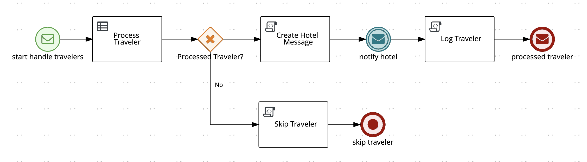
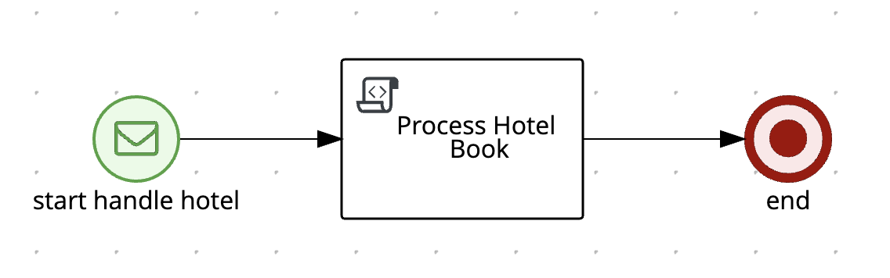
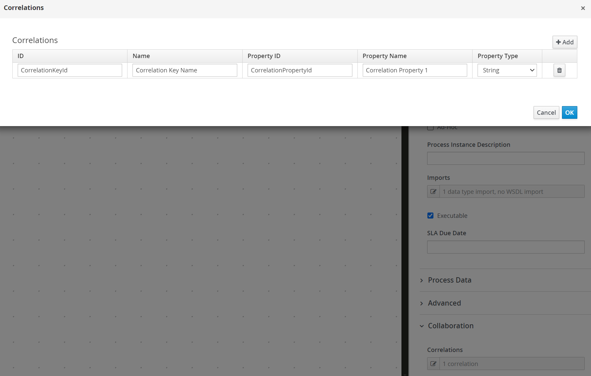
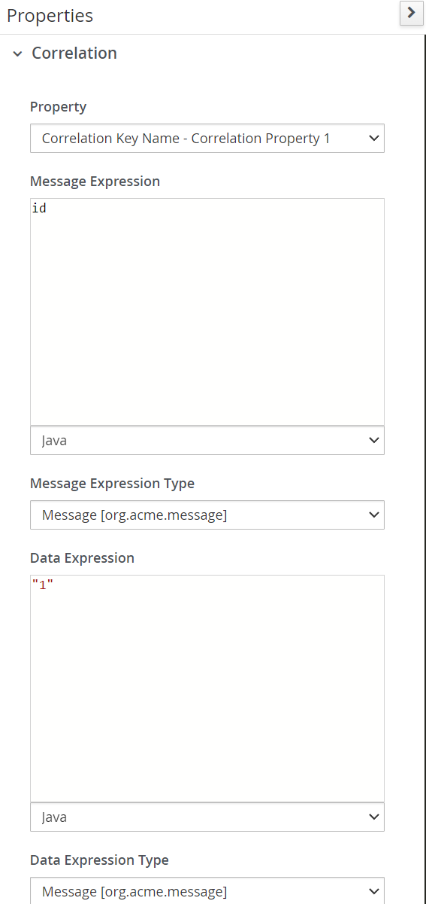

<!--
   Licensed to the Apache Software Foundation (ASF) under one
   or more contributor license agreements.  See the NOTICE file
   distributed with this work for additional information
   regarding copyright ownership.  The ASF licenses this file
   to you under the Apache License, Version 2.0 (the
   "License"); you may not use this file except in compliance
   with the License.  You may obtain a copy of the License at
     http://www.apache.org/licenses/LICENSE-2.0
   Unless required by applicable law or agreed to in writing,
   software distributed under the License is distributed on an
   "AS IS" BASIS, WITHOUT WARRANTIES OR CONDITIONS OF ANY
   KIND, either express or implied.  See the License for the
   specific language governing permissions and limitations
   under the License.
-->

# Example :: Process Event Driven Example

This example shows how a Apache KIE project can use Apache Kafka to handle events. It showcases a Travel Agency example. The **Process Travelers** process starts by consuming a *travelers* event which will be processed using pre-defined rules. If the *travelers* is successfully processed, a message will be produced triggering the **Process Hotel** process, which is responsible for processing the hotel. Afterward, the **Process Travelers** process will create a new event with the **processed traveler** content. If the *travelers* isn't successfully processed, the **Process Travelers** process will finish without any other event. Additionally, this example also demonstrates how to configure the whole environment to use events (Kafka/HTTP) between processes.

- **Process Travelers** process
<p align="center"></p>

- **Process Hotel** process
<p align="center"></p>

## Enabling Events

To enable events we must configure our project by adding Maven dependencies to the `pom.xml` and adding properties to the `src/main/resources/application.properties` file.

### Maven dependencies

To enable Kafka messages we must add the following two dependencies in the `pom.xml` file:

- `org.kie.kie-addons-quarkus-messaging`: Quarkus addon that enables Apache KIE runtime to produce and consume messages using the Smallrye Messaging library.
- `io.quarkus.quarkus-smallrye-reactive-messaging-kafka`: Enables connecting Kafka broker using the Smallrye Messaging library for Quarkus.

### Application properties

To produce and/or consume events it's required to add the `channel` configuration to the `application.properties` file. A `channel` is used to produce (`outgoing`) or consume (`incoming`) messages. Each channel will automatically create a Kafka topic with the same name as the `channel`. The configuration follows the structure below:

```
mp.messaging.[outgoing|incoming].{channel-name}.property=value
```

For the `travelers` project, we have three channels, one `incoming` and two `outgoing`:

```
mp.messaging.incoming.travelers.connector=smallrye-kafka
mp.messaging.incoming.travelers.value.deserializer=org.apache.kafka.common.serialization.StringDeserializer
mp.messaging.incoming.travelers.auto.offset.reset=earliest

mp.messaging.outgoing.correlation.connector=smallrye-kafka
mp.messaging.outgoing.correlation.value.serializer=org.apache.kafka.common.serialization.StringSerializer

mp.messaging.outgoing.processedtravelers.connector=smallrye-kafka
mp.messaging.outgoing.processedtravelers.value.serializer=org.apache.kafka.common.serialization.StringSerializer
```

The `incoming` channel is named `travelers` which will be used to start the **Process Travelers** process. The `correlation` will be used to communicate to the **Process Hotel** process, and `processedtravelers` will be used to send the processed traveler information.

For the `hotels` project we have just one `incoming` channel named `correlation`. This channel will be used to receive the message from the **Process Travelers** process and start the **Process Hotel** process:

```
mp.messaging.incoming.correlation.connector=smallrye-kafka
mp.messaging.incoming.correlation.value.deserializer=org.apache.kafka.common.serialization.StringDeserializer
mp.messaging.incoming.correlation.auto.offset.reset=earliest
```

## Infrastructure requirements

To help bootstrapping the Infrastructure Services, the example provides a `docker-compose.yml` file. This quickstart provides two ways of running the example application. In "development" mode, the user can start a Kafka service using `docker-compose` and must run **Process Travelers** and **Process Hotel** processes manually. In "container" mode the `docker-compose` file will start the Kafka service and both processes, requiring the project to be compiled first to generate the process's container images. To use `docker-compose` we must first create a `.env` file in the example root, and it should have the following variables:

```
PROJECT_VERSION=
KAFKA_HOST=
COMPOSE_PROFILES=
```

- `PROJECT_VERSION`: Should be set with the current Apache KIE version being used: `PROJECT_VERSION=0.0.0`
- `KAFKA_HOST`: tells how the processes will find the Kafka service.
- `COMPOSE_PROFILES`: filters which services will run.

### Development mode

For development mode, the `.env` must have the following values:

```
PROJECT_VERSION=0.0.0
KAFKA_HOST=localhost
COMPOSE_PROFILES=development
```

### Container mode

For container mode, the `.env` must have the following values:

```
PROJECT_VERSION=0.0.0
KAFKA_HOST=kafka
COMPOSE_PROFILES=container
```

### Handling services

To start the services use the command above:

```bash
docker compose up
```

To stop the services you can hit `CTRL/CMD + C` in your terminal, and to clean up perform the command above:

```bash
docker compose down
```

## Running

### Prerequisites

- Java 17 installed
- Environment variable `JAVA_HOME` set accordingly
- Maven 3.9.6 installed
- Docker and Docker Compose to run the required example infrastructure.

### Compile and Run in local development mode

First, start the Kafka service (["Infrastructure requirements/Development mode"](#development-mode)), and then start the processes in development mode. To do so, open two new terminals, and access the project folder by using the `cd <project_path>` (hotels/travelers) and run the command above in both terminals:

```sh
mvn clean package quarkus:dev
```

The **Process Travelers** process will run in the port `8082` and **Process Hotel** process in the port `8081`.

NOTE: With the dev mode of Quarkus you can take advantage of hot reload for business assets like processes, rules, decision tables, and java code. No need to redeploy or restart your running application.

NOTE: Adding the `development` profile is optional, which enables the jBPM Dev UI. To do so add the `-Pdevelopment` at the end of the command.

### Compile and Run in local JVM mode

First, compile the entire example by running the command above:

```sh
mvn clean package
```

Start the Kafka service (["Infrastructure requirements/Development mode"](#development-mode)), and then open two new terminals to start the processes with the following commands in both terminals:

```sh
# Starts the **Handler Travelers** process
java -jar travelers/target/quarkus-app/quarkus-run.jar

# Starts the **Handler Hotel** process
java -jar hotels/target/quarkus-app/quarkus-run.jar
```

or on Windows:

```sh
# Starts the **Handler Travelers** process
java -jar travelers\target\quarkus-app\quarkus-run.jar

# Starts the **Handler Hotel** process
java -jar hotels\target\quarkus-app\quarkus-run.jar
```

### Compile and Run using Docker compose

To run all services using Docker compose build the example using the "container" profile:

```sh
mvn clean package -Pcontainer
```

After that, start all services (["Infrastructure requirements/Container mode"](#container-mode)) by running:

```sh
docker compose up
```

## Using

Once all services are up and running you can start the **Process Travelers** process by producing a message in Kafka. To do so, open a new terminal, and run the command below to start producing messages in the `travelers` topic.

```sh
docker exec -it process-event-driven-kafka /opt/kafka/bin/kafka-console-producer.sh --broker-list localhost:9092 --topic travelers
```

NOTE: You can also, open two new terminal windows to see the produced messages:

```sh
# To see processedtravelers topic
docker exec -it process-event-driven-kafka /opt/kafka/bin/kafka-console-consumer.sh  --bootstrap-server localhost:9092 --topic processedtravelers
# To see correlation topic
docker exec -it process-event-driven-kafka /opt/kafka/bin/kafka-console-consumer.sh  --bootstrap-server localhost:9092 --topic correlation
```

Paste the **traveler_message_1** in the `travelers` topic, which will start the **Process Travelers** process and two new messages will be produced in the `correlation` (**correlation_message_1**) and `processedtravelers` (**processed_traveler_message_1**) topics:

- **traveler_message_1**
  - One-liner:

```
{"specversion": "1.0", "id": "21627e26-31eb-43e7-8343-92a696fd96b1","source": "", "type": "travelers", "time": "2022-02-24T13:25:16Z", "data": { "firstName": "Jan", "lastName": "Kowalski", "email": "jan.kowalski@example.com", "nationality": "Polish", "hotelId": "1" }}
```

- Formatted:

```json
{
  "specversion": "1.0",
  "id": "21627e26-31eb-43e7-8343-92a696fd96b1",
  "source": "",
  "type": "travelers",
  "time": "2022-02-24T13:25:16Z",
  "data": {
    "firstName": "Jan",
    "lastName": "Kowalski",
    "email": "jan.kowalski@example.com",
    "nationality": "Polish",
    "hotelId": "1"
  }
}
```

- **correlation_message_1**

```json
{
  "specversion": "1.0",
  "id": "794bdc81-1478-4945-a0b6-451272c8df1f",
  "source": "/process/travelers",
  "type": "correlation",
  "time": "2024-11-15T19:44:06.802062866-03:00",
  "kogitoproctype": "BPMN",
  "kogitoprocinstanceid": "014a03a6-0e16-4472-aae3-ff357f15c6f2",
  "kogitoprocist": "Active",
  "kogitoprocversion": "1.0",
  "kogitoprocid": "travelers",
  "data": { "id": "1", "content": "Ibis" }
}
```

- **processed_traveler_message_1**

```json
{
  "specversion": "1.0",
  "id": "fc34211f-7aca-460c-8702-22f43cabb3b8",
  "source": "/process/travelers",
  "type": "processedtravelers",
  "time": "2024-11-15T19:44:06.816989711-03:00",
  "kogitoproctype": "BPMN",
  "kogitoprocinstanceid": "014a03a6-0e16-4472-aae3-ff357f15c6f2",
  "kogitoprocist": "Active",
  "kogitoprocversion": "1.0",
  "kogitoprocid": "travelers",
  "data": {
    "firstName": "Jan",
    "lastName": "Kowalski",
    "email": "jan.kowalski@example.com",
    "nationality": "Polish",
    "hotelId": "1",
    "processed": true
  }
}
```

The **correlation_message** will start the **Process Hotel** process and both processes will end without any errors.

Now, producing the message **traveler_message_2** above in the `travelers` topic, where we change the `hotelId` to `2`, the **Process Travelers** process will produce, again, two new messages in the `correlation` (**correlation_message_2**) and `processedtravelers` (**processed_traveler_message_2**) topics:

- **traveler_message_2**
  - One-liner:

```
{"specversion": "1.0", "id": "21627e26-31eb-43e7-8343-92a696fd96b1","source": "", "type": "travelers", "time": "2022-02-24T13:25:16Z", "data": { "firstName": "Jan", "lastName": "Kowalski", "email": "jan.kowalski@example.com", "nationality": "Polish", "hotelId": "2" }}
```

- Formatted:

```json
{
  "specversion": "1.0",
  "id": "21627e26-31eb-43e7-8343-92a696fd96b1",
  "source": "",
  "type": "travelers",
  "time": "2022-02-24T13:25:16Z",
  "data": {
    "firstName": "Jan",
    "lastName": "Kowalski",
    "email": "jan.kowalski@example.com",
    "nationality": "Polish",
    "hotelId": "2"
  }
}
```

- **correlation_message_2**

```json
{
  "specversion": "1.0",
  "id": "5c4c9dc7-dfba-47c6-b972-24ecefbe7559",
  "source": "/process/travelers",
  "type": "correlation",
  "time": "2024-11-15T19:45:49.713846417-03:00",
  "kogitoproctype": "BPMN",
  "kogitoprocinstanceid": "a6de881a-aad3-47b2-ad46-482a29393377",
  "kogitoprocist": "Active",
  "kogitoprocversion": "1.0",
  "kogitoprocid": "travelers",
  "data": { "id": "2", "content": "Ibis" }
}
```

- **processed_traveler_message_2**

```json
{
  "specversion": "1.0",
  "id": "50795b4d-844e-40cf-b469-55f5070e5fb9",
  "source": "/process/travelers",
  "type": "processedtravelers",
  "time": "2024-11-15T19:45:49.715694147-03:00",
  "kogitoproctype": "BPMN",
  "kogitoprocinstanceid": "a6de881a-aad3-47b2-ad46-482a29393377",
  "kogitoprocist": "Active",
  "kogitoprocversion": "1.0",
  "kogitoprocid": "travelers",
  "data": {
    "firstName": "Jan",
    "lastName": "Kowalski",
    "email": "jan.kowalski@example.com",
    "nationality": "Polish",
    "hotelId": "2",
    "processed": true
  }
}
```

However, the **Process Hotel** will not start and we will have a error log. The **Process Hotel** process uses the "Correlation" feature, which will only start if it receives a message with an specific value. In this case, it expects the `hotelId` with value `1`. The **Process Hotel** will finish without any error.

<div style="text-align:center">
   <figure>
      
      <br/>
      <figcaption>Correlation setup in Process Hotel</figcaption>
   </figure>
</div>

<div style="text-align:center">
   <figure>
      
      <br/>
      <figcaption>Correlation usage in Process Hotel</figcaption>
   </figure>
</div>

At least, producing the **travelers_message_3** above in the `travelers` topic, where in change the `nationality` to `"American"`, the **Process Travelers** process will not process the traveler, and will not produce any other message. This happens because it uses the rules of the `travelers.drl` which expects a traveler that are not with `nationality: "American"`.

- **traveler_message_3**
  - One-liner:

```
{"specversion": "1.0", "id": "21627e26-31eb-43e7-8343-92a696fd96b1","source": "", "type": "travelers", "time": "2022-02-24T13:25:16Z", "data": { "firstName": "Jan", "lastName": "Kowalski", "email": "jan.kowalski@example.com", "nationality": "American", "hotelId": "1" }}
```

- Formatted:

```json
{
  "specversion": "1.0",
  "id": "21627e26-31eb-43e7-8343-92a696fd96b1",
  "source": "",
  "type": "travelers",
  "time": "2022-02-24T13:25:16Z",
  "data": {
    "firstName": "Jan",
    "lastName": "Kowalski",
    "email": "jan.kowalski@example.com",
    "nationality": "American",
    "hotelId": "1"
  }
}
```

### OpenAPI (Swagger) documentation

[Specification at swagger.io](https://swagger.io/docs/specification/about/)

You can take a look at the [OpenAPI definition](http://localhost:8082/openapi?format=json) - automatically generated and included in this service - to determine all available operations exposed by this service. For easy readability you can visualize the OpenAPI definition file using a UI tool like for example available [Swagger UI](https://editor.swagger.io).

In addition, various clients to interact with this service can be easily generated using this OpenAPI definition.

When running in either Quarkus Development or Native mode, we also leverage the [Quarkus OpenAPI extension](https://quarkus.io/guides/openapi-swaggerui#use-swagger-ui-for-development) that exposes [Swagger UI](http://localhost:8082/swagger-ui/) that you can use to look at available REST endpoints and send test requests.

---

Apache KIE (incubating) is an effort undergoing incubation at The Apache Software
Foundation (ASF), sponsored by the name of Apache Incubator. Incubation is
required of all newly accepted projects until a further review indicates that
the infrastructure, communications, and decision making process have stabilized
in a manner consistent with other successful ASF projects. While incubation
status is not necessarily a reflection of the completeness or stability of the
code, it does indicate that the project has yet to be fully endorsed by the ASF.

Some of the incubating project’s releases may not be fully compliant with ASF
policy. For example, releases may have incomplete or un-reviewed licensing
conditions. What follows is a list of known issues the project is currently
aware of (note that this list, by definition, is likely to be incomplete):

- Hibernate, an LGPL project, is being used. Hibernate is in the process of
  relicensing to ASL v2
- Some files, particularly test files, and those not supporting comments, may
  be missing the ASF Licensing Header

If you are planning to incorporate this work into your product/project, please
be aware that you will need to conduct a thorough licensing review to determine
the overall implications of including this work. For the current status of this
project through the Apache Incubator visit:
https://incubator.apache.org/projects/kie.html
