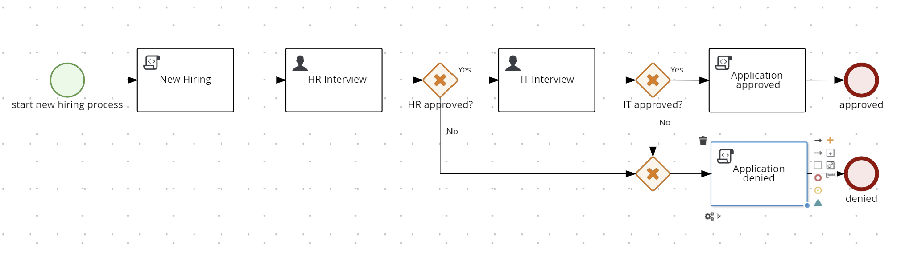
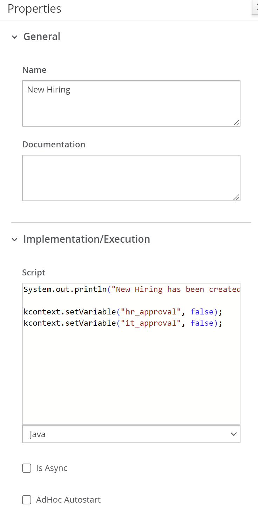
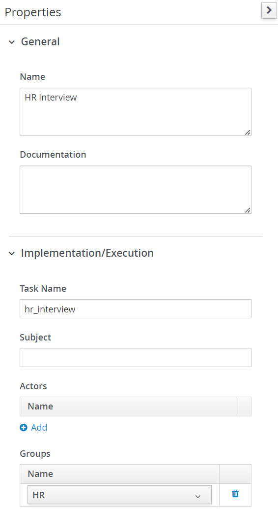
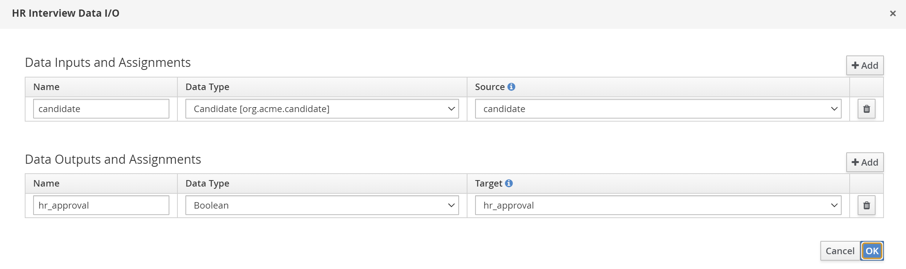
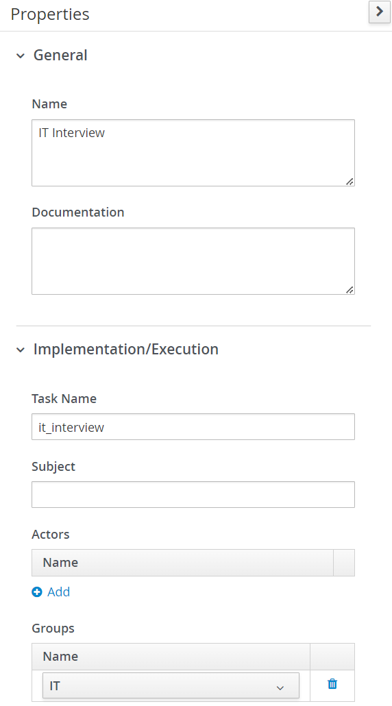
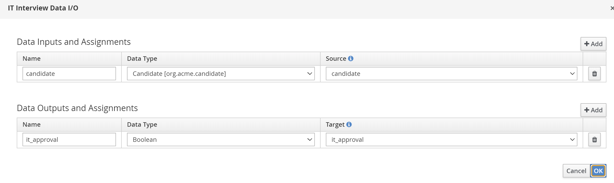
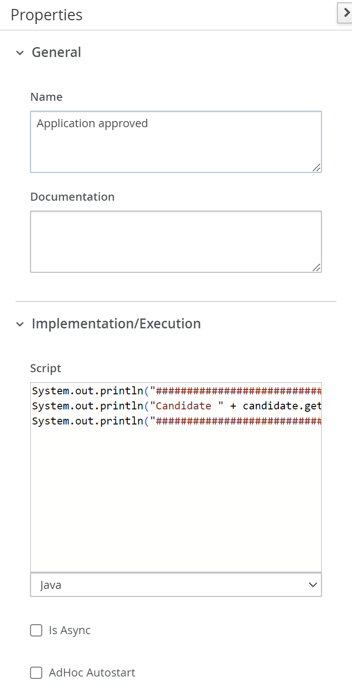
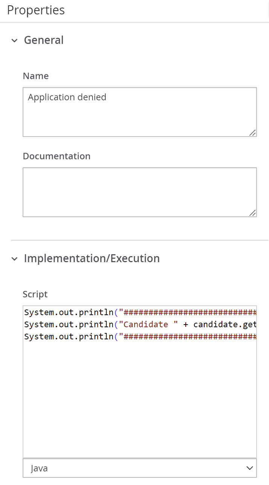

<!--
   Licensed to the Apache Software Foundation (ASF) under one
   or more contributor license agreements.  See the NOTICE file
   distributed with this work for additional information
   regarding copyright ownership.  The ASF licenses this file
   to you under the Apache License, Version 2.0 (the
   "License"); you may not use this file except in compliance
   with the License.  You may obtain a copy of the License at
     http://www.apache.org/licenses/LICENSE-2.0
   Unless required by applicable law or agreed to in writing,
   software distributed under the License is distributed on an
   "AS IS" BASIS, WITHOUT WARRANTIES OR CONDITIONS OF ANY
   KIND, either express or implied.  See the License for the
   specific language governing permissions and limitations
   under the License.
-->

# Example :: Process User Task Subsystem

## Description

This example demonstrates a Hiring Process workflow. It begins with a new hiring request, followed by sequential interviews with HR and IT departments. Each department assesses the candidate's suitability. Based on the evaluations, the process determines whether the candidate is approved or denied, leading to the corresponding end event.

- New Hiring Process Model
  <p align="center"></p>

### Key Steps:

**Start event**:

- The process is initiated with a _start event_ labeled "start new hiring process".

2. **New Hiring Task**:

- The initial task labeled "New Hiring" sets up the hiring procedure.

* New Hirining Properties (Top)
<p align="center"></p>

3. **HR Interview**:

- The first step is an HR Interview (User Task).
- After the interview, an exclusive gateway (HR approved?) is used to decide:
  - If "approved", the process moves to the IT interview.
  - If "not approved", the process ends with the "Application denied" task leading to the denied end event.

* HR Interview Properties (Top)
<p align="center"></p>

* HR InterviewAssignments
  <p align="center"></p>

4. **IT Interview**:

- If the candidate passes the HR interview, they proceed to the _IT Interview_ (User Task).
- Another exclusive gateway (IT approved?) determines the outcome:
  - If "approved", the process proceeds to an "Application approved" task, followed by an approved end event.
  - If "not approved", it moves to the "Application denied" task, leading to the denied end event.

* IT Interview Properties (Top)
  <p align="center"></p>

* IT InterviewAssignments
  <p align="center"></p>

5. **Application approved and Aplication Denied**:

- THis is the final task where the process can conclude in two ways:
  - _"approved"_: The candidate successfully completes both HR and IT interviews.
  - _"denied"_: The candidate fails either the HR or IT interview.

* Application Approved (Top)
<p align="center"></p>

* Application Denied (Top)
<p align="center"></p>

### Custom User Task assignment strategy

Apache KIE has a way to automatically assign User Tasks to a single user based on a defined logic, which is active by default. The default logic is very basic and doesn't cover real world business cases. This example shows how can you define your own logic. The `org.acme.candidate.CustomUserTaskAssignmentStrategyConfig.java` defines a simple logic assigning the User Task to an user based on the task name:

```java
@Override
  public Optional<String> computeAssigment(UserTaskInstance userTaskInstance, IdentityProvider identityProvider) {
      System.out.println("Computing assignment using custom User Task assignment strategy.");
      // Your custom logic goes here. For example:
      if ("hr_interview".equals(userTaskInstance.getTaskName())) {
          return Optional.of("recruiter");
      } else if ("it_interview".equals(userTaskInstance.getTaskName())) {
          return Optional.of("developer");
      } else {
          return Optional.empty();
      }
  }
```

If the task name is `hr_interview` the assigned user will be "recruiter". For the task `it_interview` the assigned user will be "developer". At least, if isn't any of this tasks, the method will not assign to any user.

## Running

### Prerequisites

- Java 17 installed
- Environment variable `JAVA_HOME` set accordingly
- Maven 3.9.6 installed
- Docker and Docker Compose to run the required example infrastructure.

### Compile and Run in local development mode

```sh
mvn clean compile quarkus:dev -Pdevelopment
```

NOTE: With dev mode of Quarkus you can take advantage of hot reload for business assets like processes, rules, decision tables and java code. No need to redeploy or restart your running application.

### Compile and Run in local JVM mode

```sh
mvn clean package
java -jar target/quarkus-app/quarkus-run.jar
```

or on Windows

```sh
mvn clean package
java -jar target\quarkus-app\quarkus-run.jar
```

### Package and Run in container mode

Running in container mode gives access to Apache KIE Management Console. First you need to have `Docker` and `Docker compose` installed. After it, build the project using the `container` profile:

```sh
mvn clean package -Pcontainer
```

Now, add an `.env` file with the content below:

```
PROJECT_VERSION=
MANAGEMENT_CONSOLE_IMAGE=
COMPOSE_PROFILES=
```

- `PROJECT_VERSION`: Should be set with the current Apache KIE version being used: `PROJECT_VERSION=`
- `MANAGEMENT_CONSOLE_IMAGE`: Should be set with the Apache KIE Management Console image `docker.io/apache/incubator-kie-kogito-management-console:main`
- `COMPOSE_PROFILES`: filters which services will run.

```
PROJECT_VERSION=0.0.0
MANAGEMENT_CONSOLE_IMAGE=docker.io/apache/incubator-kie-kogito-management-console:main
COMPOSE_PROFILES=container
```

Start PostgreSQL, pgAdmin, the user-tasks-susbystem business service and Apache KIE Management Console with the command below:

```sh
docker compose up
```

You can stop any time hiting `CMD/CTRL + C`, and to clean-up, removing all containers, use the command below:

```sh
docker compose down
```

To access Management Console open `http://localhost:8280` in your browser.

## Using

Once the business service is running, you can start a new process using the above `curl` command:

```sh
curl -X POST http://localhost:8080/hiring \
     -H "Content-Type: application/json" \
     -d '{
           "candidate": {
             "firstName": "John",
             "lastName": "Doe",
             "position": "Software Engineer"
           }
         }'
```

To get all processes use the GET request:

```sh
curl -X GET "http://localhost:8080/hiring"
```

Creating a new process will make the business service waits for an user from the group `HR` to complete the task. You can get all tasks from the `HR` group with the following curl command:

```sh
curl -X 'GET' \
  'http://localhost:8080/usertasks/instance?group=HR' \
  -H 'accept: application/json'
```

Alternatively, it's possible to filter the tasks assigned to an user:

```sh
curl -X 'GET' \
  'http://localhost:8080/usertasks/instance?user=recruiter' \
  -H 'accept: application/json'
```

Or even both, using both query params: `group=HR&user=recruiter`. This filter is available in all `usertasks` routes.

The `"id"` value retuned by these requests is used in the User Task API replacing the `taskId`:

```sh
curl -X 'POST' \
  'http://localhost:8080/usertasks/instance/{taskId}/transition?user=recruiter' \
  -H 'accept: application/json' \
  -H 'Content-Type: application/json' \
  -d '{
  "transitionId": "complete",
  "data": {
    "hr_approval": "true"
  }
}'
```

The above request will transition the task, advancing the process to the IT_Interview, which you can retrieve the new `id` (taskId) with:

```sh
curl -X 'GET' \
  'http://localhost:8080/usertasks/instance?group=IT' \
  -H 'accept: application/json'
```

NOTE: To check the available `transitionId` for the current user task, you can use the GET route:

```sh
curl -X 'GET' \
  'http://localhost:8080/usertasks/instance/{taskId}/transition?user=recruiter' \
  -H 'accept: application/json'
```

To change the inputs and outputs values of a task, it's possible to use the `inputs` and `outputs` route.

**Inputs**

```sh
curl -X 'PUT' \
  'http://localhost:8080/usertasks/instance/{taskId}/inputs?user=recruiter' \
  -H 'accept: application/json' \
  -H 'Content-Type: application/json' \
  -d '{
  "candidate": {
    "firstName": "Jane",
    "lastName": "Doe",
    "position": "Software Engineer"
  }
}'
```

**Outputs**

```sh
curl -X 'PUT' \
  'http://localhost:8080/usertasks/instance/{taskId}/outputs?user=recruiter' \
  -H 'accept: application/json' \
  -H 'Content-Type: application/json' \
  -d '{"hr_approval": true}'
```

Additionally, it's possible to attach document links and add comments on each task

**Attachment**:

```sh
curl -X 'POST' \
  'http://localhost:8080/usertasks/instance/{taskId}/attachments?user=recruiter' \
  -H 'accept: application/json' \
  -H 'Content-Type: application/json' \
  -d '{
  "uri": "https://google.com",
  "name": "Google"
}'
```

NOTE: The `GET`, `PUT` and `DELETE` HTTP methods are avaiable for this route.

**Comment**:

```sh
curl -X 'POST' \
  'http://localhost:8080/usertasks/instance/{taskId}/comments?user=recruiter' \
  -H 'accept: application/json' \
  -H 'Content-Type: application/json' \
  -d '{
  "comment": "My comment"
}'
```

NOTE: The `GET`, `PUT` and `DELETE` HTTP methods are avaiable for this route.

NOTE: If you have started the business service in development mode, you can check the entire API in the `localhost:8080/q/swagger-ui` route.

### OpenAPI (Swagger) documentation

[Specification at swagger.io](https://swagger.io/docs/specification/about/)

You can take a look at the [OpenAPI definition](http://localhost:8080/openapi?format=json) - automatically generated and included in this service - to determine all available operations exposed by this service. For easy readability you can visualize the OpenAPI definition file using a UI tool like for example available [Swagger UI](https://editor.swagger.io).

In addition, various clients to interact with this service can be easily generated using this OpenAPI definition.

When running in either Quarkus Development or Native mode, we also leverage the [Quarkus OpenAPI extension](https://quarkus.io/guides/openapi-swaggerui#use-swagger-ui-for-development) that exposes http://localhost:8080/q/swagger-ui/ that you can use to look at available REST endpoints and send test requests.

---

Apache KIE (incubating) is an effort undergoing incubation at The Apache Software
Foundation (ASF), sponsored by the name of Apache Incubator. Incubation is
required of all newly accepted projects until a further review indicates that
the infrastructure, communications, and decision making process have stabilized
in a manner consistent with other successful ASF projects. While incubation
status is not necessarily a reflection of the completeness or stability of the
code, it does indicate that the project has yet to be fully endorsed by the ASF.

Some of the incubating project’s releases may not be fully compliant with ASF
policy. For example, releases may have incomplete or un-reviewed licensing
conditions. What follows is a list of known issues the project is currently
aware of (note that this list, by definition, is likely to be incomplete):

- Hibernate, an LGPL project, is being used. Hibernate is in the process of
  relicensing to ASL v2
- Some files, particularly test files, and those not supporting comments, may
  be missing the ASF Licensing Header

If you are planning to incorporate this work into your product/project, please
be aware that you will need to conduct a thorough licensing review to determine
the overall implications of including this work. For the current status of this
project through the Apache Incubator visit:
https://incubator.apache.org/projects/kie.html
