<!--
   Licensed to the Apache Software Foundation (ASF) under one
   or more contributor license agreements.  See the NOTICE file
   distributed with this work for additional information
   regarding copyright ownership.  The ASF licenses this file
   to you under the Apache License, Version 2.0 (the
   "License"); you may not use this file except in compliance
   with the License.  You may obtain a copy of the License at
     http://www.apache.org/licenses/LICENSE-2.0
   Unless required by applicable law or agreed to in writing,
   software distributed under the License is distributed on an
   "AS IS" BASIS, WITHOUT WARRANTIES OR CONDITIONS OF ANY
   KIND, either express or implied.  See the License for the
   specific language governing permissions and limitations
   under the License.
-->

# @kie-tools/bpmn-editor :: MIGRATION GUIDE

## Overview

The Apache KIE BPMN Editor has been rewritten. The **Classic BPMN Editor** (Stunner/GWT-based, last available in Apache KIE 10.1) has been replaced by the **New BPMN Editor** (React/ReactFlow-based, available from Apache KIE 10.2+).

The New BPMN Editor provides:

- React and ReactFlow technology stack
- Grid snapping and infinite canvas
- Multi-node selection
- Best-effort backwards compatibility with Classic Editor files

---

## Key UI/UX Differences

### 1. Canvas and Navigation

| Feature         | Classic Editor               | New Editor                     |
| --------------- | ---------------------------- | ------------------------------ |
| **Canvas Type** | Fixed canvas with scrollbars | Infinite canvas                |
| **Zoom**        | Toolbar buttons              | Mouse wheel + toolbar controls |
| **Pan**         | Scrollbars                   | Drag canvas background         |

---

### 2. Palette and Node Creation

| Feature          | Classic Editor            | New Editor                     |
| ---------------- | ------------------------- | ------------------------------ |
| **Custom Tasks** | Mixed with standard tasks | Dedicated "Custom Tasks" panel |

**Palette Panel Icons:**

- Start Events
- Intermediate Catch Events
- Intermediate Throw Events
- End Events
- Tasks
- Call Activity
- Sub-processes
- Gateways
- Lanes
- Data Object
- Group
- Text Annotation
- Custom Tasks

---

### 3. Properties Panel

**Properties Panel Sections:**

- Element Properties (Name, Documentation, ID)
- Execution Properties (Async, Multi-instance, SLA)
- Data Mapping
- Scripts (onEntry/onExit)
- Notifications
- Reassignments
- Variables
- Metadata

---

### 4. Left Sidebar Panels (New)

#### Process Variables Panel

**Location**: Left sidebar, first icon

Dedicated panel for managing process variables with data types and custom tags.

**Classic Editor**: Variables managed in Properties panel
**New Editor**: Dedicated panel

#### Correlations Panel

**Location**: Left sidebar, second icon

Manage message correlations:

- Correlation Properties
- Correlation Keys
- Message Bindings
- Subscriptions

**Classic Editor**: Correlations accessed via "Collaboration" section in Properties panel, opened through "Correlations" button in a modal dialog
**New Editor**: Dedicated left sidebar panel with tabbed interface (Properties tab and Keys tab)

#### Properties Management Panel

**Location**: Left sidebar, third icon

Centralized management for:

- Data Types
- Messages
- Signals
- Escalations
- Errors

**Classic Editor**: Scattered across dialogs
**New Editor**: Single panel

---

### 5. Selection and Multi-Selection

| Feature             | Classic Editor         | New Editor                           |
| ------------------- | ---------------------- | ------------------------------------ |
| **Multi-Selection** | Ctrl+Click or drag box | Drag box                             |
| **Bulk Operations** | Limited                | Delete, copy, move multiple elements |

**Note**: Properties panel shows "Multiple nodes selected (N)" when multiple elements are selected. Cannot edit properties when both nodes and edges are selected.

---

### 6. Global Properties

| Feature                | Classic Editor     | New Editor                  |
| ---------------------- | ------------------ | --------------------------- |
| **Process Properties** | Single form        | Expandable sections         |
| **ID & Namespace**     | Basic input fields | Copy and regenerate buttons |

**Sections:**

- Process (Name, Documentation, Type, Executable, Ad-hoc)
- ID & Namespace (with copy/regenerate)
- Misc (Expression language, Package name, Version, Process Instance Description)

---

### 7. Keyboard Shortcuts

Standard shortcuts remain the same (Ctrl+Z, Ctrl+C, Ctrl+V, Delete, etc.).

**New**:

- Mouse wheel for zoom (in addition to Ctrl+/-)
- Toggle Properties panel

---

## Common Tasks

### Creating a New Process

**New Editor**: When opening an empty BPMN file, a "Create Your BPMN Process" dialog appears. Enter a Process ID (required, no spaces) and click "Start Modeling".

### Working with Process Variables

**Classic Editor**: Variables managed in Properties panel when canvas background is selected.

**New Editor**: Click Variables icon (left sidebar, first icon) to open dedicated panel. Click "Add Variable" to create new variables with data types and tags.

### Managing Correlations

**New Editor**: Click Correlations icon (left sidebar, second icon). Use Properties tab for Correlation Properties and Message Bindings. Use Keys tab for Correlation Keys and Subscriptions.

### Defining Reusable Properties

**New Editor**: Click Properties Management icon (left sidebar, third icon). Tabs available for Data Types, Messages, Signals, Escalations, and Errors.

---

## Step-by-Step Walkthrough: Recreating a BPMN Process

This section demonstrates how to recreate a complete BPMN process in the New Editor, highlighting differences from the Classic Editor workflow.

### Example Process: Employee Onboarding

We'll create a simple employee onboarding process with:

- Start Event: "Application Received"
- User Task: "HR Review Application"
- Business Rule Task: "Background Check"
- Exclusive Gateway: "Check Passed?"
- Two End Events: "Onboarding Complete" (success) and "Application Rejected" (failure)

### Step 1: Create New Process

**Classic Editor:**

1. Open new .bpmn file
2. Process is auto-created with default ID
3. Canvas is immediately ready

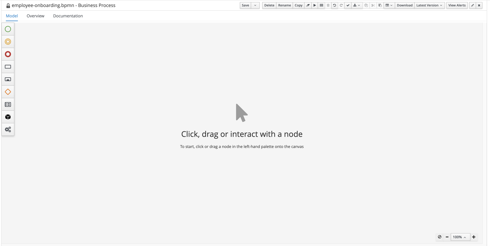

**New Editor:**

1. Open new .bpmn file
2. "Create Your BPMN Process" dialog appears
3. Enter Process ID: `employee-onboarding` (no spaces allowed)
4. Click "Start Modeling"
5. Canvas becomes active

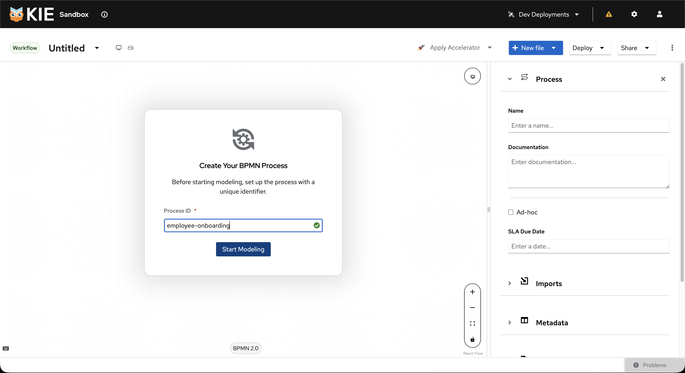

**Differences Encountered:**

- New Editor requires explicit Process ID before modeling
- Process ID validation prevents spaces (Classic Editor allowed spaces)
- Dialog step adds one extra interaction but ensures valid Process ID upfront

### Step 2: Set Process Properties

**Classic Editor:**

1. Click canvas background
2. Properties panel shows Process tab
3. Fill in Name: "Employee Onboarding"
4. Set Package: "com.company.hr"
5. Set Version: "1.0"
6. Check "Executable" checkbox

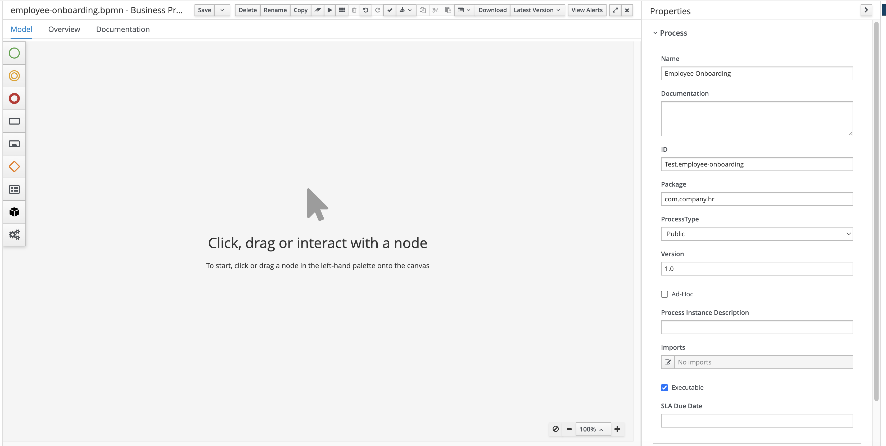

**New Editor:**

1. Click canvas background
2. Properties panel opens on right
3. Expand "Process" section
4. Fill in Name: "Employee Onboarding"
5. Expand "Misc" section
6. Set Package name: "com.company.hr"
7. Set Version: "1.0"
8. Check "Executable" checkbox

&nbsp;
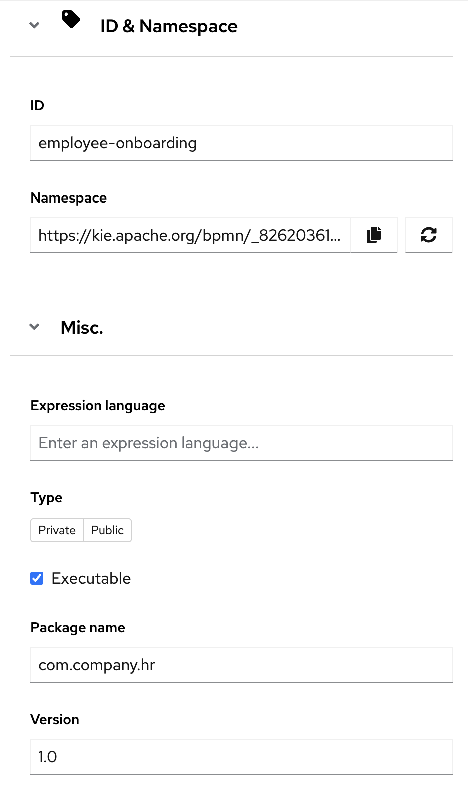

&nbsp;

**Differences Encountered:**

- Properties organized in expandable sections instead of tabs
- "Package name" field in "Misc" section (was in main Process tab)
- Must expand sections to access fields (Classic showed all at once)

### Step 3: Add Process Variables

**Classic Editor:**

1. Click canvas background
2. Find "Process Variables" section in properties
3. Click "+" to add variable
4. Enter Name: "employeeData"
5. Data Type field: Free-text input
   - Can type any value: "String", "com.company.Employee", "java.util.List"
   - No validation or dropdown
6. Add another variable:
   - Name: `result`
   - Data Type: `String`

&nbsp;
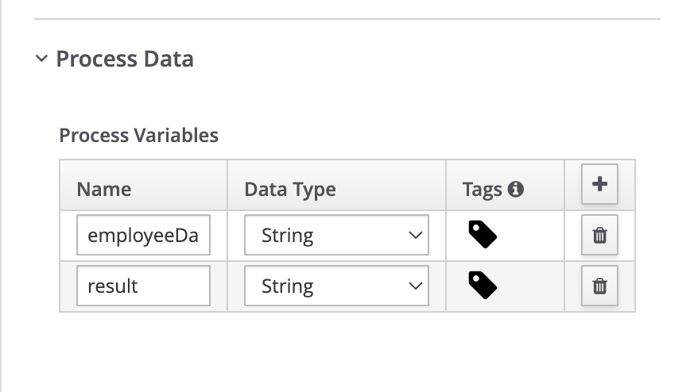
&nbsp;

**New Editor:**

1. Click Process Variables icon (left sidebar, first icon)
2. Dedicated Variables panel opens
3. Click "Add Variable" button
4. Enter Name: "employeeData"
5. Data Type dropdown shows:
   - **Built-in types**: Boolean, Float, Integer, Object, String
   - **Custom types** (if defined in Properties Management panel)
   - Option to "Create Data Type" (adds to Properties Management)
6. Select "String" from dropdown
7. Add Tags if needed (e.g., "input", "required")
8. Variable appears in list
9. Add another variable:
   - Name: `result`
   - Data Type: `String`
   - Tags: "output"
10. Close panel by clicking icon again

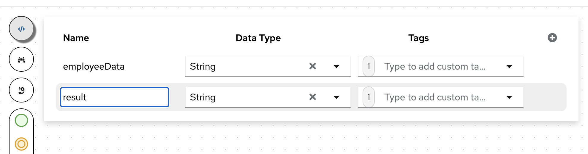

**Differences Encountered:**

- **Data Type Input**: Free-text (Classic) vs. Dropdown with validation (New)
- **Type Safety**: New Editor validates against defined types
- **Custom Types**: Must be defined in Properties Management panel first in New Editor
- Dedicated panel instead of inline properties
- Tags feature for categorizing variables (new)
- Better overview of all variables in one place
- Panel can stay open while working on canvas

**Important Note on Data Types:**

- **Classic Editor**: Accepts any string as data type, no validation
- **New Editor**: Requires types to be defined in Properties Management panel (Data Types tab) before use, or select from built-in types (Boolean, Float, Integer, Object, String)

**Why Define Variables Early:**

- Variables must exist before they can be used in data mappings (Step 9)
- Defining them early ensures they're available in dropdowns throughout the process
- Prevents errors when configuring task inputs/outputs

### Step 4: Add Start Event

**Classic Editor:**

1. Drag "Start" from palette panel to canvas
2. In the Properties panel set Name: "Application Received"

**New Editor:**

1. Drag "Start" from palette panel to canvas
2. In the Properties panel set Name: "Application Received"

### Step 5: Add User Task (HR Review)

**Classic Editor:**

1. Drag "Task" from palette panel to canvas
2. Morph to "User Task"
3. In the Properties panel set Name: "HR Review Application"
4. Find "Task Name" field
5. Set Task Name: "ReviewApplication"
6. Find "Actors" field
7. Set Actors: "hr" (or multiple: "hr,manager")

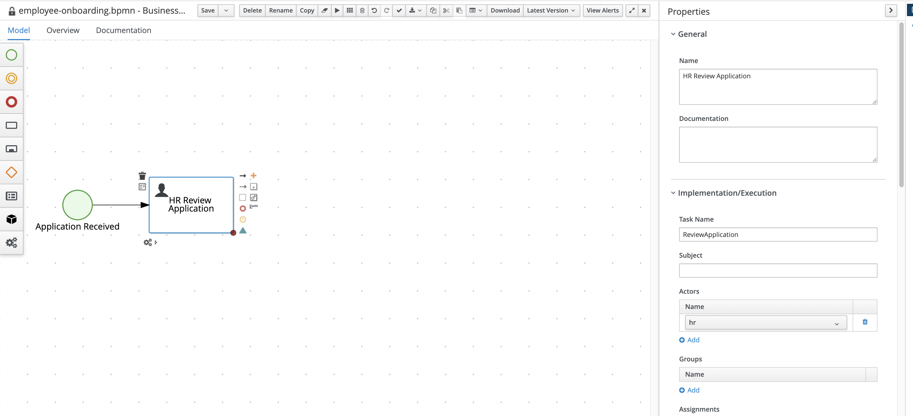

**New Editor:**

1. Drag and Drop "Task" to canvas
2. Morph to "User Task"
3. In the Properties panel set Name: "HR Review Application"
4. Find "Task Name" field
5. Set Task Name: "ReviewApplication"
6. Find "Implementation/Execution" dropdown
7. Find "Actors" field (plain text input)
8. Type actors directly: "hr"
   - For multiple actors, use comma-separated values: "hr,manager,admin"

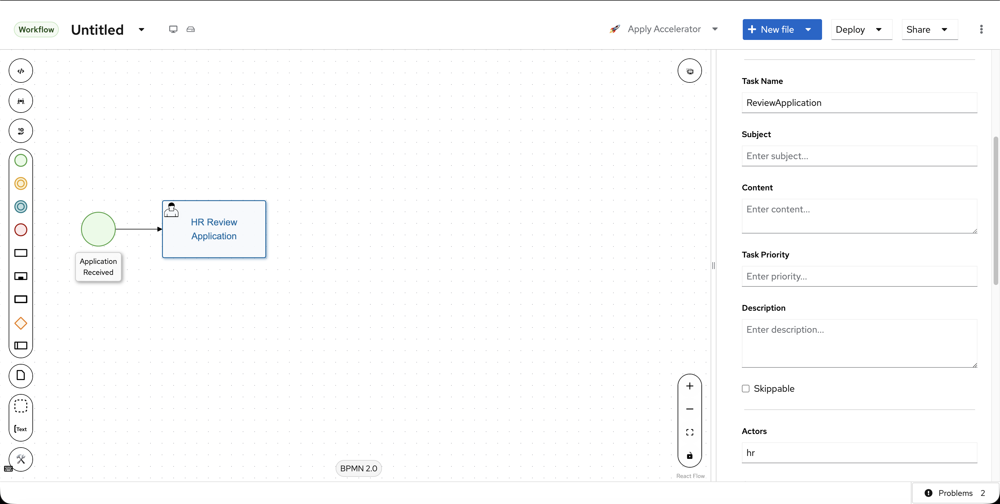

**Differences Encountered:**

- **Actors field**: Plain text input in both editors, comma-separated for multiple actors
- **No actor selection UI**: Both editors use simple text input (not a dropdown or selector)

### Step 6: Add Business Rule Task

**Classic Editor:**

1. Drag "Task" from palette panel to canvas
2. Morph to "Business Rule Task"
3. In the Properties panel set Name: "Background Check"
4. Find "Implementation/Execution" dropdown
5. Select "DMN"
6. Set DMN Model Name: "BackgroundCheckDecision"
7. Set DMN Namespace: "https://company.com/dmn"

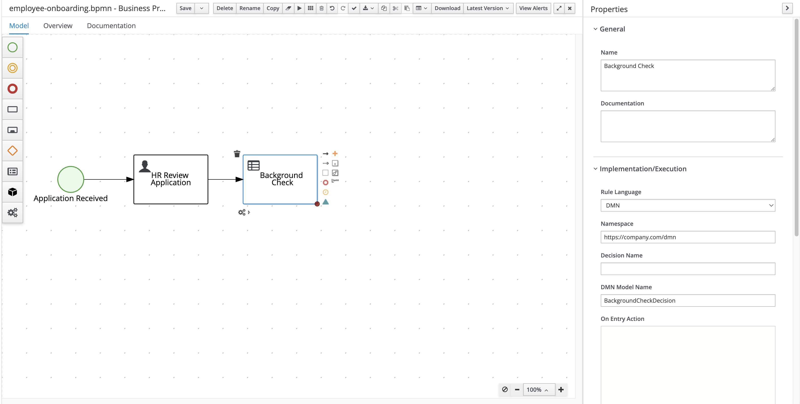

**New Editor:**

1. Drag "Task" from palette panel, morph to "Business Rule Task"
2. Set Name: "Background Check"
3. Find "Implementation" section
4. Select "DMN" radio button
5. Enter:
   - DMN model name: "BackgroundCheckDecision"
   - DMN model namespace: "https://company.com/dmn"

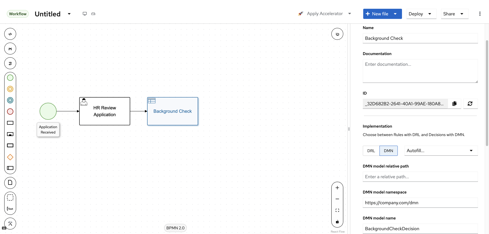

### Step 7: Add Exclusive Gateway and Diverging Paths

**Classic Editor:**

1. Drag "Gateway" from palette panel to canvas
2. Morph to "Exclusive"
3. In the Properties panel set Name: "Check Passed?"
4. Connect Background Check task to gateway:
   - Click Background Check task
   - Drag connector to gateway
5. Add two End Events for the diverging paths:
   - Drag "End Event" from palette panel (for "Passed" path)
   - In the Properties panel set Name: "Onboarding Complete"
   - Drag another "End Event" (for "Failed" path)
   - In the Properties panel set Name: "Application Rejected"
6. Connect gateway to both End Events:
   - From gateway to "Onboarding Complete" end event
   - From gateway to "Application Rejected" end event

**New Editor:**

1. Drag "Gateways" from palette panel, morph to "Exclusive"
2. Set Name: "Check Passed?"
3. Hover over Background Check task to see connection handles
4. Drag from handle to gateway
5. Add two End Events for the diverging paths:
   - Click "End Events" icon in palette panel
   - Drag "End Event" (for "Passed" path)
   - Set Name: "Onboarding Complete"
   - Drag another "End Event" (for "Failed" path)
   - Set Name: "Application Rejected"
6. Connect gateway to both End Events:
   - Hover over gateway, drag handle to "Onboarding Complete"
   - Hover over gateway, drag handle to "Application Rejected"

### Step 8: Add Conditional Expressions to Sequence Flows

**Classic Editor:**

1. Select sequence flow from gateway to "Employee Hired" end event
2. In properties, find "Condition" field
3. Language selector dropdown available with options: **Java, MVEL, DROOLS, FEEL**
4. Select language from dropdown (Default - Java)
5. Plain text input field for expression
6. Enter expression: `return result.equals("PASS");`
7. Repeat for sequence flow to "Application Rejected":
   - Select the other sequence flow from gateway
   - Select language from dropdown
   - Enter expression: `return result.equals("FAIL");`

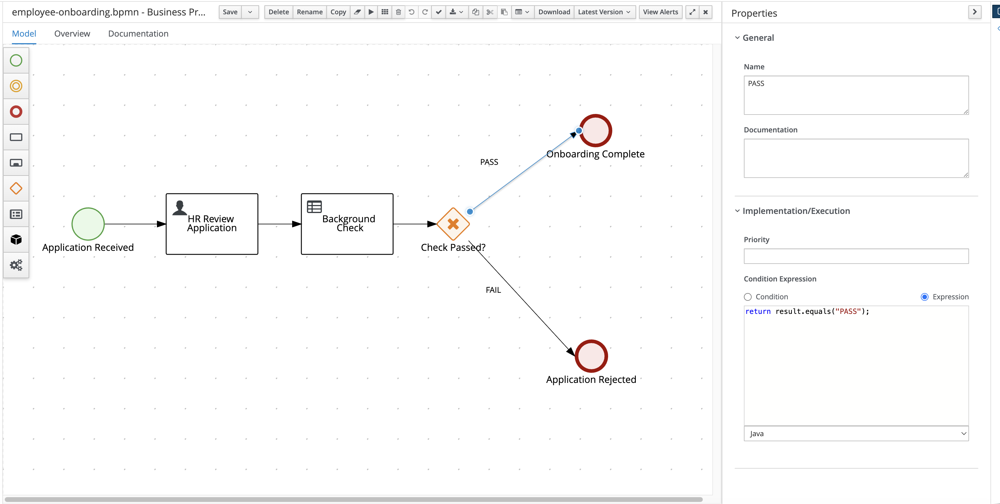

**New Editor:**

1. Click sequence flow from gateway to "Employee Hired" end event
2. Properties panel opens
3. Find "Conditional Expression" section
4. Code editor appears with language label showing: **Java** (fixed, not selectable)
5. Enter expression: `return result.equals("PASS");`
6. Code editor provides:
   - Syntax highlighting
   - Multi-line support
   - Better formatting
7. Repeat for sequence flow to "Application Rejected":
   - Click the other sequence flow from gateway
   - Enter expression: `return result.equals("FAIL");`

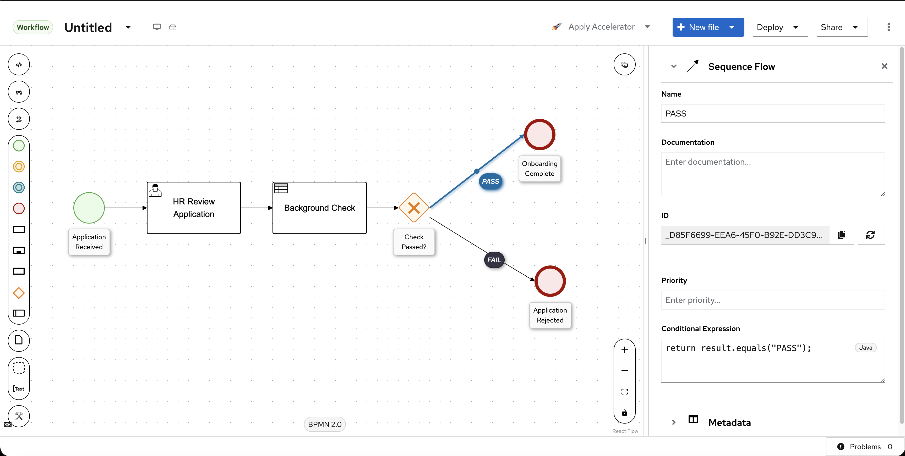

**Differences Encountered:**

- **Expression Languages**: Classic Editor has dropdown to select Java, MVEL, DROOLS, FEEL; New Editor shows **Java only** (fixed label, no dropdown)
- **Important**: New Editor only supports Java for conditional expressions on sequence flows

**Expression Syntax Examples:**

- **Java** (default): `return approved;` or `return score > 80;` or `return status.equals("APPROVED");`
- **Boolean logic**: `return hr_approval && it_approval;`
- **Null checks**: `return candidate != null && candidate.getExperience() > 5;`
- **String comparison**: `return result.equals("PASS");` (not `result == "PASS"`)

### Step 9: Set Default Route on Gateway

**Classic Editor:**

1. Select gateway
2. Find "Default Route" dropdown in properties
3. Select the "Failed" sequence flow from list

**New Editor:**

1. Select gateway
2. Find "Default route" section in properties
3. Dropdown shows available outgoing flows
4. Select "Failed" sequence flow

### Step 10: Configure Data Mapping for User Task

**Classic Editor:**

1. Select User Task
2. Find "Data Inputs and Assignments" section
3. Add input mapping inline:
   - Name: `employeeData` (task input variable)
   - Source: `employeeData` (process variable to map from)
4. Add output mapping inline:
   - Name: `decision` (task output variable)
   - Target: `result` (process variable to map to)

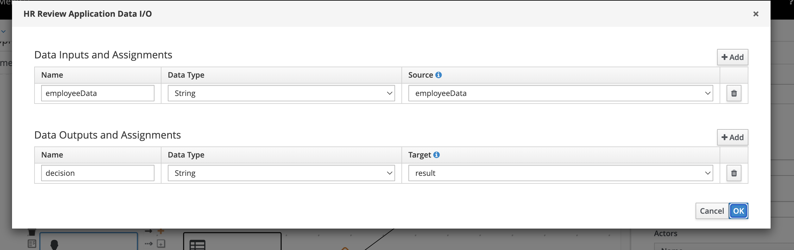

**New Editor:**

1. Select User Task
2. In the Properties panel scroll to "Data Mapping" section
3. Click on the "Data Mapping" section header (with edit icon)
4. Modal opens: "HR Review Application Data I/O"
5. In "Data Inputs and Assignments" section:
   - Click "+" button
   - Name: `employeeData` (task input variable)
   - Data Type: String
   - Source: Select `employeeData` from dropdown (process variable)
6. In "Data Outputs and Assignments" section:
   - Click "+" button
   - Name: `decision` (task output variable)
   - Data Type: String
   - Target: Select `result` from dropdown (process variable)
7. Click "OK" to save

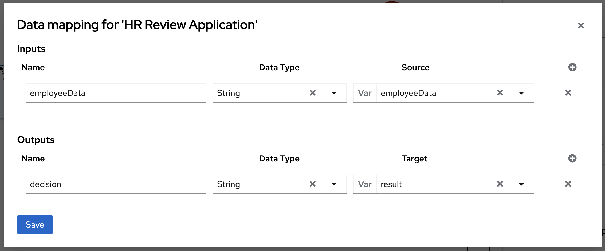

**Data Mapping Explained:**

- **Input mapping**: Brings data INTO the task
  - Name: The variable name inside the task
  - Source: The process variable to read from
  - Example: Task input `employeeData` <- Process variable `employeeData`
- **Output mapping**: Sends data OUT from the task
  - Name: The variable name produced by the task
  - Target: The process variable to write to
  - Example: Task output `decision` -> Process variable `result`

### Step 11: Add Notifications to User Task

**Classic Editor:**

1. Select User Task
2. Find "Notifications" section in Properties panel
3. Click on the "Notifications" section header
4. Modal opens: "Notification"
5. Configure notification:
   - **Task state type**: Select "Not started (Created, ready or reserved)" radio button
   - **Task expiration definition**: Select "Time period" from dropdown
   - **Notify**: Enter "2" and select "hours" from dropdown (for 2h)
   - **Notification repeat**: Leave as "No"
6. Configure message:
   - **From**: Enter sender (optional)
   - **Reply to**: Enter reply-to address (optional)
   - **To: user(s)**: Enter "hr" (comma-separated for multiple users)
   - **To: group(s)**: Enter group names (comma-separated, optional)
   - **To: email(s)**: Enter email addresses separated by comma (optional)
   - **Subject**: Enter "Review Pending"
   - **Body**: Enter notification message (optional)
7. Click "Ok" to save

&nbsp;
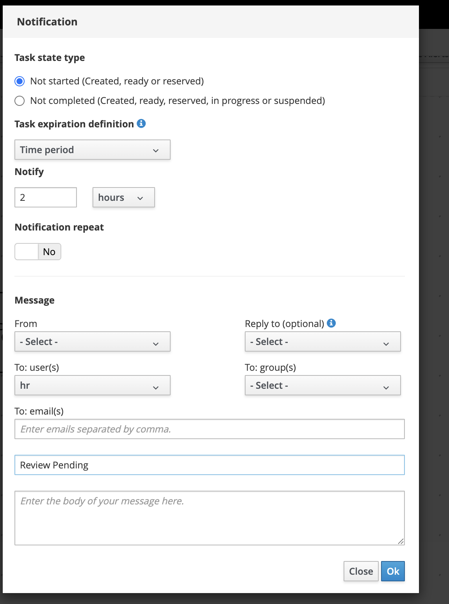
&nbsp;

**New Editor:**

1. Select User Task
2. Find "Notifications" section in Properties panel
3. Click on the "Notifications" section header (with edit icon)
4. Modal opens: "Notifications" with table interface
5. Click "+ Add" button (top right) to add a notification
6. Fill in the table row with inline fields:
   - **Type**: Select "Not Started" from dropdown
   - **Expires at**: Enter "2h"
   - **From**: Enter sender (optional, placeholder: "From...")
   - **To: user(s)**: Enter "hr" (text input)
   - **To: group(s)**: Enter group names (optional, placeholder: "To Groups...")
   - **To: email(s)**: Enter email addresses (optional, placeholder: "To Emails...")
   - **Reply to**: Enter reply-to address (optional, placeholder: "Reply to...")
   - **Subject**: Enter "Review Pen..." (shows truncated in table)
   - **Body**: Enter notification message (optional, placeholder: "Body...")
7. Click "Save" button at bottom

&nbsp;
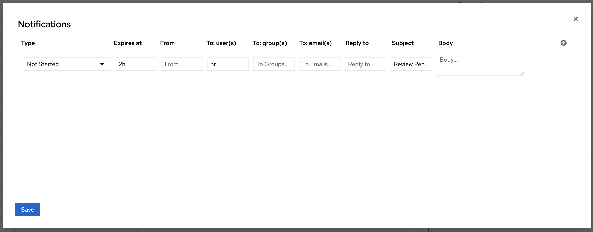
&nbsp;

### Step 12: Save and Verify

**Classic Editor:**

1. Click Save button or use Ctrl+S
2. File saved as .bpmn XML

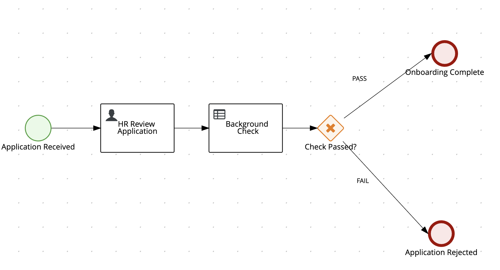

**New Editor:**

1. Click Save button or use Ctrl+S
2. File saved as .bpmn XML
3. Verify BPMN 2.0 compliance maintained

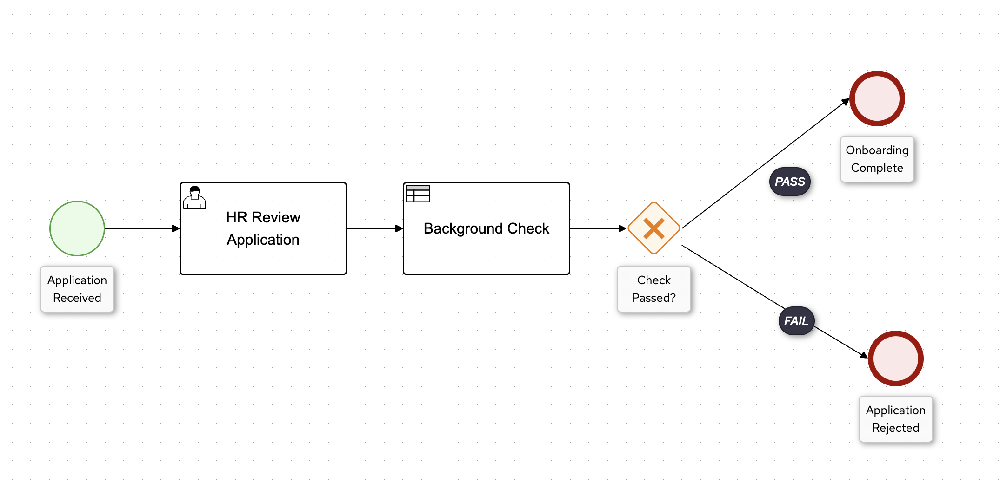

**Differences Encountered:**

- Same save workflow
- Both editors produce valid BPMN 2.0 XML
- New Editor files can be opened in Classic Editor (backwards compatible)

### Common Issues During Recreation

**Issue 1: Process ID with Spaces**

- **Classic Editor**: Allowed spaces in Process ID
- **New Editor**: Rejects spaces, shows validation error
- **Solution**: Use hyphens or camelCase (e.g., `employee-onboarding` or `employeeOnboarding`)

**Issue 2: Variables Not Available in Dropdowns**

- **Classic Editor**: Variables defined inline
- **New Editor**: Variables in separate panel
- **Solution**: Define variables in Variables panel first, then use in data mappings

**Issue 3: Custom Data Types Not Available**

- **Classic Editor**: Free-text data type entry
- **New Editor**: Must define in Properties Management panel first
- **Solution**:
  1. Click Properties Management icon (left sidebar, third icon)
  2. Go to "Data Types" tab
  3. Click "Add Data Type" button
  4. Enter custom type (e.g., "com.company.Employee")
  5. Then use in variable definitions
- **Built-in types available**: Boolean, Float, Integer, Object, String

**Issue 4: Script Language Not Supported**

- **Classic Editor**: May have supported multiple script languages
- **New Editor**: Only Java supported for Script Tasks and onEntry/onExit scripts
- **Solution**: Convert all scripts to Java
- **Affected areas**: Script Task, onEntry scripts, onExit scripts

---

## Key Changes Summary

### Technology

- GWT/Stunner -> React/ReactFlow
- Tabbed properties -> Expandable sections
- Fixed canvas -> Infinite canvas with grid snapping

### New Features

- Dedicated panels for Variables, Correlations, and Properties Management
- Node morphing panel
- Grid snapping
- Multi-selection with Shift+Click

### Changed Workflows

- Variables: Now in dedicated left sidebar panel
- Data Mapping/Notifications/Reassignments: Click section header to open modal
- Multi-selection: Shift+Click instead of Ctrl+Click
- Properties panel: Collapsible with toggle button

---

## Notes

- The New BPMN Editor provides best-effort backwards compatibility with Classic Editor files
- Review properties after opening Classic Editor files to ensure correct migration
- Use version control to maintain backups during the Technology Preview phase
