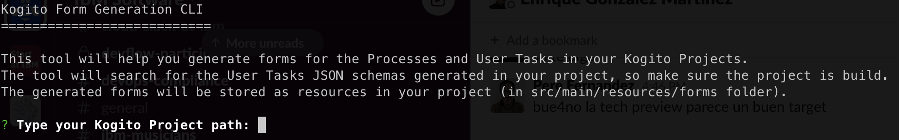
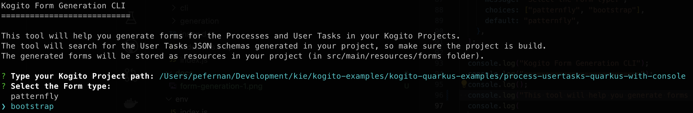
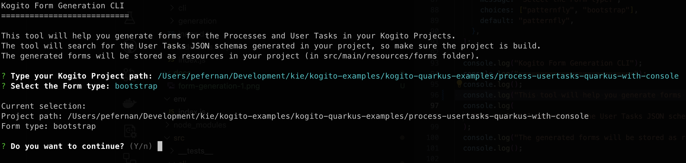
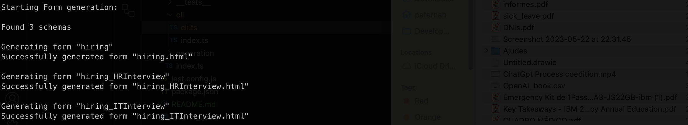
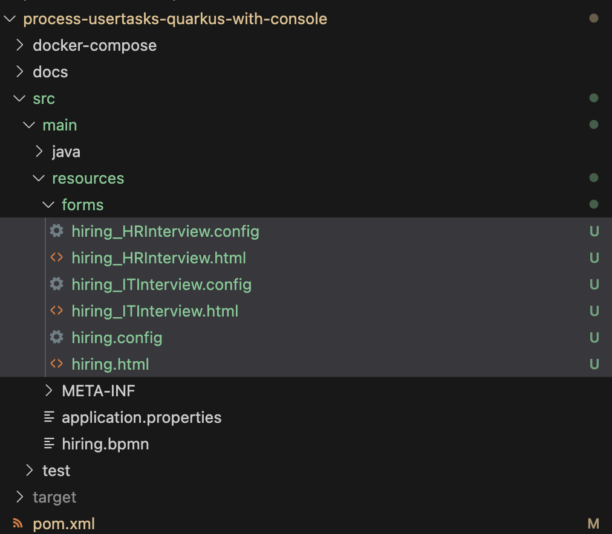

<!--
   Licensed to the Apache Software Foundation (ASF) under one
   or more contributor license agreements.  See the NOTICE file
   distributed with this work for additional information
   regarding copyright ownership.  The ASF licenses this file
   to you under the Apache License, Version 2.0 (the
   "License"); you may not use this file except in compliance
   with the License.  You may obtain a copy of the License at
     http://www.apache.org/licenses/LICENSE-2.0
   Unless required by applicable law or agreed to in writing,
   software distributed under the License is distributed on an
   "AS IS" BASIS, WITHOUT WARRANTIES OR CONDITIONS OF ANY
   KIND, either express or implied.  See the License for the
   specific language governing permissions and limitations
   under the License.
-->

## Form Generation Tool

This is a utility CLI to help generating forms in differents formats for BPMN processes and User Tasks in your Kogito projects.

### How does it work?

When building a Kogito project, Kogito generates JSON schemas to represent the data models for both Processes and User Tasks.

This tool locates those JSON Schemas in the project and taking advantage of the [Uniforms](https://uniforms.tools) APIs, processes them and generate static forms as a resources in the project `src/main/resoures/form` folder.

### Form Types

There are two types of form supported with differnt styling and output format:

- **Patternfly**: generates a React (`.tsx`) forms using Patternfly 4 components. Implementation can be found in `@kie-tools/uniforms-patternfly-codegen`

- **Bootstrap 4**: generates a HTML (`.html`) forms using Bootstrap 4 styling.

Each generated form consist in two files, the source code (`.tsx` or `.html`) and a companion `.config` file that defines the external resources (`css` / `js`) the form may need.

## Build

In order to build the CLI you must run the following command in the root folder of the repository:

```shell script
pnpm -F @kie-tools/form-generation-tool... build:prod
```

After the command has finished, go to `packages/form-generation-tool/dist` folder and you'll find the CLI binary (`form-generation-cli-macos`, `form-generation-cli-linux` or `form-generation-cli-win.exe` depending on your OS).

## Running the CLI

If you built the `form-generation-tool` package as described above locally, then in the command line just execute the CLI binary:

```shell script
./form-generation-cli-linux
```

For those, who do not want to build `form-generation-tool` package locally, they can install last published version and then run it:

```shell script
npm i -g @kie-tools/form-generation-tool
form-generation-tool
```

For those, who want to try `form-generation-tool` without instalation they can start it as:

```shell script
npx @kie-tools/form-generation-tool
```

All commands will start a wizard to help you generate the forms:

1. First set the path to your Kogito Project.



> **ℹ️ NOTE:** Make sure your Kogito project has been compiled, otherwhise the CLI won't be able to find all the form schemas.

2. Select one of the availables the Form types (Patternfly or Bootstrap 4).



3. Confirm Selection to start the Form Generation process.



4. If the Form generation process is succesful, you'll get a confirmation message.



The generated forms will be stored in the `src/main/resources/forms` folder of the Kogito project.



## Using the Custom Forms with Runtime Tools Quarkus Extension

If your project is a Quarkus based Kogito project, you can use and test them by using the **Runtime Tools Quarkus Extension**.

To do so, just add the following dependency in your project `pom.xml`:

```xml
<dependency>
  <groupId>org.kie.kogito</groupId>
  <artifactId>runtime-tools-quarkus-extension</artifactId>
  <version>${version}</version>
</dependency>
```

And start the project in Dev mode with the command:

```shell script
mvn clean quarkus:dev
```

For more information on how to setup the **Runtime Tools Quarkus Extension** in your project look at the oficial Kogito [documentation](https://docs.kogito.kie.org/latest/html_single/#con-runtime-tools-dev-ui_kogito-developing-process-services).

---

Apache KIE (incubating) is an effort undergoing incubation at The Apache Software
Foundation (ASF), sponsored by the name of Apache Incubator. Incubation is
required of all newly accepted projects until a further review indicates that
the infrastructure, communications, and decision making process have stabilized
in a manner consistent with other successful ASF projects. While incubation
status is not necessarily a reflection of the completeness or stability of the
code, it does indicate that the project has yet to be fully endorsed by the ASF.

Some of the incubating project’s releases may not be fully compliant with ASF
policy. For example, releases may have incomplete or un-reviewed licensing
conditions. What follows is a list of known issues the project is currently
aware of (note that this list, by definition, is likely to be incomplete):

- Hibernate, an LGPL project, is being used. Hibernate is in the process of
  relicensing to ASL v2
- Some files, particularly test files, and those not supporting comments, may
  be missing the ASF Licensing Header

If you are planning to incorporate this work into your product/project, please
be aware that you will need to conduct a thorough licensing review to determine
the overall implications of including this work. For the current status of this
project through the Apache Incubator visit:
https://incubator.apache.org/projects/kie.html
