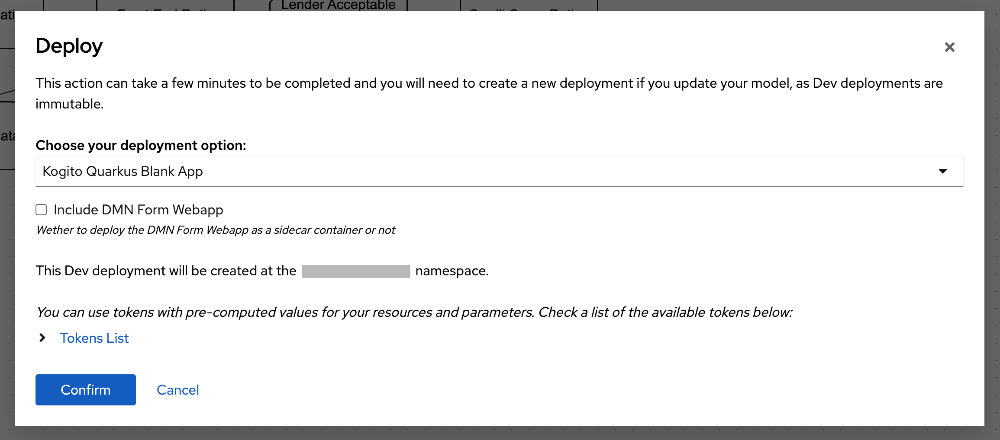
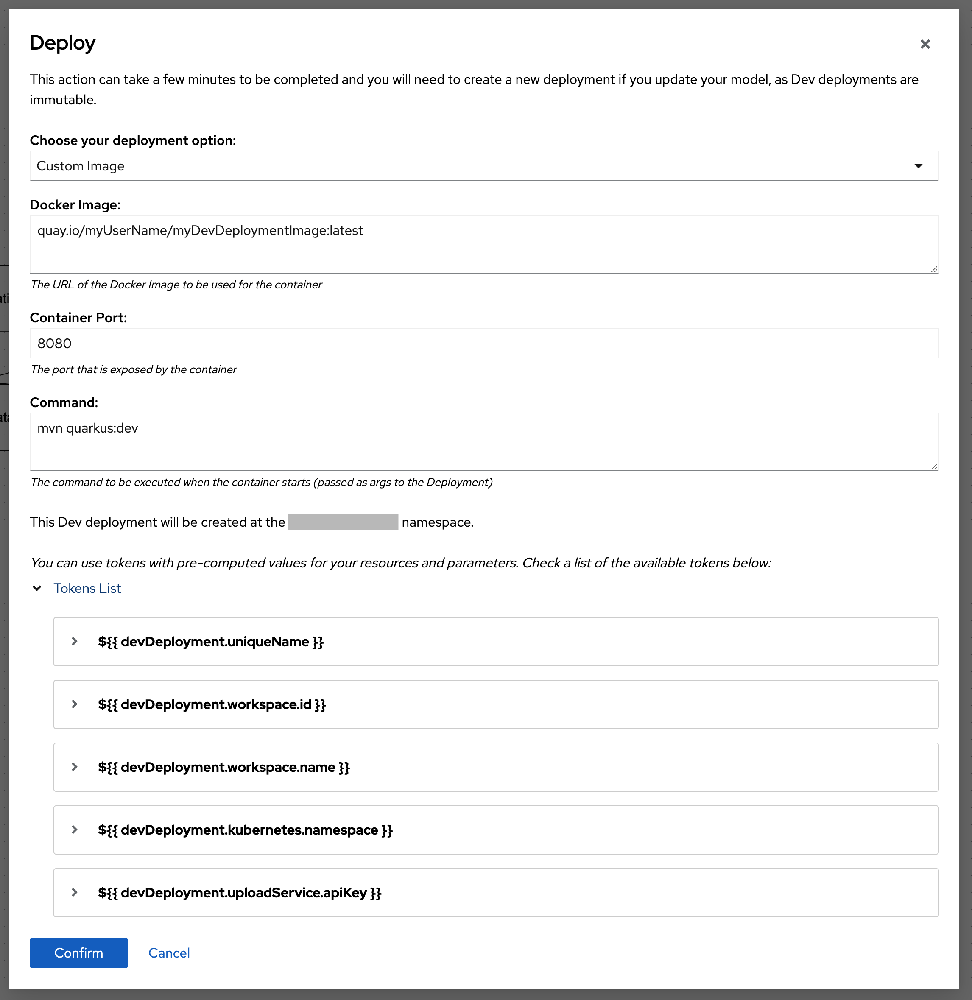
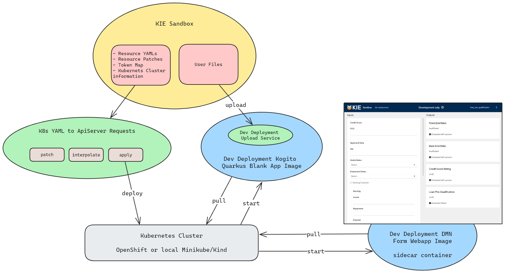

<!--
   Licensed to the Apache Software Foundation (ASF) under one
   or more contributor license agreements.  See the NOTICE file
   distributed with this work for additional information
   regarding copyright ownership.  The ASF licenses this file
   to you under the Apache License, Version 2.0 (the
   "License"); you may not use this file except in compliance
   with the License.  You may obtain a copy of the License at
     http://www.apache.org/licenses/LICENSE-2.0
   Unless required by applicable law or agreed to in writing,
   software distributed under the License is distributed on an
   "AS IS" BASIS, WITHOUT WARRANTIES OR CONDITIONS OF ANY
   KIND, either express or implied.  See the License for the
   specific language governing permissions and limitations
   under the License.
-->

# Dev Deployments

KIE Sandbox allows for Dev Deployments targeting OpenShift or simple Kubernetes clusters. This is achieved by applying pre-defined Kubernetes and OpenShift resources for each provider.

To apply those YAMLs the `k8s-yaml-to-apiserver-requests` library is used. It first maps the cluster API resources and then parses a YAML to make the required requests. This creates the resources at the Kubernetes cluster and returns the resources created.

Dev Deployments require some information to be present on the resource's metadata so that it can list and manage these resources, including a Dev Deployment name, related workspace ID, and a created by tag with the value `kie-tools`. To make this easier a set of tokens is generated and can be used to interpolate variables inside the resource YAML. Here's an example:

```yaml
kind: Deployment
apiVersion: apps/v1
metadata:
  name: \${{ devDeployment.uniqueName }}
  namespace: \${{ devDeployment.kubernetes.namespace }}
  labels:
    app: \${{ devDeployment.uniqueName }}
    app.kubernetes.io/component: \${{ devDeployment.uniqueName }}
    app.kubernetes.io/instance: \${{ devDeployment.uniqueName }}
    app.kubernetes.io/name: \${{ devDeployment.uniqueName }}
    app.kubernetes.io/part-of: \${{ devDeployment.uniqueName }}
    \${{ devDeployment.labels.createdBy }}: kie-tools
    \${{ devDeployment.labels.partOf }}: \${{ devDeployment.uniqueName }}
  annotations:
    \${{ devDeployment.annotations.workspaceId }}: \${{ devDeployment.workspace.id }}
    \${{ devDeployment.annotations.workspaceName }}: \${{ devDeployment.workspace.name }}
```

As you can see, there are several variables in use here: `devDeployment.uniqueName`, `devDeployment.labels...`, `devDeployment.annotations...`, `devDeployment.workspace...`. These are replaced via an [interpolation implementation](../../k8s-yaml-to-apiserver-requests/src/interpolateK8sResourceYaml.ts).

## Required metadata, labels and annotations

For a successful deployment, this is the required information the resource should have:

```yaml
metadata:
  name: \${{ devDeployment.uniqueName }}
  namespace: \${{ devDeployment.kubernetes.namespace }}
  labels:
    \${{ devDeployment.labels.createdBy }}: kie-tools
    \${{ devDeployment.labels.partOf }}: \${{ devDeployment.uniqueName }}
  annotations:
    \${{ devDeployment.annotations.workspaceId }}: \${{ devDeployment.workspace.id }}
    \${{ devDeployment.annotations.workspaceName }}: \${{ devDeployment.workspace.name }}
```

- The `name` is how the deployment is identified across the board.
- The `namespace` is where the deployment should be created in the cluster and should be the same configured in the connected account.
- The labels (`createdBy` and `partOf`) are required so that KIE Sandbox can filter and map all resources related to a single deployment. **Important:** `createdBy` should always have the value `kie-tools`.
- The annotations (`workspaceId` and `workspaceName`) are useful to match a deployment to a workspace.

Anything else can be customized.

**_Obs.: It's important to note that our Dev Deployment service inside KIE Sandbox already applies these required labels and annotations by patching the resource YAMLs._**

## Available tokens

Some tokens are pre-defined and others are generated during runtime (like `uniqueName` and `uploadService.apiKey`).

```js
devDeployment: {
  labels: {
    createdBy: "tools.kie.org/created-by",
    partOf: "tools.kie.org/part-of",
  },
  annotations: {
    workspaceId: "tools.kie.org/workspace-id",
    workspaceName: "tools.kie.org/workspace-name",
  },
  uniqueName: string,
  uploadService: {
    apiKey: string,
  },
  workspace: {
    id: string,
    name: string,
  },
  kubernetes: {
    namespace: string,
  },
},
```

These tokens can be referenced in the YAML resource using the following notation: `${{ varPath.varName }}`. Here are some examples from the tokens above:

- `${{ devDeployment.labels.createdBy }}`
- `${{ devDeployment.annotations.workspaceId }}`
- `${{ devDeployment.uniqueName }}`
- `${{ devDeployment.kubernetes.namespace }}`

**\*Obs.:** It's important to note that if you're defining a resource YAML in a `.js`/`.ts` file you'll need to escape the `$` character, so a variable would become `\${{ varPath.varName}}`.\*

## Creating your own Dev Deployment image

For convenience, one of the deployment options in KIE Sandbox allows the user the input a custom image and a custom command to start the application once the upload is complete.

KIE Sandbox expects a few things from your custom image to make sure that it can upload the project assets and manage de deployment on the Kubernetes cluster.

### Requirements:

1. Have the [dev-deployment-upload-service](../../dev-deployment-upload-service/) binary installed and available globally, as KIE Sandbox will override the default command from your image with `dev-deployment-upload-service && <CUSTOM_COMMAND>` (`<CUSTOM_COMMAND>` is defined in the UI when deploying the image);
2. The image must expose port `8080` and all services running on the container should listen to this port. This includes the `dev-deployment-upload-service`, which can be configured by setting the `DEV_DEPLOYMENT__UPLOAD_SERVICE_PORT` environment variable to `8080`;
3. After KIE Sandbox uploads the assets to the `dev-deployment-upload-service` listening inside your image, and the service finishes unzipping and placing the files in the configured directory, it's expected that an application starts and provides an endpoint `/q/health` that responds with **`HTTP 200`** so that KIE Sandbox can acknowledge that the application started successfully and is running;

**_Obs.: More info on how to configure the `dev-deployment-upload-service` is available here: [dev-deployment-upload-service/README.md](../../dev-deployment-upload-service/README.md)._**

### Example 1:

Using the `registry.access.redhat.com/ubi9/openjdk-17` image as base, let's create a Dev Deployment image that follows all the requirements listed above and results in a Quarkus app running with the project files uploaded by KIE Sandbox.

-> **Containerfile**

```docker
# Set the base image with Java 17 and Maven.
FROM registry.access.redhat.com/ubi9/openjdk-17

# Arguments and environment variables to define our user and home path.
# Obs.: This can vary according to your base image.
ARG USER_ID_ARG=185
ARG HOME_PATH_ARG=$HOME
ENV USER_ID=${USER_ID_ARG}
ENV HOME_PATH=${HOME_PATH_ARG}

# Start as root to install all required dependencies.
USER root

# Configure the dev-deployment-upload-service:
# Our extraction directory is /src/main/resources inside of our Quarkus app, but it may differ for your application.
# This is the path where all files from your KIE Sandbox project (including .dmn, .bpmn, etc) will be extracted to after upload.
ENV DEV_DEPLOYMENT__UPLOAD_SERVICE_EXTRACT_TO_DIR=$HOME_PATH/app/src/main/resources
ENV DEV_DEPLOYMENT__UPLOAD_SERVICE_PORT=8080

# Install `tar` and `gzip` packages, as they are required by the dev-deployment-upload-service to unzip the uploaded files.
RUN microdnf --disableplugin=subscription-manager install -y tar gzip \
  && microdnf --disableplugin=subscription-manager clean all

# Create the user home, tmp, and .m2 paths to be used by our application.
# Setting the permission to 777 is important so that our users can access and modify these files during runtime.
RUN mkdir -p -m 777 $HOME_PATH/app \
  && mkdir -p -m 777 /tmp/app \
  && mkdir -p -m 777 /.m2

# Copy the dev-deployment-upload-service to the /usr/local/bin directory, making it globally available.
# NOTE: In this base image /usr/local/bin is included in the PATH environment variable,
# if you're using a different one, make sure that the binary is globally accessible.
COPY dev-deployment-upload-service /usr/local/bin
# Alternatively you can use the released install script for the dev-deployment-upload-service binary:
# RUN curl github.com/apache/incubator-kie-tools/releases/download/<RELEASE_VERSION>/getDevDeploymentUploadService.sh | bash

# Another round of changing permissions and ownership of directories.
# This is important because our Quarkus app will make changes to files during runtime.
RUN chgrp -R 0 $HOME_PATH/app && \
  chmod -R 777 $HOME_PATH/app && \
  chgrp -R 0 /.m2 && \
  chmod -R 777 /.m2

# Change the work directory to our app path.
WORKDIR $HOME_PATH/app/

# Copy your Quarkus app folder with everything needed to run a Quarkus app with .dmn and .bpmn resources,
# setting the permissions/ownership to our user.
COPY --chown=$USER_ID:$USER_ID ./my-quarkus-app $HOME_PATH/app/

# Expose port 8080
EXPOSE 8080

# Set to a user different than root (in this case, user ID 185, but it may vary depending on your base image).
USER $USER_ID

# Set the entrypoint to run bash.
ENTRYPOINT ["/bin/bash", "-c"]

# The CMD directive is not necessary since KIE Sandbox will overwrite it.
```

As an example of a template Quarkus app, checkout [dev-deployment-quarkus-blank-app](../../dev-deployment-quarkus-blank-app).

Now all you have to do is build and publish your image.

### Example 2:

Instead of the `openjdk` image, let's use the `dev-deployment-base-image` as a base, since it already has the `dev-deployment-upload-service` pre-configured.

-> **Containerfile**

```docker
# Set the base image with Java 17, Maven, and the dev-deployment-upload-service.
FROM quay.io/kie-tools/dev-deployment-base-image:main

# Start as root to get elevated access.
USER root

# Configure the dev-deployment-upload-service:
# Our extraction directory is /src/main/resources inside of our Quarkus app, but it may differ for your application.
# This is the path where all files from your KIE Sandbox project (including .dmn, .bpmn, etc) will be extracted to after upload.
ENV DEV_DEPLOYMENT__UPLOAD_SERVICE_EXTRACT_TO_DIR=$HOME_PATH/app/src/main/resources
ENV DEV_DEPLOYMENT__UPLOAD_SERVICE_PORT=8080

# Copy your Quarkus app folder with everything needed to run a Quarkus app with .dmn and .bpmn resources,
# setting the permissions/ownership to our user.
COPY --chown=$USER_ID:$USER_ID ./my-quarkus-app $HOME_PATH/app/

# Expose port 8080
EXPOSE 8080

# Set to a user different than root (in this case, user ID 185, coming from our base image).
USER $USER_ID

# Set the entrypoint to run bash.
ENTRYPOINT ["/bin/bash", "-c"]

# The CMD directive is not necessary since KIE Sandbox will overwrite it.
```

### Using your custom image on KIE Sandbox

For the next steps, let's say you tagged and pushed your image to `quay.io/myUserName/myDevDeploymentImage:latest`.

When creating a Dev Deployment on KIE Tools you'll be met with this modal:



By default, it's going to use the pre-configured `Quarkus Blank App` option, but we want to use our custom image, so we need to open the dropdown and select `Custom Image`.



Notice the `Docker Image` parameter, it's set to our custom image tag (`quay.io/myUserName/myDevDeploymentImage:latest`).

Also, notice the `Command` parameter, it will execute `mvn quarkus:dev` inside our `$HOME_PATH/app` directory after the upload step is done. The resulting `CMD` for our container will be `dev-deployment-upload-service && mvn quarkus:dev`.

> **_NOTE:_** When deploying to a local Kubernetes cluster configured via the Kubernetes Cluster Wizard from KIE Sandbox the `Command` will need a few more parameters for a Quarkus app:
>
> `mvn quarkus:dev -Dquarkus.http.non-application-root-path=/${{ devDeployment.uniqueName }}/q -Dquarkus.http.root-path=/${{ devDeployment.uniqueName }}"`
>
> When deploying to an OpenShift cluster `mvn quarkus:dev` will work without any flags.
>
> This is because the Ingress controller is configured to use sub-paths for each Dev Deployment instead of new subdomains on the Kubernetes cluster, so we need to make sure that the Quarkus app conforms to these sub-paths.

## How Dev Deployments work?



The "magic" that drives Dev Deployments depends on various parts working together in sync: KIE Sandbox, your Kubernetes cluster, the container images, the upload service, etc.

Before any deployment is made when adding a new Kubernetes or OpenShift cluster connection to KIE Sandbox it will automatically fetch all possible API endpoints and map them to their corresponding Kubernetes resource names, this way it _knows_ how to apply and manage different resources (such as Deployments, Ingresses, Routes, Services, etc).

When you click on "Deploy" a lot has to happen behind the scenes so that your Dev Deployment happens. Here's a basic step-by-step:

1. KIE Sandbox will zip all the files in the workspace being deployed (ignoring .git directories);
2. Then it will load the chosen deployment option (Custom Image or Quarkus Blank app) YAML files and modify them dynamically:
   - Applying the required patches to set KIE Sandbox labels, annotations, and resource names;
   - Applying patches related to the parameters set in the deployment modal (each parameter corresponds to a set of patches and tokens);
   - Interpolate all tokens with their corresponding values, including parameters;
   - Split the YAML files into multiple YAMLs, making one per resource kind.
3. Using the Kubernetes resource name and the list of API endpoints saved, requests are made to the cluster to apply each resource YAML, saving the returned resource ID locally to be referenced later.
4. The cluster will start to initiate Pods, Services, and other resources, while KIE Sandbox will keep polling the cluster to find out whether the Deployment is healthy and ready, first by fetching the Deployment resource status, then, when healthy, polling the Dev Deployment Upload Service status to check if it's ready to receive the upload.
   - If the Deployment resource is not healthy, KIE Sandbox will keep polling its status whenever it tries to list Kubernetes resources and will show an error icon if the Deployment errors out, or a loading icon if the Deployment is pending;
   - If the Deployment is healthy, KIE Sandbox will start polling the Dev Deployment Upload Service running inside the deployed containers, to check if it's ready to receive an upload;
   - If the Dev Deployment Upload Service fails to respond after a certain defined timeout, the Dev Deployment fails and is updated with an error icon.
5. After reaching the "READY" status on the Dev Deployment Upload Service, KIE Sandbox uploads the .zip file generated in Step 1 to the upload service;
6. The Dev Deployment Upload Service receives the .zip file and extracts it to the defined path (this path is set using the configured environment variables on the container). After the extraction is over, the service ends with a status code 0 and calls the next defined command (usually `mvn quarkus:dev` or whatever is defined in the Custom Image option parameter);
7. A quarkus application starts loading inside the container, while KIE Sandbox starts polling the container to check if the quarkus app is ready;
8. When quarkus finishes loading and the polling succeeds, KIE Sandbox updates the Dev Deployment icon to a success icon and provides a link to the Dev Deployment endpoint, which can be either:
   - The Quarkus swagger-ui if deployed via Custom Image or Quarkus Blank App options, without the DMN Form Webapp parameter;
   - The DMN Form Webapp if the checkbox for it was checked;
9. Users can interact with the Dev Deployment and test/validate their decisions and processes, after that's finished it's possible to delete a deployment by hovering over it in the Dev Deployments list and clicking on the trash icon.
