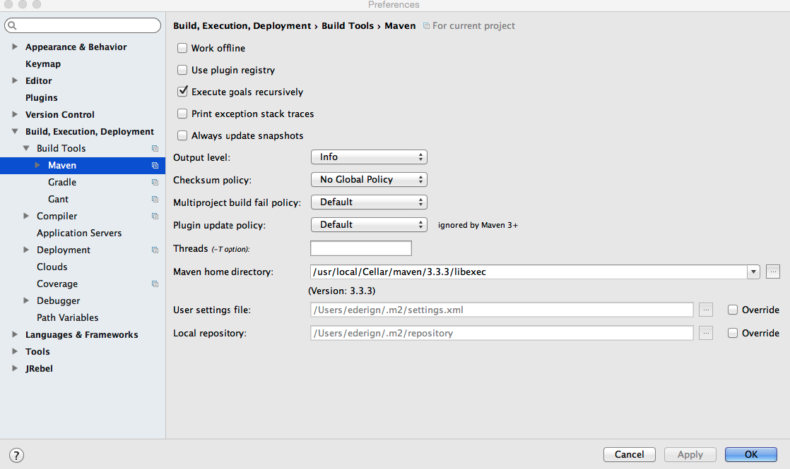

#####1-) After import my Uberfire App in IntelliJ IDEA, the GWT module are not displayed.
*Possible symptoms*: build of your web-app was broken on IDEA, and it is running on command line.

*Answer*: Uberfire requires Maven 3.3. Make sure that your IDEA is using Maven 3.3.

