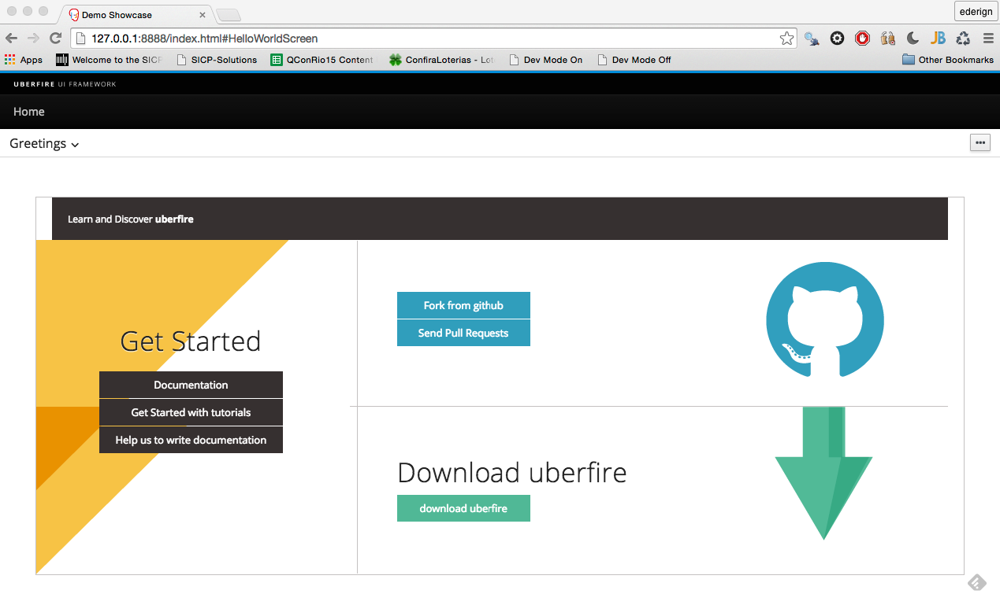

#5 minutes Introduction
This session teaches you how to build your first Uberfire App in just 5 minutes.

## Prerequisites
This guide assumes you have the following software set up and working on your computer:

* A Java Development Kit (JDK) version 8 or newer. **Microsoft Windows users:** be sure to use a 64-bit version of the JDK because Uberfire requires more heap space than can be addressed by a 32-bit VM.

* Maven 3.x

## Creating your first App

 In a command line, run the archetype to create your first app.

```
 mvn archetype:generate -B \
-DarchetypeGroupId=org.uberfire \
-DarchetypeArtifactId=uberfire-project-archetype \
-DarchetypeVersion=0.9.0-SNAPSHOT \
-DgroupId=org.uberfire \
-DartifactId=demo \
-Dversion=1.0-SNAPSHOT\
-Dpackage=org.uberfire \
-DcapitalizedRootArtifactId=Demo
```
Run it and then you should see the message:
```
[INFO] ---------------------------------------------------------
[INFO] BUILD SUCCESS
[INFO] ---------------------------------------------------------
[INFO] Total time: 3:32.347s
[INFO] Finished at: Wed Jan 14 20:30:27 BRST 2015
[INFO] Final Memory: 29M/959M
[INFO] ---------------------------------------------------------
````
## Building your first App

To build your first app, go to directory demo, build the project in maven and wait for the build to finish.

```
$ cd demo
$ mvn clean install

```
You should see the maven build success message again.

## See it work!

How about running our first project?
```
$ cd demo-showcase/demo-webapp
$ mvn clean gwt:run
```
Wait for GWT console build your app:


Click on "Launch Default Browser" to open your Uberfire App. Log in with the username "admin" and the password "admin". You should see our Hello World screen!



After you see that Hello World, you'll soon be able to taste the power of Uberfire.


