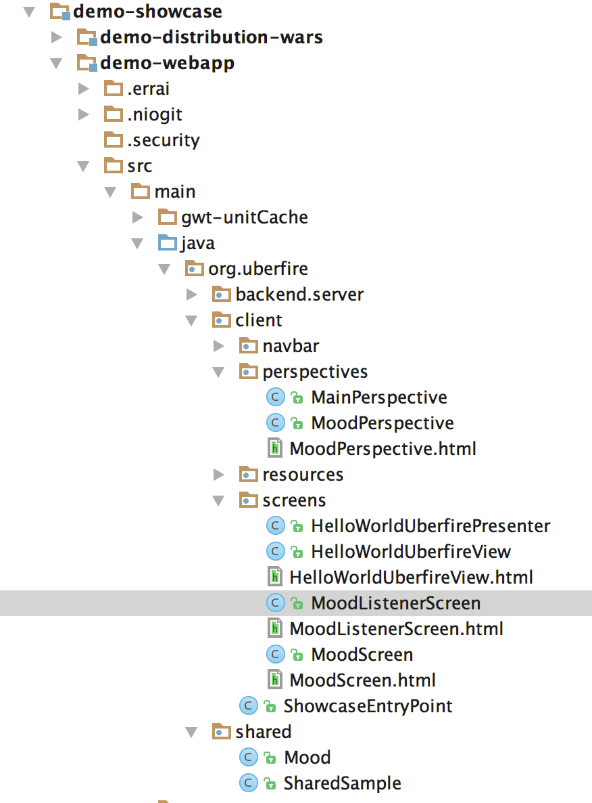
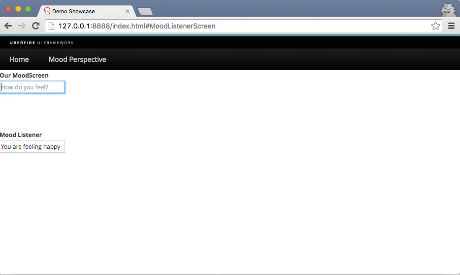

#Improving your first App
In this session, we will create some basic Uberfire components aiming to give you an idea of how Uberfire works. For now, don’t pay too much attention to new terms and concepts presented here, it’s time to just have fun.
The Uberfire Architeture and details of how everything glues together will be presented in the [Tutorial](../tutorial/tutorial.md) section.

## Feeling Uberfire
Let’s change our App so we can get a better feel for how Uberfire workbench perspectives and panels fit together.

We’ll create two screens backed by a simple model class to demonstrate how you’d typically separate model from view in an UberFire application and how screens communicate in a decoupled way.

### Creating our model
The data model in an UberFire app is typically represented by Plain Old Java Objects, (POJOs). This leaves you the flexibility to use them in other frameworks that like POJOs such as JPA, JAXB, Errai Data Binding, and much more by adorning them with annotations. For now, our extremely simple data model will just be an unadorned POJO.


The model class will be called Mood, and it will represent how the current user is feeling at the moment. Place it on org.uberfire.shared package of your web app.
```
package org.uberfire.shared;

public class Mood {

    private final String text;

    public Mood( String text ) {
        this.text = text;
    }

    public String getText() {
        return text;
    }

    @Override
    public String toString() {
        return text;
    }
}
```
### Creating MoodScreen, a Templated Widget

For MoodScreen, let’s use the Errai UI Template system. This approach is similar to GWT UiBinder, but it lets you create the template in a plain HTML 5 file rather than a specialized UiBinder XML file.

Create a HTML file named MoodScreen.html inside Java package org.uberfire.client.screens with this content:


```
<div>
    <div style="border: 1px solid red; padding: 30px">
        <input data-field="moodTextBox" type="text" placeholder="How do you feel?">
    </div>
</div>
```
Create a Java class "MoodScreen.java" in the package org.uberfire.client.screens. This file will be used as a client-side template for the new MoodScreen widget. Here’s what that looks like:
```
package org.uberfire.client.screens;

import javax.enterprise.context.Dependent;
import javax.enterprise.event.Event;
import javax.inject.Inject;

import com.google.gwt.event.dom.client.KeyCodes;
import com.google.gwt.event.dom.client.KeyDownEvent;
import com.google.gwt.user.client.ui.Composite;
import com.google.gwt.user.client.ui.TextBox;
import org.jboss.errai.ui.shared.api.annotations.DataField;
import org.jboss.errai.ui.shared.api.annotations.EventHandler;
import org.jboss.errai.ui.shared.api.annotations.Templated;
import org.uberfire.client.annotations.WorkbenchPartTitle;
import org.uberfire.client.annotations.WorkbenchScreen;
import org.uberfire.shared.Mood;

@Dependent
@Templated
@WorkbenchScreen(identifier = "MoodScreen")
public class MoodScreen extends Composite {

    @Inject
    @DataField
    private TextBox moodTextBox;

    @Inject
    Event<Mood> moodEvent;

    @WorkbenchPartTitle
    public String getScreenTitle() {
        return "Change Mood";
    }

    @EventHandler("moodTextBox")
    private void onKeyDown( KeyDownEvent event ) {
        if ( event.getNativeKeyCode() == KeyCodes.KEY_ENTER ) {
            moodEvent.fire( new Mood( moodTextBox.getText() ) );
            moodTextBox.setText( "" );
        }
    }
}
```
MoodScreen is very similar to HelloWorldScreen. The only structural differences are related to our choice to use an Errai UI Template. See more about Errai UI templates in [this guide](https://docs.jboss.org/author/display/ERRAI/Errai+UI).

### Creating MoodListenerScreen
Create a HTML file named MoodListenerScreen.html inside Java package org.uberfire.client.screens with this content:
```
<div>
    <div style="border: 1px solid red; padding: 30px">
        <input data-field="moodTextBox" type="text"
               placeholder="I understand that you are feeling...">
    </div>
</div>
```
And create MoodListenerScreen.java, inside org.uberfire.cliente.screens:
```
package org.uberfire.client.screens;

import javax.enterprise.context.Dependent;
import javax.inject.Inject;

import com.google.gwt.user.client.ui.Composite;
import com.google.gwt.user.client.ui.TextBox;
import org.jboss.errai.ui.shared.api.annotations.DataField;
import org.jboss.errai.ui.shared.api.annotations.Templated;
import org.uberfire.client.annotations.WorkbenchPartTitle;
import org.uberfire.client.annotations.WorkbenchScreen;

@Dependent
@Templated
@WorkbenchScreen(identifier = "MoodListenerScreen")
public class MoodListenerScreen extends Composite {

    @Inject
    @DataField
    private TextBox moodTextBox;

    @WorkbenchPartTitle
    public String getScreenTitle() {
        return "MoodListenerScreen";
    }
}
```

### Giving MoodScreen, a perspective
Let's create our first perspective, using Uberfire Templated Perspectives.

First, we need to create the perspective Errai UI template, named "MoodPerspective.html" on org.uberfire.client.perspectives package:
```
<div>
    <div id="home1">
        <span><b>Our MoodScreen</b></span>
        <div data-field="moodScreen"></div>
    </div>
    <div id="home2">
        <span><b>Mood Listener</b></span>
        <div data-field="moodListener"></div>
    </div>
</div>
```

Now, let's create the Perspective class MoodPerspective on org.uberfire.client.perspectives package:

```
package org.uberfire.client.perspectives;

import com.google.gwt.user.client.ui.Composite;
import org.jboss.errai.ui.shared.api.annotations.DataField;
import org.jboss.errai.ui.shared.api.annotations.Templated;
import org.uberfire.client.annotations.WorkbenchPanel;
import org.uberfire.client.annotations.WorkbenchPerspective;
import org.uberfire.client.workbench.panels.UFFlowPanel;

@Templated
@WorkbenchPerspective(identifier = "MoodPerspective")
public class MoodPerspective extends Composite {

    @DataField
    @WorkbenchPanel(parts = "MoodScreen")
    UFFlowPanel moodScreen = new UFFlowPanel( 100 );

    @DataField
    @WorkbenchPanel(parts = "MoodListenerScreen")
    UFFlowPanel moodListener = new UFFlowPanel( 100 );
}
```
### Adding MoodPerspective
Moving on, let’s add MoodPerspective to the menu bar of our app.
We need to update org.uberfire.client.ShowcaseEntryPoint and replace setupMenu method to that:
```
    private void setupMenu( @Observes final ApplicationReadyEvent event ) {
        final Menus menus =
                newTopLevelMenu( "Home" )
                        .respondsWith(
                                () -> placeManager.goTo( "MainPerspective" ) )
                        .endMenu()
                        .newTopLevelMenu( "Mood Perspective" )
                        .respondsWith(
                                () -> placeManager.goTo( "MoodPerspective" ) )
                        .endMenu()
                        .build();

        menubar.addMenus( menus );
    }
 ```
### Check your work
It's time to check your classes and package created. See an example here:


### See it work!!!
How about seeing our changes?
```
cd demo-showcase/demo-webapp
mvn clean install
mvn clean gwt:run
```
Click on MoodPerspective menu:


### Let's make the screens communicate
Did you notice the CDI event raised by MoodScreen? If no, take a look at onKeyDownMethod.

Now let’s do something in response to the the event we fire in MoodListenerScreen when the user presses Enter. To do this we’ll add a CDI observer method at MoodListenerScreen:
```
public void onMoodChange( @Observes Mood mood ) {
        moodTextBox.setText( "You are feeling " + mood.getText() );
}
```
Build and run your App again (mvn gwt: clean gwt:compile gwt:run), write a text on "How do  you fell" textbox and press enter to see screens communicating:


### A taste of Uberfire lifecycle events
Uberfire supports a lot of workbench events, let's see how they work.

Edit MoodPerspective.java and add these two methods, run the app again and change perspectives to see the events happening.

```
    @OnOpen
    public void onOpen() {
        Window.alert( "On Open" );
    }

    @OnClose
    public void OnClose() {
        Window.alert( "On Close" );
    }
```
Build (mvn clean install) and run your App again (mvn clean gwt:run) and change perspectives to see the events being triggered.
