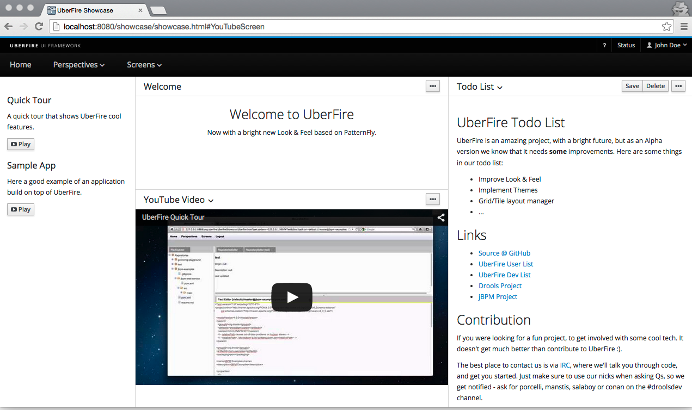

#Running Uberfire Showcase
This guide will help you install an UberFire demo application on your own computer. This will help let you try out an UberFire application and see our show case demo.

##Get an app server

The pre-built UberFire Showcase Web App is available for JBoss AS 7.1.1, EAP 6.2, and Tomcat.

If you don’t already have one of these app servers installed on your computer, don’t worry. In all cases, installing is as easy as downloading and unzipping.

| Wildfly 8.1 | [Download](http://download.jboss.org/wildfly/8.1.0.Final/wildfly-8.1.0.Final.zip) |
| -- | -- |
| **Tomcat 7** | **[Download](http://tomcat.apache.org/download-70.cgi)** |


Once the file has finished downloading, unzip it wherever you like.
##Start the app server
Now start the app server using a command line terminal. Use the *cd* command to change the working directory of your terminal to the place where you unzipped the application server, then execute one of the following commands, based on your operating system and choice of app server:

|Server|	*nix, Mac OS X|	Windows|
| -- | -- | -- |
| WildFly|bin/standalone.sh| bin\standalone.bat|
| Tomcat | bin/startup.sh | bin\startup.bat|

Then visit the URL http://localhost:8080/ and you should see a webpage confirming that the app server is running.

##Get the pre-built WAR file
Now download the pre-built WAR file for the server you’ve installed and started.


| Wildfly | [Download](https://repo1.maven.org/maven2/org/uberfire/showcase-distribution-wars/0.7.0.Beta2/showcase-distribution-wars-0.7.0.Beta2-wildfly8.1.war) |
| -- | -- |
| **Tomcat 7** | **[Download](https://repo1.maven.org/maven2/org/uberfire/showcase-distribution-wars/0.7.0.Beta2/showcase-distribution-wars-0.7.0.Beta2-tomcat7.0.war)** |

**Note**: If you find that the war file has limited functionality, e.g. some perspectives do not work correctly, please build it from source.

##Build from source

You can build your archetype from the lastest source.
```
$ git clone git@github.com:uberfire/uberfire.git
$ cd uberfire
$ mvn clean install
```
The war's will be located at:
```
../uberfire/uberfire-showcase/showcase-distribution-wars/target
```

##Deploy the WAR
Rename the downloaded WAR file to **uberfire-showcase.war** and copy it into the auto-deployment directory for your app server:

| Wildfly 8.1| standalone/deployments/|
| -- | -- |
| **Tomcat 7** |**webapps/** |

Example: Wildfly 8.1 on Unix/Linux/Mac:
```
$ mv ~/Downloads/showcase-distribution-wars-0.4.0-20131125.172155-223-jboss-as7.0.war standalone/deployments/uberfire-showcase.war
```

You should notice some disk activity, and if you’re using Wildfly, you will see some logging on the console where you started the server. Tomcat logs only to files by default, so you won’t see logs in your Tomcat terminal at this stage.

##See it work!
Now visit [http://localhost:8080/uberfire-showcase/](http://localhost:8080/uberfire-showcase/) and sign in with username **admin**, password **admin**.



Once you’re logged in, here are some things to try:

* Try switching perspectives in the perspective menu.

* On Home Perspective, try dragging a view clicking on TODO List and moving it from one panel to another.

* Try adding a new location for views by dragging a view near the edge of the screen.

* See some useful features on Screens menu..


##What's next?
Now that you’ve created and deployed an UberFire app and had some hands-on time with it, why not create a more complex App? Our tutorial guide provides a detailed walkthrough to create a Task Manager using Uberfire.


