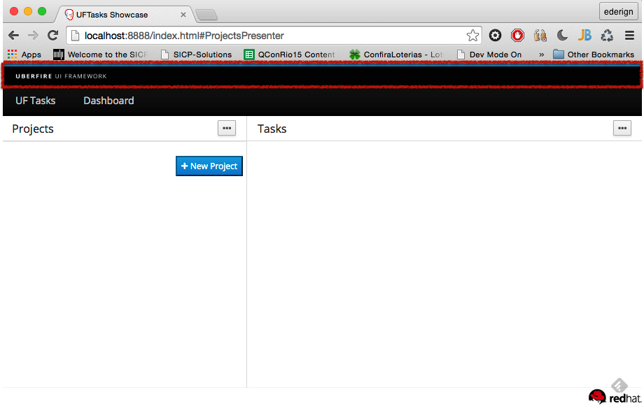

# Header
Headers in Uberfire are automatically discovered via CDI and added to the top of the Workbench screen. They stick
to the top of the viewport even when the main content area is scrolled up and down or the browser window is resized.

In order to create a header you have to create a CDI bean that implements org.uberfire.client.workbench.Header interface.

