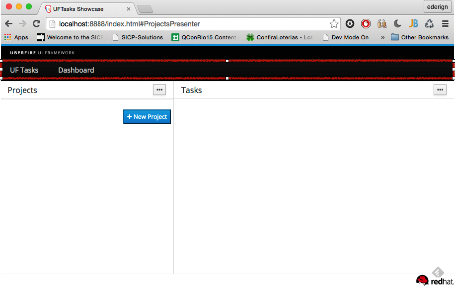

# Menu
Menu bars typically live at the top of the screen, and UberFire’s perspective layout system gives you a way to place widgets in just that spot.




In order to create a menu bar in the top of the app, create a class that implements Header and add menus to it via WorkbenchMenuBarPresenter CDI bean. As an example, the Menu of UFTasks app:

**ShowcaseEntryPoint.java**
```
    @Inject
    private WorkbenchMenuBar menubar;

    private void setupMenu( @Observes final ApplicationReadyEvent event ) {
        final Menus menus =
                newTopLevelMenu( "UF Tasks" )
                        .respondsWith( new Command() {
                            @Override
                            public void execute() {
                                placeManager.goTo( new DefaultPlaceRequest( "TasksPerspective" ) );
                            }
                        } )
                        .endMenu().
                        newTopLevelMenu( "Dashboard" )
                        .respondsWith( new Command() {
                            @Override
                            public void execute() {
                                placeManager.goTo( new DefaultPlaceRequest( "DashboardPerspective" ) );
                            }
                        } )
                        .endMenu()
                        .build();

        menubar.addMenus( menus );
    }
```
**AppNavBar.java**
```
@ApplicationScoped
public class AppNavBar
        extends Composite implements Header {

    @Inject
    private WorkbenchMenuBarPresenter menuBarPresenter;

    @Override
    public Widget asWidget() {
        return menuBarPresenter.getView().asWidget();
    }

    @Override
    public String getId() {
        return "AppNavBar";
    }

    @Override
    public int getOrder() {
        return MAX_VALUE;
    }
}

```


