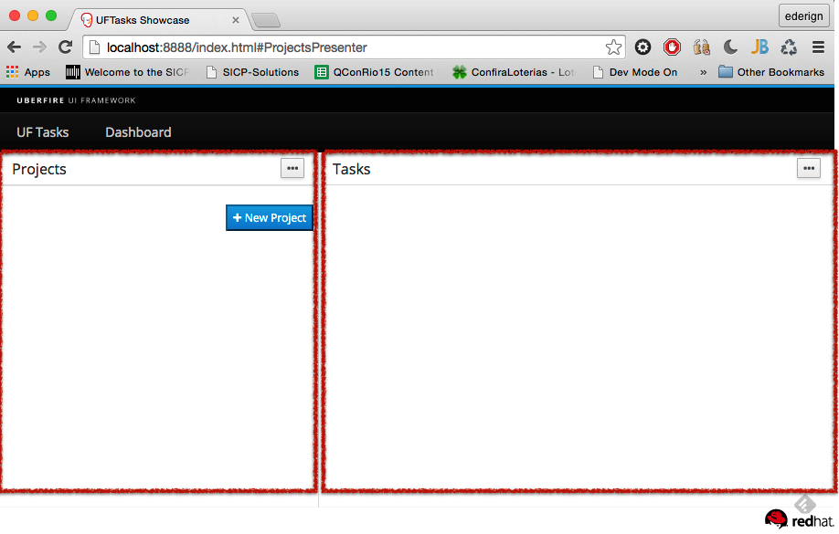

# Panel
Each Uberfire Perspective contains multiple Panels.

A Panel describes a physical region within a Workbench Perspective. Panels have a set physical size that they occupy, which is divided up between any panel decorations (a tab bar or dropdown list is common), one or more Parts (generally
Editors or Screens), one of which can be visible at a time, and also child Panel Definitions, all of which are
visible simultaneously.

