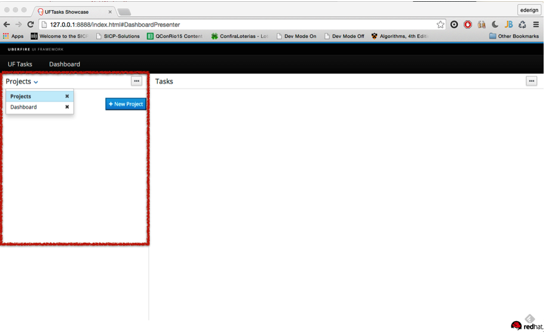

# Part
A part specifies content that should be put in a panel main display area when it is materialized. The content add is specified by a PartDefinition, at the core of which is a PlaceRequest that identifies a WorkbenchActivity (an UberfireComponent like screen, editor, popups or splashscreen).

For example, here is a panel that contains two parts:

```
final PanelDefinition west = new PanelDefinitionImpl( SimpleWorkbenchPanelPresenter.class.getName() );
west.addPart( new PartDefinitionImpl( new DefaultPlaceRequest( "ProjectsPresenter" ) ) );
west.addPart( new PartDefinitionImpl( new DefaultPlaceRequest( "DashboardPresenter" ) ) );
```




