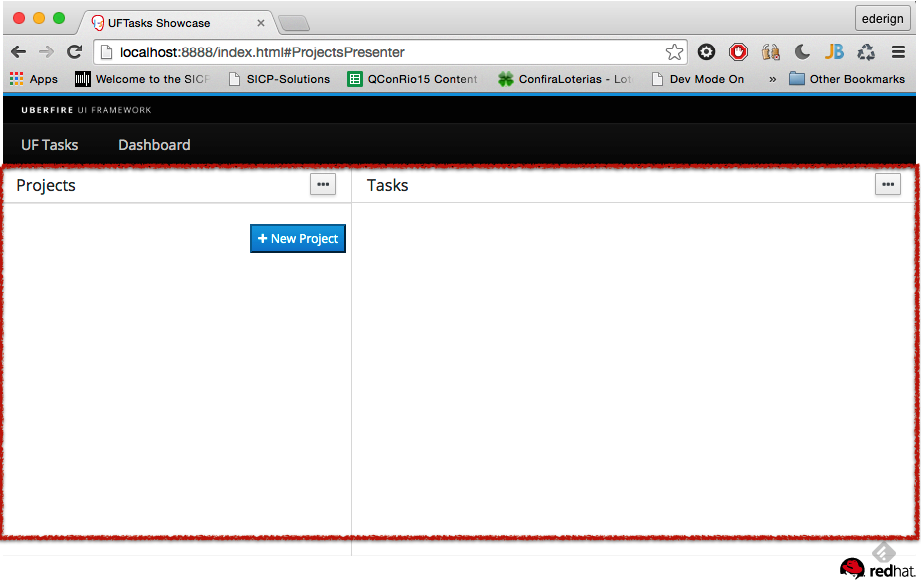

# Perspective
An Uberfire Workbench contains one or more perspectives. The UberFire workbench UI is arranged as:

**Workbench → Perspective → Workbench Panel → Component**

Perspectives split up the screen into multiple resizable regions, and end users can drag and drop Panels between these regions to customize their workspace. Perspectives dictate the position and size of Workbench Panels.

Each Perspective has a PerspectiveDefinition. A PerspectiveDefinition is a meta-data defining a Perspective.
