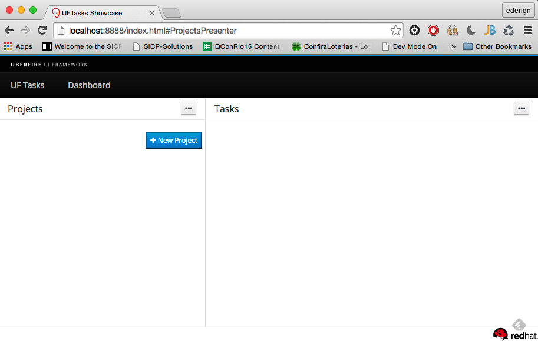

#Workbench
UberFire workbenches are made of some fundamental building blocks: Widgets, Layout Panels, Screens, Workbench Panels, Menu Bars, Tool Bars, and Perspectives.

Layout Panels can contain Widgets and other Layout Panels; Perspectives contain Workbench Panels, an optional Menu Bar, and an optional Tool Bar. Perspectives split up the screen into multiple resizable regions, and end users can drag and drop Panels between these regions to customize their workspace.

Let's detail each of these concepts.
