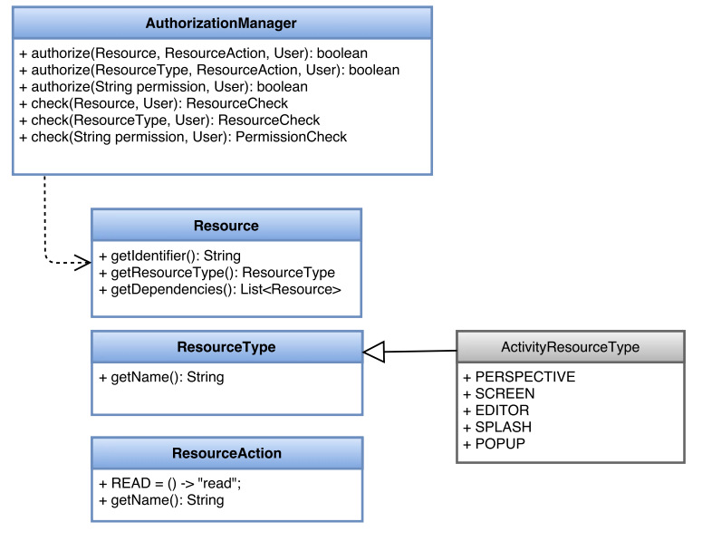

# Resources and Actions

`Resource` is a generic interface for modelling resources, like, for instance, UI assets: perspectives, screens or editors or even backend resources like repositories, projects, data objects, etc... Every _Resource_ has a dependency to a `ResourceType` that acts as a resource classifier.

For instance, in Uberfire there exist the `ActivityResourceType` interface which defines the following types: `PERSPECTIVE`, `SCREEN`, `EDITOR`, `SPLASH` & `POPUP`.

There is also the `ResourceAction` interface which defines what actions can be aplied over a resource. The `READ` action is common to all the resource types and it basically defines the ability to reach, access or view a resource. For instance, read a file, view an item in the UI, etc.

The _AuthorizationManager_ provides specific methods for checking actions against the different resource types. For example:


To check the READ action on any _Resource_ instance:
```
boolean result = authzManager.authorize(perspective1, ResourceAction.READ, user);
```

The following diagram shows the _AuthorizationManager_ and its related interfaces:



In Uberfire, the class model for perspectives, screens, etc, supports the _Resource_ interface. During application development it is possible to bring new classes under authorization management control by following the same approach. Basically:

* To make the resource class to implement the _Resource_ interface
* To provide an extended _ResourceAction_ interface listing the available actions


See the section [_Extensibility_](_Extensibility) to figure out the details.

