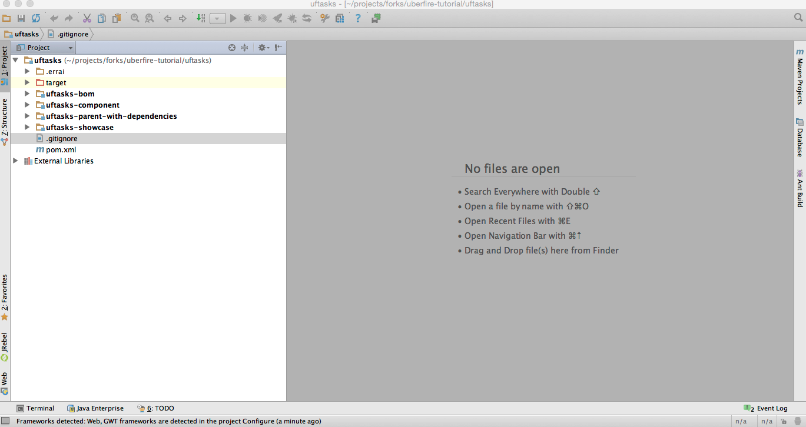
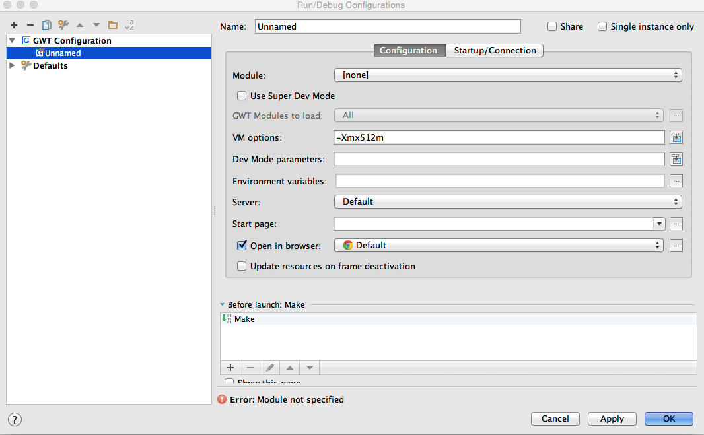
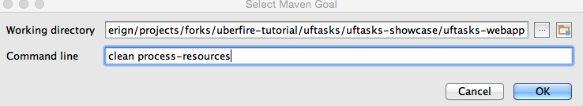
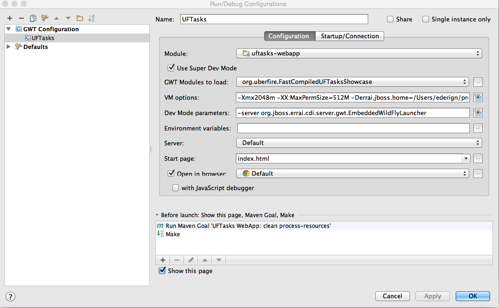
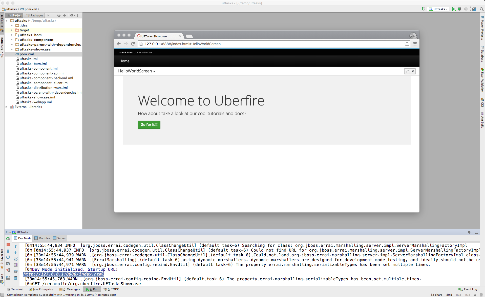

# Intellij IDEA

The Ultimate Edition for Intellij IDEA comes with a built-in GWT plugin that allows you to run and debug GWT apps. We can configure the plugin to use the embedded WildFly launcher to debug both server and client-side code in one debug session. This section explains how to do that.

(This procedure was tested on IntelliJ IDEA Ultimate 14.1.3 and 15.0.1)

1. Click on open, and point to pom.xml file located on uftasks dir. (Wait for import and indexing)

2. Access Run menu, select "Edit Configurations", press the + button under GWT Configurations to create a new GWT configuration.

3. Fill out the following parameters in the corresponding boxes:

**Name:** UFTasks

 **Module:** uftasks-webapp

 **Use Super Dev Mode**: yes (check it)

 **GWT Modules to load**: org.uberfire.FastCompiledUFTasksShowcase

(if your Gwt Modules are not displayed jin this combobox, go to FAQ section and look for "fix maven version on IDEA").

 **VM options**: -Xmx2048m -XX:MaxPermSize=512M -Derrai.jboss.home=/Users/ederign/projects/uftasks/uftasks-showcase/uftasks-webapp/target/wildfly-8.1.0.Final/

The errai.jboss.home parameter must point to your local WildFly installation directory or the Wildfly within the target/ directory of your app. For the UFTasks app, errai.jboss.home points to the WildFly installation within the target/ directory, which is redownloaded and installed as part of the build.

**Dev Mode Parameters**:
-server org.jboss.errai.cdi.server.gwt.EmbeddedWildFlyLauncher

**With JavaScript debugger**: optionally (you’ll need to install an IntelliJ plugin in your browser in order to have a better debug experience)

**Before Launch**: Add a new “Run Maven Goal” configuration **before** your make. Press + button, "Run Maven Goal"

Point “Working directory” to your webapp folder, Set “clean process-resources" in line parameter, press OK, and move this new configuration *before* Make.

This is what your config should look like:

To run or debug your app, select this configuration in the top right corner of Intellij IDEA and click the Run or Debug buttons next to it. Your app should start up in Dev Mode within Intellij automatically and you should be able to use Intellij’s own debugger to debug your code.

