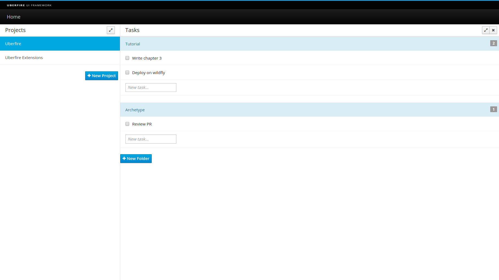
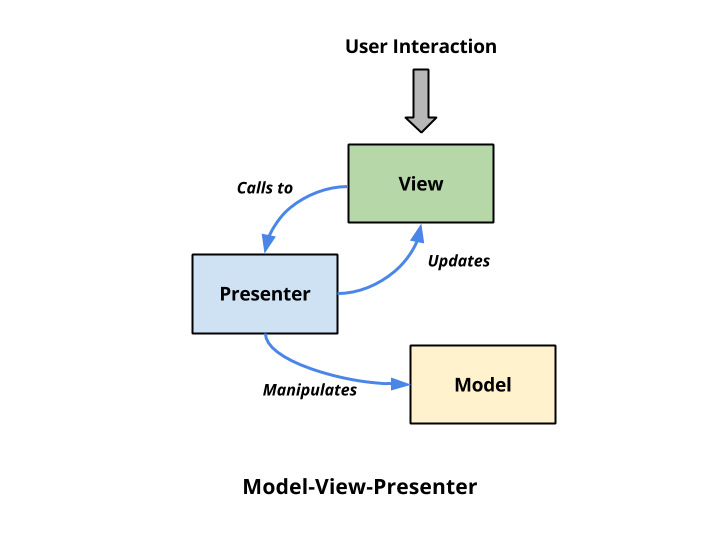
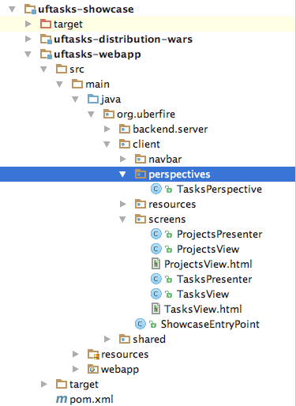
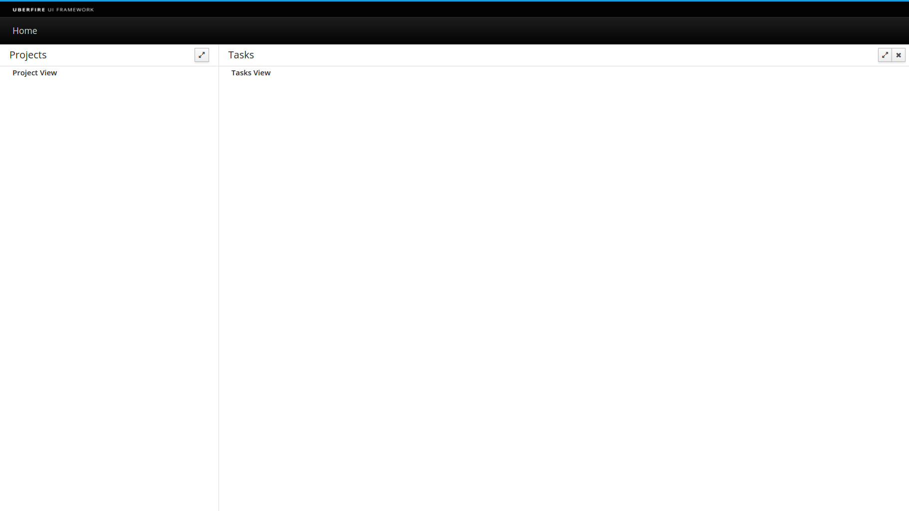
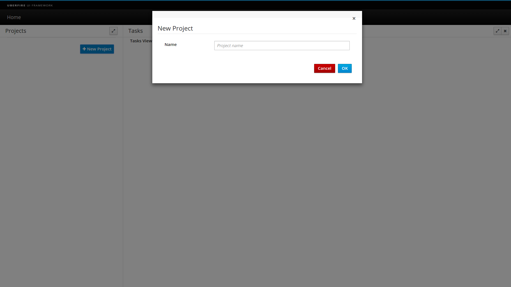
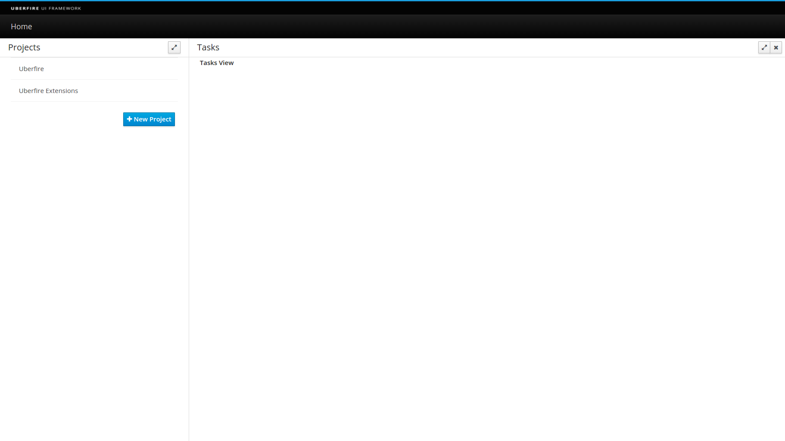
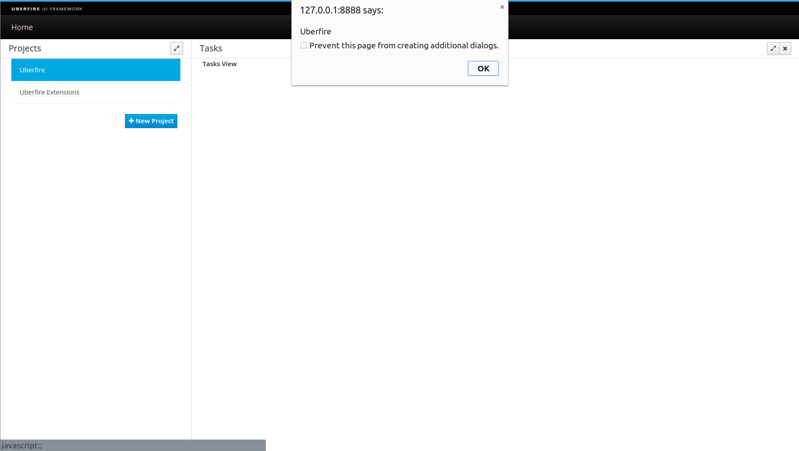
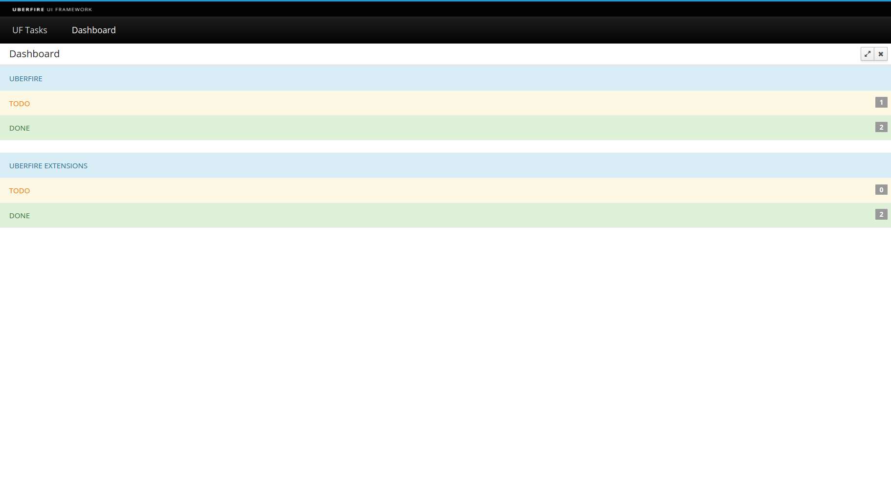

#UF Tasks
In order to understand how Uberfire works, let's create a simple task manager that will look like this:



On the left side is a "Projects" section, where the user can create Projects.

Each project has a group of folders (displayed in the main window), and each folder has a group of tasks.

A task can be created in the text field "New Task" and can be marked as *Done* with the checkbox left of the task description.

##Uberfire Design Guidelines

Before you can start writing code, it's important to familiarize yourself with the [MVP Pattern](https://en.wikipedia.org/wiki/Model%E2%80%93view%E2%80%93presenter) to better understand this tutorial.


###MVP Pattern
MVP (Model-View-Presenter) like any pattern is open to different interpretation, so here is how MVP is used in this tutorial:

- Model is POJO;

- View is a passive interface that displays data, but this data cannot be the model. So it’s limited to primitive types and regular platform objects (e.g. String). Every user action should be routed to the presenter;
- Presenter is where all business logic should live; it acts upon the model and the view.



##Cleaning the Archetype
Uberfire Archetype contains some useful code samples that are not necessary in our app, so let's do some cleanup first.

Please delete these files: SharedSample.java, HelloWorldScreen.java, HelloWorldScreen.ui.xml and  MainPerspective.java.

##Creating project structure

Uberfire interfaces are made of some fundamental building blocks: Widgets, Layout Panels, Screens, Workbench Panels, Menu Bars, Tool Bars, and Perspectives. Layout Panels can contain Widgets and other Layout Panels; Perspectives contains Workbench Panels, an optional Menu Bar, and an optional Tool Bar.

Perspectives split up the screen into multiple resizeable regions, and end users can drag and drop Panels between these regions to customize their workspace.

For now, we will create two Uberfire Screens (Project and Tasks) and one perspective to hold these screens.

###Creating Projects Screen
Following the MVP pattern, each Uberfire Screen will be a Presenter plus a View. Our views will be built using [Errai UI](https://docs.jboss.org/author/display/ERRAI/Errai+UI). This means we will also have an .html file associated with each screen.

Inside the package org.uberfire.client.screens, create this new source file:

- ProjectsPresenter.java

```
package org.uberfire.client.screens;

import org.uberfire.client.annotations.WorkbenchPartTitle;
import org.uberfire.client.annotations.WorkbenchPartView;
import org.uberfire.client.annotations.WorkbenchScreen;
import org.uberfire.client.mvp.UberView;

import javax.enterprise.context.ApplicationScoped;
import javax.inject.Inject;

@ApplicationScoped
@WorkbenchScreen(identifier = "ProjectsPresenter")
public class ProjectsPresenter {

    public interface View extends UberView<ProjectsPresenter> {
    }

    @Inject
    private View view;

    @WorkbenchPartTitle
    public String getTitle() {
        return "Projects";
    }

    @WorkbenchPartView
    public UberView<ProjectsPresenter> getView() {
        return view;
    }
}
```
The presenter itself is a CDI bean with one injected field (the view). But whether or not we’re familiar with CDI, we’re seeing a bunch of Uberfire annotations for the first time. Let’s examine some of them:

**@WorkbenchScreen**
Tells Uberfire that the class defines a Screen in the application. Each screen has an identifier.

**@WorkbenchPartTitle**
Denotes the method that returns the Screen’s title. Every Screen must have a @WorkbenchPartTitle method.

**@WorkbenchPartView**
Denotes the method that returns the Panel’s view. The view can be any class that extends GWT’s Widget class or implements GWT’s IsWidget interface. In this example, we’re returning a CDI bean that implements UberView<ProjectsPresenter>, which is the specific view, for this presenter (following MVP pattern). Every Screen must have a @WorkbenchPartView method, extend Widget, or implement IsWidget. Let's define our view (inside org.uberfire.client.screens package):


- ProjectsView.java

```
package org.uberfire.client.screens;

import javax.enterprise.context.Dependent;

import com.google.gwt.user.client.ui.Composite;
import org.jboss.errai.ui.shared.api.annotations.Templated;

@Dependent
@Templated
public class ProjectsView extends Composite implements ProjectsPresenter.View {

    private ProjectsPresenter presenter;

    @Override
    public void init( ProjectsPresenter presenter ) {
        this.presenter = presenter;
    }
}
```
- ProjectsView.html

```
<div class="container-fluid">
    <label>Project View</label>
</div>
```
For now, this view only has a label with the text "Project View".

###Creating Tasks Screen
Our second screen is the Task Screen. Let's create it (inside org.uberfire.client.screens package):

- TasksPresenter.java

```
package org.uberfire.client.screens;

import org.uberfire.client.annotations.WorkbenchPartTitle;
import org.uberfire.client.annotations.WorkbenchPartView;
import org.uberfire.client.annotations.WorkbenchScreen;
import org.uberfire.client.mvp.UberView;

import javax.enterprise.context.ApplicationScoped;
import javax.inject.Inject;

@ApplicationScoped
@WorkbenchScreen(identifier = "TasksPresenter")
public class TasksPresenter {

    public interface View extends UberView<TasksPresenter> {
    }

    @Inject
    private View view;

    @WorkbenchPartTitle
    public String getTitle() {
        return "Tasks";
    }

    @WorkbenchPartView
    public UberView<TasksPresenter> getView() {
        return view;
    }
}
```
- TasksView.java

```
package org.uberfire.client.screens;

import javax.enterprise.context.Dependent;

import com.google.gwt.user.client.ui.Composite;
import org.jboss.errai.ui.shared.api.annotations.Templated;

@Dependent
@Templated
public class TasksView extends Composite implements TasksPresenter.View {

    private TasksPresenter presenter;

    @Override
    public void init( final TasksPresenter presenter ) {
        this.presenter = presenter;
    }
}
```
- TasksView.html

```
<div class="container-fluid">
    <label>Tasks View</label>
</div>
```

###Creating Tasks Perspective
Now we have two Uberfire Screens, but nowhere to put them. Remember, the Uberfire Workbench UI is arranged as Workbench → Perspective → Workbench Panel → Screen. Perspectives dictate the position and size of Workbench Panels. Besides the explicit positioning approach, we can also define perspectives using Errai UI templates.

We need to define a Perspective inside org.uberfire.client.perspectives:

- TasksPerspective.java

```
package org.uberfire.client.perspectives;

import javax.enterprise.context.ApplicationScoped;

import org.uberfire.client.annotations.Perspective;
import org.uberfire.client.annotations.WorkbenchPerspective;
import org.uberfire.client.workbench.panels.impl.MultiListWorkbenchPanelPresenter;
import org.uberfire.client.workbench.panels.impl.SimpleWorkbenchPanelPresenter;
import org.uberfire.mvp.impl.DefaultPlaceRequest;
import org.uberfire.workbench.model.CompassPosition;
import org.uberfire.workbench.model.PanelDefinition;
import org.uberfire.workbench.model.PerspectiveDefinition;
import org.uberfire.workbench.model.impl.PanelDefinitionImpl;
import org.uberfire.workbench.model.impl.PartDefinitionImpl;
import org.uberfire.workbench.model.impl.PerspectiveDefinitionImpl;

@ApplicationScoped
@WorkbenchPerspective(identifier = "TasksPerspective", isDefault = true)
public class TasksPerspective {

    @Perspective
    public PerspectiveDefinition buildPerspective() {
        final PerspectiveDefinitionImpl perspective =
                new PerspectiveDefinitionImpl( MultiListWorkbenchPanelPresenter.class.getName() );
        perspective.setName( "TasksPerspective" );

        final PanelDefinition west = new PanelDefinitionImpl( SimpleWorkbenchPanelPresenter.class.getName() );
        west.addPart( new PartDefinitionImpl( new DefaultPlaceRequest( "ProjectsPresenter" ) ) );
        west.setWidth( 350 );
        perspective.getRoot().insertChild( CompassPosition.WEST, west );

        perspective.getRoot().addPart( new PartDefinitionImpl( new DefaultPlaceRequest( "TasksPresenter" ) ) );

        return perspective;
    }
}
```
Once again, we’re encountering some new annotations:

**@WorkbenchPerspective**
Tells UberFire that the class defines a perspective.

**@Perspective**
Tells Uberfire that this method returns the PerspectiveDefinition that governs the perspective’s layout and default contents. Every @WorkbenchPerspective class needs a method annotated with @Perspective.

In this definition, we’ll add a new panel on the left-hand side (WEST) and populate it with ProjectsPresenter by default. The perspective root panel (main window) will be populated with TasksPresenter.


###Modifying application entry point


Inside the package org.uberfire.client, modify the setup method as follows to create a menu item in the "TaskPerspective" we just defined before (instead of the "MainPerspective"):

- ShowcaseEntryPoint.java


```
private void setupMenu( @Observes final ApplicationReadyEvent event ) {
    final Menus menus =
            newTopLevelMenu( "Home" )
                    .respondsWith( new Command() {
                        @Override
                        public void execute() {
                            placeManager.goTo( new DefaultPlaceRequest( "TasksPerspective" ) );
                        }
                    } )
                    .endMenu()
                    .build();

    menubar.addMenus( menus );
}
```


##Time to see it work!
We’ve come a long way since we started with that empty directory. Let’s reward all the hard work by starting our app and seeing it do something!

If you are using a IDE, stop the server, build and restart or if you are using command line interface:

```
$ mvn clean install
$ mvn clean gwt:run
```
Eventually, the GWT Development Mode GUI will pop up. Wait for the "Calculating…" button to change to "Launch in Default Browser," then press that button.

That should be the result of our work:



And our app running:




##Projects Screen
Now that we have the basic infrastructure required for our project, it's time to put some functionality in the Project Screen. Let's begin with the ProjectsPresenter.

###ProjectsPresenter
Here’s what ProjectsPresenter.java might look like:
```
package org.uberfire.client.screens;

import javax.enterprise.context.ApplicationScoped;
import javax.inject.Inject;

import org.uberfire.client.annotations.WorkbenchPartTitle;
import org.uberfire.client.annotations.WorkbenchPartView;
import org.uberfire.client.annotations.WorkbenchScreen;
import org.uberfire.client.mvp.UberView;

@ApplicationScoped
@WorkbenchScreen(identifier = "ProjectsPresenter")
public class ProjectsPresenter {

    public interface View extends UberView<ProjectsPresenter> {

        void clearProjects();

        void addProject( String projectName,
                         boolean selected );
    }

    @Inject
    private View view;

    @WorkbenchPartTitle
    public String getTitle() {
        return "Projects";
    }

    @WorkbenchPartView
    public UberView<ProjectsPresenter> getView() {
        return view;
    }

    public void newProject() {
        // TODO
    }

    public void selectProject( String projectName ) {
        // TODO
    }
}
```

###ProjectsView
Our view has two components: a [Bootstrap3](https://gwtbootstrap3.github.io/gwtbootstrap3-demo/#listGroup) LinkedGroup to list our projects and a button to create new ones.

Here’s what ProjectsView.html looks like:
```
<div>
    <div class="list-group" id="projects"></div>
    <button type="button" class="btn btn-primary" id="new-project"
            style="float: right; margin-right: 5px;">
        <i class="fa fa-plus"></i> New Project
    </button>
</div>
```
And the owner class for the above template might look like this:
```
package org.uberfire.client.screens;

import javax.enterprise.context.Dependent;
import javax.inject.Inject;

import com.google.gwt.core.client.GWT;
import com.google.gwt.event.dom.client.ClickEvent;
import com.google.gwt.user.client.ui.Composite;
import org.gwtbootstrap3.client.ui.Button;
import org.gwtbootstrap3.client.ui.LinkedGroup;
import org.gwtbootstrap3.client.ui.LinkedGroupItem;
import org.jboss.errai.ui.shared.api.annotations.DataField;
import org.jboss.errai.ui.shared.api.annotations.EventHandler;
import org.jboss.errai.ui.shared.api.annotations.Templated;

@Dependent
@Templated
public class ProjectsView extends Composite implements ProjectsPresenter.View {

    private ProjectsPresenter presenter;

    @Inject
    @DataField("new-project")
    Button newProject;

    @Inject
    @DataField("projects")
    LinkedGroup projects;

    @Override
    public void init( ProjectsPresenter presenter ) {
        this.presenter = presenter;
    }

    @Override
    public void clearProjects() {
        projects.clear();
    }

    @Override
    public void addProject( final String projectName,
                            final boolean active ) {
        final LinkedGroupItem projectItem = createProjectItems( projectName, active );
        projects.add( projectItem );
    }

    private LinkedGroupItem createProjectItems( final String projectName,
                                                final boolean active ) {
        final LinkedGroupItem projectItem = GWT.create( LinkedGroupItem.class );
        projectItem.setText( projectName );
        projectItem.setActive( active );
        projectItem.addClickHandler( ( event ) -> presenter.selectProject( projectName ) );
        return projectItem;
    }

    @EventHandler("new-project")
    public void newProject( ClickEvent event ) {
        presenter.newProject();
    }
}
```
Two @DataField attributes to bind the template with the view Java class, a click handler for the "New Project" button and a method to add a project.
This method should receive as parameters the projectName and a boolean representing if the project is active in the screen.

##Time to see our view working.
Refresh the browser, let GWT Super Dev mode do its magic, and we should see the New Project button.


##New Project Screen
The next step of our project is to provide a real implementation for the New Project button. To achieve this, let's create these classes on org.uberfire.client.screens.popup package:

**NewProjectPresenter.java**
```
package org.uberfire.client.screens.popup;

import javax.annotation.PostConstruct;
import javax.enterprise.context.Dependent;
import javax.inject.Inject;

import org.uberfire.client.mvp.UberView;
import org.uberfire.client.screens.ProjectsPresenter;

@Dependent
public class NewProjectPresenter {

    private ProjectsPresenter projectsPresenter;

    public interface View extends UberView<NewProjectPresenter> {

        void show();

        void hide();
    }

    @Inject
    private View view;

    @PostConstruct
    public void setup() {
        view.init( this );
    }

    public void show( ProjectsPresenter projectsPresenter ) {
        this.projectsPresenter = projectsPresenter;
        view.show();
    }

    public void newProject( String projectName ) {
        projectsPresenter.createNewProject( projectName );
        view.hide();
    }

    public void close() {
        view.hide();
    }
}
```
The method show(projectsPresenter) will open the modal dialog on the view. The method newProject(projectName) will create a new project on projectsPresenter and hide the view.

**NewProjectView.java**
```
package org.uberfire.client.screens.popup;

import javax.enterprise.context.Dependent;
import javax.inject.Inject;

import com.google.gwt.event.dom.client.ClickEvent;
import com.google.gwt.user.client.ui.Composite;
import org.gwtbootstrap3.client.ui.Button;
import org.gwtbootstrap3.client.ui.Modal;
import org.gwtbootstrap3.client.ui.ModalBody;
import org.gwtbootstrap3.client.ui.TextBox;
import org.jboss.errai.ui.shared.api.annotations.DataField;
import org.jboss.errai.ui.shared.api.annotations.EventHandler;
import org.jboss.errai.ui.shared.api.annotations.Templated;

@Dependent
@Templated
public class NewProjectView extends Composite implements NewProjectPresenter.View {

    private NewProjectPresenter presenter;

    private Modal modal;

    @Inject
    @DataField("project-name")
    TextBox projectNameTextBox;

    @Inject
    @DataField("ok-button")
    Button okButton;

    @Inject
    @DataField("cancel-button")
    Button cancelButton;

    @Override
    public void init( NewProjectPresenter presenter ) {
        this.presenter = presenter;

        this.modal = new Modal();
        final ModalBody body = new ModalBody();
        body.add( this );
        modal.add( body );
    }

    @Override
    public void show() {
        modal.show();
    }

    @Override
    public void hide() {
        modal.hide();
        projectNameTextBox.setText( "" );
    }

    @EventHandler("ok-button")
    public void addProject( ClickEvent event ) {
        presenter.newProject( projectNameTextBox.getText() );
    }

    @EventHandler("cancel-button")
    public void cancel( ClickEvent event ) {
        presenter.close();
    }
}
```
**NewProjectView.html**
```
<div>
    <form data-field="new-project-modal">
        <fieldset>
            <legend>New Project</legend>
            <div class="form-group">
                <label class="control-label col-md-3">Name</label>
                <div class="col-md-9">
                    <input type="text" class="form-control" data-field="project-name"
                           placeholder="Project name">
                    <span data-field="project-name-help" class="help-block"></span>
                </div>
            </div>
        </fieldset>
    </form>
    <div class="modal-footer">
        <button type="button" class="btn btn-danger" data-field="cancel-button">Cancel</button>
        <button type="button" class="btn btn-primary" data-field="ok-button">OK</button>
    </div>
</div>
```
We also have to change **ProjectsPresenter.java** in order to open the popup and receive the name of the new project created. Add this snippet to our class:
```
import com.google.gwt.user.client.Window;
import org.uberfire.client.screens.popup.NewProjectPresenter;

[...]

    @Inject
    private NewProjectPresenter newProjectPresenter;

    public void newProject() {
        newProjectPresenter.show( this );
    }

    public void createNewProject( String projectName ) {
        Window.alert( "project created: " + projectName );
    }
```

##Time to see it work!
Let’s see the results of all our hard work: start the app and watch it open the popup dialog displaying the project created message!

Refresh your browser and click on the New Project button.



##Adding a project to the projects list
Our next task is to add a project to the projects list. First of all, let's create the Project model class. In package org.uberfire.shared.model, create this class:

**Project.java**
```
package org.uberfire.shared.model;

public class Project {

    private final String name;
    private boolean selected;

    public Project( String name ) {
        this.name = name;
        this.selected = false;
    }

    public String getName() {
        return name;
    }

    public boolean isSelected() {
        return selected;
    }

    public void setSelected( boolean selected ) {
        this.selected = selected;
    }
}
```
Next, when the method createNewProject(project) is called, let's create a new model for that project and update the view. Add the following code to ProjectsPresenter.java:

**ProjectsPresenter.java**
```
import org.uberfire.shared.model.Project;
import java.util.ArrayList;
import java.util.List;

[...]

    private List<Project> projects = new ArrayList<Project>();

    public void createNewProject( String projectName ) {
        projects.add( new Project( projectName ) );
        updateView();
    }

    private void updateView() {
        view.clearProjects();
        for ( Project project : projects ) {
            view.addProject( project.getName(), project.isSelected() );
        }
    }
```

##Time to see it work!

Refresh the browser, and add two projects to our list.




##Creating tasks list
It's time to create our task list. When our user creates or selects a project in the projects list, we should display the folders and tasks associated with that project.

In order to do that, let's create inside org.uberfire.shared.events a model class called ProjectSelectedEvent, to allow communication between our screens:

**ProjectSelectedEvent.java**
```
package org.uberfire.shared.events;

public class ProjectSelectedEvent {

    private final String name;

    public ProjectSelectedEvent( String name ) {
        this.name = name;
    }

    public String getName() {
        return name;
    }
}
```

And also add this code on **ProjectsPresenter.java**:
```
import org.uberfire.shared.events.ProjectSelectedEvent;
import javax.enterprise.event.Event;

[...]

    @Inject
    private Event<ProjectSelectedEvent> projectSelectedEvent;

    public void selectProject( String projectName ) {
        setActiveProject( projectName );
        projectSelectedEvent.fire( new ProjectSelectedEvent( projectName ) );
    }

    private void setActiveProject( String projectName ) {
        for ( Project project : projects ) {
            if ( projectName.equalsIgnoreCase( project.getName() ) ) {
                project.setSelected( true );
            } else {
                project.setSelected( false );
            }
        }
        updateView();
    }
```
There are two important calls that happen inside the selectProject(projectName) method:

- setActiveProject(projectName): marks a specific project as active and updates the view;
- projectSelectEvent.fire(...): fires a CDI event telling TasksPresenter.java that a project was selected

Now, let's listen to this CDI event on **TaskPresenter.java**. Add the following method:
```
import com.google.gwt.user.client.Window;
import org.uberfire.shared.events.ProjectSelectedEvent;
import javax.enterprise.event.Observes;

[...]

    public void projectSelected( @Observes ProjectSelectedEvent projectSelectedEvent ) {
        Window.alert( projectSelectedEvent.getName() );
    }
```

##Time to see it work!

Refresh the browser, create two projects and click on one of them.




##New folder
Our next step is to create a new folder button. A folder is an aggregator of tasks. This button is only displayed after a project is selected. Let's edit the view:

**TasksView.html**
```
<div>
    <div class="list-group" data-field="tasks"></div>
    <button type="button" class="btn btn-primary" data-field="new-folder">
        <i class="fa fa-plus"></i> New Folder
    </button>
</div>
```
Update your **TaskPresenter.java** with the following code:
```
package org.uberfire.client.screens;

import java.util.ArrayList;
import java.util.List;
import javax.enterprise.context.ApplicationScoped;
import javax.enterprise.event.Observes;
import javax.inject.Inject;

import org.uberfire.client.annotations.WorkbenchPartTitle;
import org.uberfire.client.annotations.WorkbenchPartView;
import org.uberfire.client.annotations.WorkbenchScreen;
import org.uberfire.client.mvp.UberView;
import org.uberfire.client.screens.popup.NewFolderPresenter;
import org.uberfire.shared.events.ProjectSelectedEvent;

@ApplicationScoped
@WorkbenchScreen(identifier = "TasksPresenter")
public class TasksPresenter {

    public interface View extends UberView<TasksPresenter> {

        void activateNewFolder();

        void clearTasks();

        void newFolder( String name,
                        Integer size,
                        List<String> tasks );
    }

    @Inject
    private View view;

    @Inject
    private NewFolderPresenter newFolderPresenter;

    private String currentSelectedProject;

    @WorkbenchPartTitle
    public String getTitle() {
        return "Tasks";
    }

    @WorkbenchPartView
    public UberView<TasksPresenter> getView() {
        return view;
    }

    public void projectSelected( @Observes ProjectSelectedEvent projectSelectedEvent ) {
        this.currentSelectedProject = projectSelectedEvent.getName();
        selectFolder();
    }

    private void selectFolder() {
        view.activateNewFolder();
        updateView( null );
    }

    public void showNewFolder() {
        newFolderPresenter.show( this );
    }

    private void updateView( String folderName ) {
        view.clearTasks();
        if ( folderName != null ) {
            view.newFolder( folderName, 0, new ArrayList<String>() );
        }
    }

    public void newFolder( String folderName ) {
        updateView( folderName );
    }
}
```
We're going to use a popup structure, like the **NewProject** structure. Let's create it inside package org.uberfire.client.screens.popup:

**NewFolderPresenter.java**
```
package org.uberfire.client.screens.popup;

import javax.annotation.PostConstruct;
import javax.enterprise.context.Dependent;
import javax.inject.Inject;

import org.uberfire.client.mvp.UberView;
import org.uberfire.client.screens.TasksPresenter;

@Dependent
public class NewFolderPresenter {

    public interface View extends UberView<NewFolderPresenter> {

        void show();

        void hide();
    }

    @Inject
    private View view;

    private TasksPresenter tasksPresenter;

    @PostConstruct
    public void setup() {
        view.init( this );
    }

    public void show( TasksPresenter tasksPresenter ) {
        this.tasksPresenter = tasksPresenter;
        view.show();
    }

    public void newFolder( String folderName ) {
        tasksPresenter.newFolder( folderName );
        view.hide();
    }

    public void close() {
        view.hide();
    }
}
```
**NewFolderView.java**
```
package org.uberfire.client.screens.popup;

import javax.enterprise.context.Dependent;
import javax.inject.Inject;

import com.google.gwt.event.dom.client.ClickEvent;
import com.google.gwt.user.client.ui.Composite;
import org.gwtbootstrap3.client.ui.Button;
import org.gwtbootstrap3.client.ui.Modal;
import org.gwtbootstrap3.client.ui.ModalBody;
import org.gwtbootstrap3.client.ui.TextBox;
import org.jboss.errai.ui.shared.api.annotations.DataField;
import org.jboss.errai.ui.shared.api.annotations.EventHandler;
import org.jboss.errai.ui.shared.api.annotations.Templated;

@Dependent
@Templated
public class NewFolderView extends Composite
        implements NewFolderPresenter.View {

    private NewFolderPresenter presenter;

    private Modal modal;

    @Inject
    @DataField("folder-name")
    TextBox folderNameTextBox;

    @Inject
    @DataField("ok-button")
    Button okButton;

    @Inject
    @DataField("cancel-button")
    Button cancelButton;

    @Override
    public void init( NewFolderPresenter presenter ) {
        this.presenter = presenter;

        this.modal = new Modal();
        final ModalBody body = new ModalBody();
        body.add( this );
        modal.add( body );
    }

    @Override
    public void show() {
        modal.show();
    }

    @Override
    public void hide() {
        modal.hide();
        folderNameTextBox.setText( "" );
    }

    @EventHandler("ok-button")
    public void addFolder( ClickEvent event ) {
        presenter.newFolder( folderNameTextBox.getText() );
    }

    @EventHandler("cancel-button")
    public void cancel( ClickEvent event ) {
        presenter.close();
    }
}
```
**NewFolderView.html**
```
<div>
    <form data-field="new-folder-modal">
        <fieldset>
            <legend>New Folder</legend>
            <div class="form-group">
                <label class="control-label col-md-3">Name</label>
                <div class="col-md-9">
                    <input type="text" class="form-control" data-field="folder-name"
                           placeholder="Folder name">
                    <span data-field="project-name-help" class="help-block"></span>
                </div>
            </div>
        </fieldset>
    </form>
    <div class="modal-footer">
        <button type="button" class="btn btn-danger" data-field="cancel-button">Cancel</button>
        <button type="button" class="btn btn-primary" data-field="ok-button">OK</button>
    </div>
</div>
```

####Time to add some tasks
It's time to add some tasks to our project. At this point, you're probably very comfortable with basic Uberfire concepts, so we'll just quickly run through the necessary changes to implement the tasks support in our project.
Let's begin by creating a model class (package org.uberfire.shared.model):

**Folder.java**

```
package org.uberfire.shared.model;

import java.util.ArrayList;
import java.util.List;

public class Folder {

    private final String name;

    private List<String> tasks = new ArrayList<String>();

    public Folder( String name ) {
        this.name = name;
    }

    public String getName() {
        return name;
    }

    public List<String> getTasks() {
        return tasks;
    }

    public void addTask( String task ) {
        tasks.add( task );
    }

    public void removeTask( String taskText ) {
        tasks.remove( taskText );
    }
}
```
Now update the **TasksPresenter.java** in order to support task creation.
```
package org.uberfire.client.screens;

import java.util.ArrayList;
import java.util.HashMap;
import java.util.List;
import java.util.Map;
import javax.enterprise.context.ApplicationScoped;
import javax.enterprise.event.Observes;
import javax.inject.Inject;

import org.uberfire.client.annotations.WorkbenchPartTitle;
import org.uberfire.client.annotations.WorkbenchPartView;
import org.uberfire.client.annotations.WorkbenchScreen;
import org.uberfire.client.mvp.UberView;
import org.uberfire.client.screens.popup.NewFolderPresenter;
import org.uberfire.shared.events.ProjectSelectedEvent;
import org.uberfire.shared.model.Folder;

@ApplicationScoped
@WorkbenchScreen(identifier = "TasksPresenter")
public class TasksPresenter {

    public interface View extends UberView<TasksPresenter> {

        void activateNewFolder();

        void clearTasks();

        void newFolder( String name,
                        Integer size,
                        List<String> strings );
    }

    @Inject
    private View view;

    @Inject
    private NewFolderPresenter newFolderPresenter;

    private String currentSelectedProject;

    private Map<String, List<Folder>> foldersPerProject = new HashMap<String, List<Folder>>();

    @WorkbenchPartTitle
    public String getTitle() {
        return "Tasks";
    }

    @WorkbenchPartView
    public UberView<TasksPresenter> getView() {
        return view;
    }

    public void projectSelected( @Observes ProjectSelectedEvent projectSelectedEvent ) {
        this.currentSelectedProject = projectSelectedEvent.getName();
        selectFolder();
    }

    private void selectFolder() {
        view.activateNewFolder();
        updateView();
    }

    public void showNewFolder() {
        newFolderPresenter.show( this );
    }

    public void createTask( String folderName,
                            String task ) {

        Folder folder = getFolder( folderName );
        if ( folder != null ) {
            folder.addTask( task );
        }
        updateView();
    }

    private Folder getFolder( String folderName ) {
        for ( final Folder folder : getFolders() ) {
            if ( folder.getName().equalsIgnoreCase( folderName ) ) {
                return folder;
            }
        }
        return null;
    }

    public void doneTask( String folderName,
                          String taskText ) {
        Folder folder = getFolder( folderName );
        if ( folder != null ) {
            folder.removeTask( taskText );
        }
        updateView();
    }

    private List<Folder> getFolders() {
        List<Folder> folders = foldersPerProject.get( currentSelectedProject );
        if ( folders == null ) {
            folders = new ArrayList<Folder>();
        }
        return folders;
    }

    private void updateView() {
        view.clearTasks();
        for ( final Folder folder : getFolders() ) {
            view.newFolder( folder.getName(), folder.getTasks().size(), folder.getTasks() );
        }
    }

    public void newFolder( String folderName ) {
        List<Folder> folders = getFolders();
        folders.add( new Folder( folderName ) );
        foldersPerProject.put( currentSelectedProject, folders );
        updateView();
    }
}
```
Let's highlight some important pieces of code

- Map< String, List < Folder > > foldersPerProject: keeps an in memory map of folders for each project selected;
- createTask(folderName,task): add a task for a specific folder. This is triggered by addTasks text box;
- doneTask(folderName,taskText): after a task is marked as done, remove it from folder;
- newFolder(folderName): create a new folder and add it in persistence structure (folderPerProject).


Let's update the **TasksView.java** to support task creation.
```
package org.uberfire.client.screens;

import java.util.List;
import javax.enterprise.context.Dependent;
import javax.inject.Inject;

import com.google.gwt.core.client.GWT;
import com.google.gwt.event.dom.client.ClickEvent;
import com.google.gwt.event.dom.client.KeyCodes;
import com.google.gwt.user.client.ui.Composite;
import com.google.gwt.user.client.ui.FlowPanel;
import org.gwtbootstrap3.client.ui.Badge;
import org.gwtbootstrap3.client.ui.Button;
import org.gwtbootstrap3.client.ui.InlineCheckBox;
import org.gwtbootstrap3.client.ui.InputGroup;
import org.gwtbootstrap3.client.ui.ListGroup;
import org.gwtbootstrap3.client.ui.ListGroupItem;
import org.gwtbootstrap3.client.ui.TextBox;
import org.gwtbootstrap3.client.ui.constants.ListGroupItemType;
import org.jboss.errai.ui.shared.api.annotations.DataField;
import org.jboss.errai.ui.shared.api.annotations.EventHandler;
import org.jboss.errai.ui.shared.api.annotations.Templated;

@Dependent
@Templated
public class TasksView extends Composite implements TasksPresenter.View {

    private TasksPresenter presenter;

    @Inject
    @DataField("new-folder")
    Button newFolder;

    @Inject
    @DataField("tasks")
    FlowPanel tasks;

    @Override
    public void init( final TasksPresenter presenter ) {
        this.presenter = presenter;
        this.newFolder.setVisible( false );
    }

    @Override
    public void activateNewFolder() {
        newFolder.setVisible( true );
    }

    @Override
    public void clearTasks() {
        tasks.clear();
    }

    @Override
    public void newFolder( String folderName,
                           Integer numberOfTasks,
                           List<String> tasksList ) {

        ListGroup folder = GWT.create( ListGroup.class );
        folder.add( generateFolderTitle( folderName, numberOfTasks ) );
        for ( String task : tasksList ) {
            folder.add( generateTask( folderName, task ) );
        }
        folder.add( generateNewTask( folderName ) );

        tasks.add( folder );
    }

    private ListGroupItem generateNewTask( String folderName ) {
        ListGroupItem newTask = GWT.create( ListGroupItem.class );

        InputGroup inputGroup = GWT.create( InputGroup.class );
        inputGroup.add( createTextBox( folderName ) );

        newTask.add( inputGroup );

        return newTask;
    }

    private TextBox createTextBox( final String folderName ) {
        final TextBox taskText = GWT.create( TextBox.class );
        taskText.setWidth( "400" );
        taskText.setPlaceholder( "New task..." );
        taskText.addKeyDownHandler( event -> {
            if ( event.getNativeKeyCode() == KeyCodes.KEY_ENTER ) {
                presenter.createTask( folderName, taskText.getText() );
            }
        } );

        return taskText;
    }

    private ListGroupItem generateFolderTitle( String name,
                                               Integer numberOfTasks ) {
        ListGroupItem folderTitle = GWT.create( ListGroupItem.class );
        folderTitle.setText( name );
        folderTitle.setType( ListGroupItemType.INFO );

        Badge number = GWT.create( Badge.class );
        number.setText( String.valueOf( numberOfTasks ) );

        folderTitle.add( number );

        return folderTitle;
    }

    private ListGroupItem generateTask( String folderName,
                                        String taskText ) {
        ListGroupItem tasks = GWT.create( ListGroupItem.class );
        tasks.add( createTaskCheckbox( folderName, taskText ) );

        return tasks;
    }

    private InlineCheckBox createTaskCheckbox( final String folderName,
                                               final String taskText ) {
        InlineCheckBox checkBox = GWT.create( InlineCheckBox.class );
        checkBox.setText( taskText );
        checkBox.addClickHandler( event -> presenter.doneTask( folderName, taskText ) );

        return checkBox;
    }

    @EventHandler("new-folder")
    public void newFolderClick( ClickEvent event ) {
        presenter.showNewFolder();
    }
}
```

Pay attention to the method newFolder(folderName, numberOfTasks, tasksList), because here is where we create the components for task folder: a folderTitle, a list of tasks and newTask textbox.

##Time to see it work!

Refresh the browser, create two projects and click in one of them. Create a new folder and add some tasks for it.


##Let's improve your app

In order to get in touch with some important Uberfire concepts like adding more Perspectives, using PlaceManagers, etc, let's improve your tasks app and build a basic dashboard on it.

This dashboard will count the number of tasks created and done by project and will look like this:



Because we'll be writing new perspectives and screens, Uberfire needs to generate some new code; stop the server and let's get back to work.

###Dashboard Perspective
Create this class on package org.uberfire.client.perspectives:

```
package org.uberfire.client.perspectives;

import org.uberfire.client.annotations.Perspective;
import org.uberfire.client.annotations.WorkbenchPerspective;
import org.uberfire.client.workbench.panels.impl.MultiListWorkbenchPanelPresenter;
import org.uberfire.mvp.impl.DefaultPlaceRequest;
import org.uberfire.workbench.model.PerspectiveDefinition;
import org.uberfire.workbench.model.impl.PartDefinitionImpl;
import org.uberfire.workbench.model.impl.PerspectiveDefinitionImpl;

import javax.enterprise.context.ApplicationScoped;

@ApplicationScoped
@WorkbenchPerspective(identifier = "DashboardPerspective")
public class DashboardPerspective {

    @Perspective
    public PerspectiveDefinition buildPerspective() {
        final PerspectiveDefinitionImpl perspective =
                new PerspectiveDefinitionImpl( MultiListWorkbenchPanelPresenter.class.getName() );
        perspective.setName( "DashboardPerspective" );

        perspective.getRoot().addPart( new PartDefinitionImpl( new DefaultPlaceRequest( "DashboardPresenter" ) ));

        return perspective;
    }
}
```
This class has one presenter (DashboardPresenter) and note that it is a little bit different from TaskPerspective, because it is not a default perspective. You can have only one default perspective that will be automatically loaded on startup.

###DashboardPresenter
On org.uberfire.client.screens package:

```
package org.uberfire.client.screens;

import org.uberfire.client.annotations.WorkbenchPartTitle;
import org.uberfire.client.annotations.WorkbenchPartView;
import org.uberfire.client.annotations.WorkbenchScreen;
import org.uberfire.client.mvp.UberView;
import org.uberfire.lifecycle.OnOpen;
import org.uberfire.shared.events.TaskCreated;
import org.uberfire.shared.events.TaskDone;

import javax.enterprise.context.ApplicationScoped;
import javax.enterprise.event.Observes;
import javax.inject.Inject;
import java.util.HashMap;
import java.util.Map;

@ApplicationScoped
@WorkbenchScreen(identifier = "DashboardPresenter")
public class DashboardPresenter {

    public interface View extends UberView<DashboardPresenter> {

        void addProject( String project,
                         String tasksCreated,
                         String tasksDone );

        void clear();
    }

    @Inject
    private View view;

    private Map<String, ProjectTasksCounter> projectTasksCounter = new HashMap<String, ProjectTasksCounter>();

    @WorkbenchPartTitle
    public String getTitle() {
        return "Dashboard";
    }

    @WorkbenchPartView
    public UberView<DashboardPresenter> getView() {
        return view;
    }

    @OnOpen
    public void onOpen() {
        updateView();
    }

    private void updateView() {
        view.clear();
        for ( String project : projectTasksCounter.keySet() ) {
            ProjectTasksCounter projectTasksCounter = this.projectTasksCounter.get( project );
            view.addProject( project, projectTasksCounter.getTasksCreated(), projectTasksCounter.getTasksDone() );
        }
    }

    public void taskCreated( @Observes TaskCreated taskCreated ) {
        ProjectTasksCounter projectTasksCounter = getProjectTasksCounter( taskCreated.getProject() );
        projectTasksCounter.taskCreated();
    }

    public void taskDone( @Observes TaskDone taskDone ) {
        ProjectTasksCounter projectTasksCounter = getProjectTasksCounter( taskDone.getProject() );
        projectTasksCounter.taskDone();
    }

    public ProjectTasksCounter getProjectTasksCounter( String projectName ) {
        ProjectTasksCounter projectTasksCounter = this.projectTasksCounter.get( projectName );
        if ( projectTasksCounter == null ) {
            projectTasksCounter = new ProjectTasksCounter();
            this.projectTasksCounter.put( projectName, projectTasksCounter );
        }
        return projectTasksCounter;
    }

    private class ProjectTasksCounter {

        int tasksDone;
        int tasksCreated;

        public void taskDone() {
            tasksDone++;
            tasksCreated--;
        }

        public void taskCreated() {
            tasksCreated++;
        }

        public String getTasksDone() {
            return String.valueOf( tasksDone );
        }

        public String getTasksCreated() {
            return String.valueOf( tasksCreated );
        }
    }
}
```
This presenter has a Map and a utility class to keep track of tasks created and done. But how do we keep track of task changes? Let's pay a close attention to these methods:
```
    public void taskCreated( @Observes TaskCreated taskCreated ) {
        ProjectTasksCounter projectTasksCounter = getProjectTasksCounter( taskCreated.getProject() );
        projectTasksCounter.taskCreated();
    }

    public void taskDone( @Observes TaskDone taskDone ) {
        ProjectTasksCounter projectTasksCounter = getProjectTasksCounter( taskDone.getProject() );
        projectTasksCounter.taskDone();
    }
```
There are two observer methods listening for task events. Let's create these event classes.

On org.uberfire.shared.events package:
```
package org.uberfire.shared.events;

public class TaskCreated {

    private final String project;
    private final String folder;
    private final String task;

    public TaskCreated( String project,
                        String folder,
                        String task ) {

        this.project = project;
        this.folder = folder;
        this.task = task;
    }

    public String getProject() {
        return project;
    }
}
```
And an event class for TaskDone:
```
package org.uberfire.shared.events;

public class TaskDone {

    private final String project;
    private final String folder;
    private final String task;

    public TaskDone( String project,
                     String folder,
                     String task ) {

        this.project = project;
        this.folder = folder;
        this.task = task;
    }

    public String getProject() {
        return project;
    }
}
```
Remember that the TaskPresenter creates and marks tasks as done, so let's change these methods to fire a CDI event:
```
import org.uberfire.shared.events.TaskCreated;
import org.uberfire.shared.events.TaskDone;
import javax.enterprise.event.Event;

[...]

    @Inject
    private Event<TaskCreated> taskCreatedEvent;

    @Inject
    private Event<TaskDone> taskDoneEvent;

    public void doneTask( String folderName,
                          String taskText ) {
        Folder folder = getFolder( folderName );
        if ( folder != null ) {
            folder.removeTask( taskText );
        }
        taskDoneEvent.fire( new TaskDone(currentSelectedProject,folderName, taskText) );
        updateView();
    }

    public void createTask( String folderName,
                            String task ) {

        Folder folder = getFolder( folderName );
        if ( folder != null ) {
            folder.addTask( task );
        }
        taskCreatedEvent.fire( new TaskCreated(currentSelectedProject,folderName, task) );
        updateView();
    }
```

###DashboardView
Now it's time to create our view classes (org.uberfire.client.screens package):

**DashboardView.java**
```
package org.uberfire.client.screens;

import javax.enterprise.context.Dependent;
import javax.inject.Inject;

import com.google.gwt.core.client.GWT;
import com.google.gwt.user.client.ui.Composite;
import com.google.gwt.user.client.ui.FlowPanel;
import org.gwtbootstrap3.client.ui.Badge;
import org.gwtbootstrap3.client.ui.ListGroup;
import org.gwtbootstrap3.client.ui.ListGroupItem;
import org.gwtbootstrap3.client.ui.constants.ListGroupItemType;
import org.jboss.errai.ui.shared.api.annotations.DataField;
import org.jboss.errai.ui.shared.api.annotations.Templated;

@Dependent
@Templated
public class DashboardView extends Composite implements DashboardPresenter.View {

    private DashboardPresenter presenter;

    @Inject
    @DataField("projects")
    FlowPanel projects;

    @Override
    public void init( DashboardPresenter presenter ) {
        this.presenter = presenter;
    }

    @Override
    public void addProject( final String project,
                            final String tasksCreated,
                            final String tasksDone ) {
        ListGroup projectGroup = GWT.create( ListGroup.class );

        projectGroup.add( createListGroupItem( ListGroupItemType.INFO, project.toUpperCase(), null ) );
        projectGroup.add( createListGroupItem( ListGroupItemType.WARNING, "TODO", String.valueOf( tasksCreated ) ) );
        projectGroup.add( createListGroupItem( ListGroupItemType.SUCCESS, "DONE", String.valueOf( tasksDone ) ) );

        projects.add( projectGroup );
    }

    @Override
    public void clear() {
        projects.clear();
    }

    private ListGroupItem createListGroupItem( final ListGroupItemType type,
                                               final String text,
                                               final String number ) {
        ListGroupItem item = GWT.create( ListGroupItem.class );

        item.setType( type );
        item.setText( text );
        if ( number != null ) {
            Badge numberBadge = GWT.create( Badge.class );
            numberBadge.setText( number );
            item.add( numberBadge );
        }

        return item;
    }
}
```
**DashboardView.html**
```
<div class="list-group" data-field="projects"></div>
```

###Create Perspective Menu
Now it's time to put this work on our app menu. Open ShowcaseEntryPoint.java and update method setupMenu(event):

```
    private void setupMenu( @Observes final ApplicationReadyEvent event ) {
        final Menus menus =
                newTopLevelMenu( "UF Tasks" )
                        .respondsWith(
                                () -> placeManager.goTo( new DefaultPlaceRequest( "TasksPerspective" ) ) )
                        .endMenu()
                        .newTopLevelMenu( "Dashboard" )
                        .respondsWith(
                                () -> placeManager.goTo( new DefaultPlaceRequest( "DashboardPerspective" ) ) )
                        .endMenu()
                        .build();

        menubar.addMenus( menus );
    }
```
Pay attention to placeManager.goTo( new DefaultPlaceRequest( "DashboardPerspective" ) ) call.
This method is a Workbench-centric abstraction over the browser's history mechanism. It allows the application to initiate navigation
to any displayable thing: a WorkbenchPerspective, a  WorkbenchScreen, a WorkbenchPopup, a WorkbenchEditor, a WorkbenchPart within a screen or editor, or the editor associated with a VFS file.

##Time to see it work!

Start the server, refresh the browser, create two projects and click in one of them. Create a new folder and add some tasks for it and mark some of them as done. Click on Dashboard menu:


##Next
We hope you liked this tutorial. If you find any issues or want to contribute to it, feel free to send a pull request for [Uberfire Docs](https://github.com/uberfire/uberfire-docs) and [Uberfire Tutorial](https://github.com/uberfire/uberfire-tutorial) projects.

Now, let's deploy this app in Tomcat and Wildfly.
