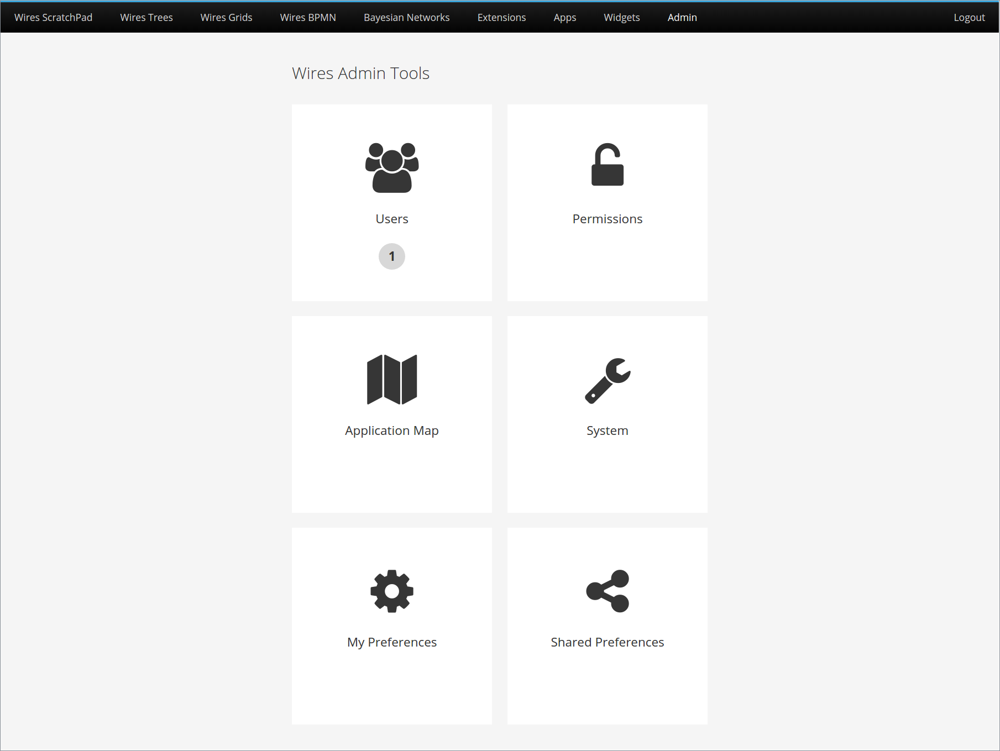

# Admin Page

## Introduction

The Admin Page is a perspective which offers quick access to admin tools. It is absolutely customizable, in the sense that you can add tools and customize what happens when a tool is selected. Also, counters are supported, so you can display to the user a relevant number related to what will be found when the tool is selected.

Also, the ability to have different admin pages for different contexts is also supported.

To open this perspective, you just have to run this line of code:
```
Map<String, String> params = new HashMap<>();
params.put( "screen", "my-screen" );
placeManager.goTo( new DefaultPlaceRequest( "AdminPagePerspective", params ) );
```

The screen parameter represents a identifier for the screen context that will be open.

## Example



Code used to build this example:

```
@Inject
Caller<UsersService> usersService;

@Inject
AdminPage adminPage;

private void setupSettings() {
    adminPage.addScreen( "root", "Wires Admin Tools" );

    adminPage.addTool( "root",
                       "Users",
                       "fa-users",
                       "Security",
                       () -> placeManager.goTo( new DefaultPlaceRequest( "UsersPerspective" ) ),
                       ( counterCommand ) -> usersService
                            .call( (RemoteCallback<Integer>) counterCommand::execute )
                            .getUsersCount() );

    adminPage.addTool( "root",
                       "Permissions",
                       "fa-unlock-alt",
                       "Security",
                       () -> placeManager.goTo( new DefaultPlaceRequest( "PermissionsPerspective" ) ) );

    adminPage.addTool( "root",
                       "Application Map",
                       "fa-map",
                       "General",
                       () -> placeManager.goTo( new DefaultPlaceRequest( "ApplicationMapPerspective" ) ) );

    adminPage.addTool( "root",
                       "System",
                       "fa-wrench",
                       "General",
                       () -> placeManager.goTo( new DefaultPlaceRequest( "SystemPerspective" ) ) );

    adminPage.addPreference( "root",
                             "MyPreference",
                             "My Preferences",
                             "fa-gear",
                             "Preferences" );

    adminPage.addPreference( "root",
                             "MySharedPreference",
                             "Shared Preferences",
                             "fa-share-alt",
                             "Preferences" );
}
```

As this example shows, you can add an admin tool to the page in three different ways:
* Simple tool: Just adds a tool with an icon and a text. When the tool is selected (clicked), the command passed will be executed.
* Tool with counter: It's like a simple tool, but it shows a counter under the text. The counter is computed using the passed parameterized command, when the Admin Page is opened.
* Preference tool: It's similar to a simple tool, but instead of passing a command, you just have to inform the identifier of the preference that will have its edition screen opened when the tool is clicked.

All tools above were inserted in the "root" screen, and inside categories (e.g. Security, General and Preferences). A category basically define how the tools are grouped. Each group is a line, possibly broken down into multiple lines, and arranged based on the call order (first category inserted comes first).

Inside each category, the tools are also arranged based on the call order (first tool inserted comes first).

For more details, please look at our Javadoc.
