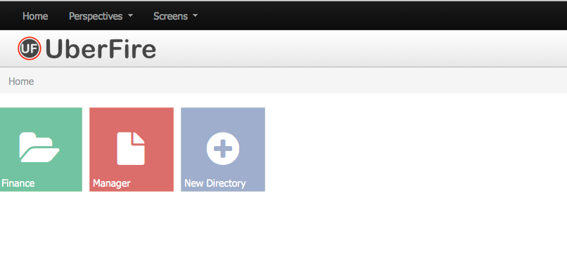

#App Directory

App Directory is part of the Uberfire Configurable Workbench. It allows you to organize your components as well as top menu entries by associating labels with these components. These labels are used to associated a perspective with an App’s directory.

Here is a [video](http://youtu.be/Yhg31m4kRsM) showing App Builder working with DashBuilder.
