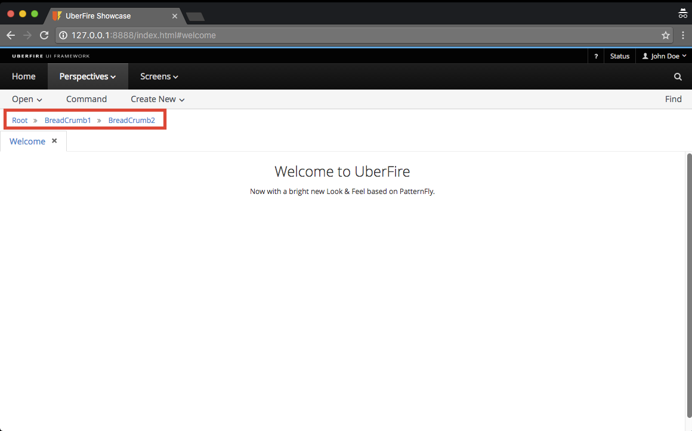

# Breadcrumbs

Uberfire provides a breadcrumb navigation system. It allows navigating to displayable components such as perspectives, screens and editors.



## How it works

A breadcrumb is associated with a perspective. In order to use the breadcrumb navigation system, you first have to create a root breadcrumb associated with a perspective.

````
@Inject
UberfireBreadcrumbs uberfireBreadcrumbs;

...

uberfireBreadcrumbs.createRoot( "SimplePerspective", "Root", new DefaultPlaceRequest( "welcome" ) );
````

The first parameter is the perspective associated with the root breadcrumb, its label and the place request associated with the breadcrumb link.

Also, you could pass a fourth optional parameter telling the breadcrumbs to open (placeManager.goTo call) to your place request. The default value of this parameter is false.

In order to navigate to a new place request through breadcrumb navigation, you just need to make the call:
````
uberfireBreadcrumbs.navigateTo( "BreadCrumb1", new DefaultPlaceRequest( "welcome1" ) );
`````
Optionally, you can pass for navigateTo method a third parameter in order to define the target panel to open your place request.

