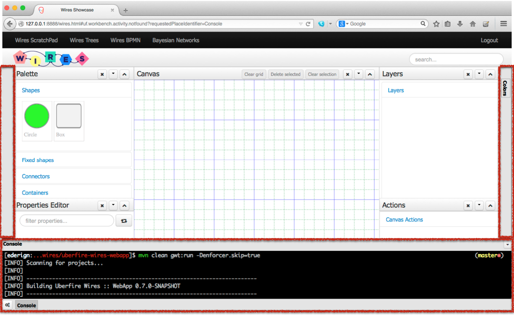

#Simple Docks

Simple Docks is an implementation of Uberfire Docks support.



In order to create a dock using Uberfire Extensions Simple Dock, you should add the dependency to your pom.xml and gwt.xml.

pom.xml
```
    <dependency>
      <groupId>org.uberfire</groupId>
      <artifactId>uberfire-simple-docks-client</artifactId>
      <version>0.7.0-SNAPSHOT</version>
    </dependency>
    ...
     <compileSourcesArtifact>org.uberfire:uberfire-simple-docks-client</compileSourcesArtifact>

```
gwt.xml
```
  <inherits name="org.uberfire.UberfireDocksClient"/>
```

The Uberfire Docks is a CDI bean. So you should inject it in your web app:

```
 @Inject
 UberfireDocks docks;
 ```

##Creating docks
A UberfireDock has two parameters: a Position (SOUTH, WEST, EAST) and a Place Request associated with the dock (usually a Uberfire Screen). The third optional constructor parameter is the perspective associated with the dock.

```
UberfireDock dock = new UberfireDock(UberfireDockPosition.EAST,
    new DefaultPlaceRequest("bla2"), "WiresScratchPadPerspective");
```
All the available docks are displayed in the available docks button (left side of south dock).

You also can set a different size of the dock open. You can define the size of a dock:

```
dock.withSize(500.0);
```
##Registering docks
In order to register a dock, call register method:
```
docks.register(dock);
```
There is also a way to temporarily disable/enable a dock inside a perspective:
```
docks.disable(UberfireDockPosition.EAST,"WiresScratchPadPerspective");
docks.enable(UberfireDockPosition.EAST,"WiresScratchPadPerspective");
```


