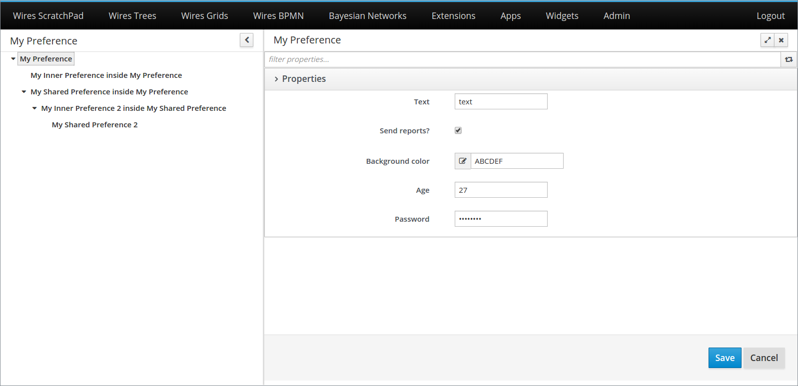
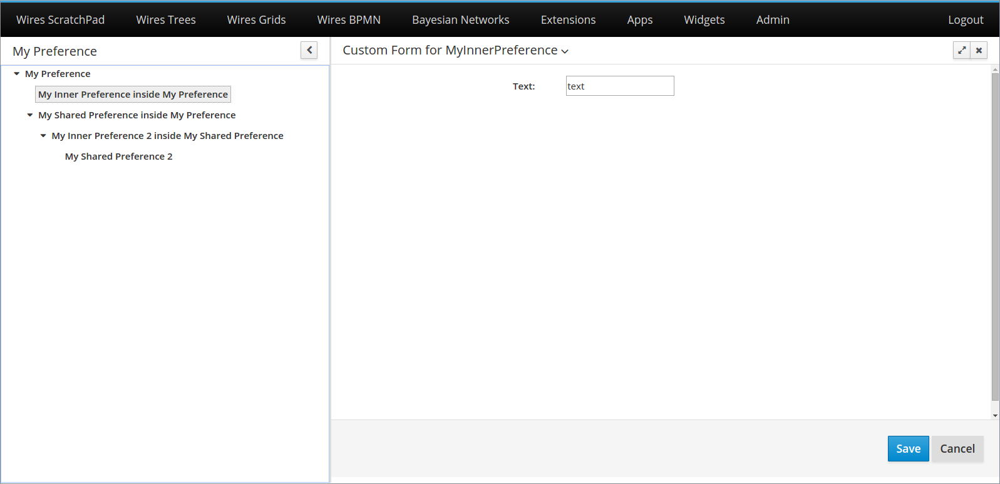

# Edition Screen

## Introduction

Uberfire provides an easy and customizable way for editing preferences using screens.

When you create a preference bean, you can use the Admin Page and add a tool to edit this preference, as we shown in the Admin Page section.

## Example

Using the `MyPreference` bean shown in the previous section, the following command should be executed to add the bean edition to the Admin Page:

```
@Inject
AdminPage adminPage;

private void setupSettings() {
    adminPage.addPreference( "MyPreference",
                             "My Preferences",
                             "fa-gear",
                             "Preferences" );
}
```

This will insert the admin tool "My Preference" to the Admin Page, and group it together with all tools of the "Preferences" group (in this example, only "Shared Preferences"):


When the user clicks on "My Preference", the following screen will be opened:



A navigation tree is displayed on the left. It is automatically built, based on the preference hierarchy defined by your beans.

An edition form is displayed on the right. It can be automatically generated (you have to do nothing!), or it can be customized. When using the automatically generated form, you should change the attribute `formType` on `@Property` to choose the type of field that will be displayed on the form. The types of field supported are all in `MyPreference` example. By default, it will be a text field.

In the bottom, there are some actions. The "Save" action will save all editions made in all opened forms. The "Cancel" action will undo all of them.

## Making your own edition form

To that for our `MyPreference`, you just have to:
* Create a `@WorkbenchScreen` with your form;
* Annotate it with `@PreferenceForm("MyPreference")`, where the annotation value is your preference identifier;
* Extend the `BasePreferenceForm` class.

By extending the `BasePreferenceForm` class, you will be required to implement the following methods:
* `init`: This method is called once your form is opened, and brings your preference instance as a parameter, the one that should be edited by the screen.
* `beforeSave`: This method is called when the "Save" button is clicked, right before the saving really happens. Inside this method, you should make any preparations on your preference instance, so it can be saved correctly.
* `onCancel`: This method is called when the "Cancel" button is clicked. It is expected that it undo any user actions, and both the form and the instance return to the state of the last saving.

For example, if we have the following preference bean:

```
@WorkbenchPreference(identifier = "MyInnerPreference",
        bundleKey = "MyInnerPreference.Label")
public class MyInnerPreference implements BasePreference<MyInnerPreference> {

    @Property(bundleKey = "MyInnerPreference.Text")
    private String text;

    public void setText( final String text ) {
        this.text = text;
    }

    public String getText() {
        return text;
    }
}
```

An example of custom form would be:

MyInnerPreferenceCustomForm.java
```
@PreferenceForm("MyInnerPreference")
@WorkbenchScreen(identifier = MyInnerPreferenceCustomForm.IDENTIFIER)
public class MyInnerPreferenceCustomForm extends BasePreferenceForm<MyInnerPreference> {

    public static final String IDENTIFIER = "MyInnerPreferenceCustomForm";

    public interface View extends UberElement<MyInnerPreferenceCustomForm> {

        void init( final MyInnerPreferenceCustomForm presenter );

        void updatePreference( final MyInnerPreference preference );
    }

    private final View view;

    @Inject
    public MyInnerPreferenceCustomForm( final View view ) {
        this.view = view;
    }

    @Override
    public void init( final MyInnerPreference preference ) {
        view.init( this );
    }

    @Override
    public void beforeSave() {
        view.updatePreference( getPreference() );
    }

    @Override
    public void onUndo() {
        view.init( this );
    }

    @WorkbenchPartView
    public View getView() {
        return view;
    }

    @WorkbenchPartTitle
    public String getTitle() {
        return "Custom Form for MyInnerPreference";
    }

}
```

MyInnerPreferenceCustomFormView.java

```
@Templated
public class MyInnerPreferenceCustomFormView implements IsElement,
                                                        MyInnerPreferenceCustomForm.View {

    private MyInnerPreferenceCustomForm presenter;

    @Inject
    @DataField("text")
    TextInput text;

    @Override
    public void init( final MyInnerPreferenceCustomForm presenter ) {
        this.presenter = presenter;
        text.setValue( presenter.getPreference().getText() );
    }

    public void updatePreference( final MyInnerPreference preference ) {
        preference.setText( text.getValue() );
    }
}
```

MyInnerPreferenceCustomFormView.html
```
<div>
    <div class="form-group form-horizontal">
        <div class="uf-form-label col-md-4">
            <label class="control-label">Text: </label>
        </div>
        <div class="col-md-8">
            <input type="text" data-field="text" />
        </div>
    </div>
</div>
```

And the custom form will look like that:


