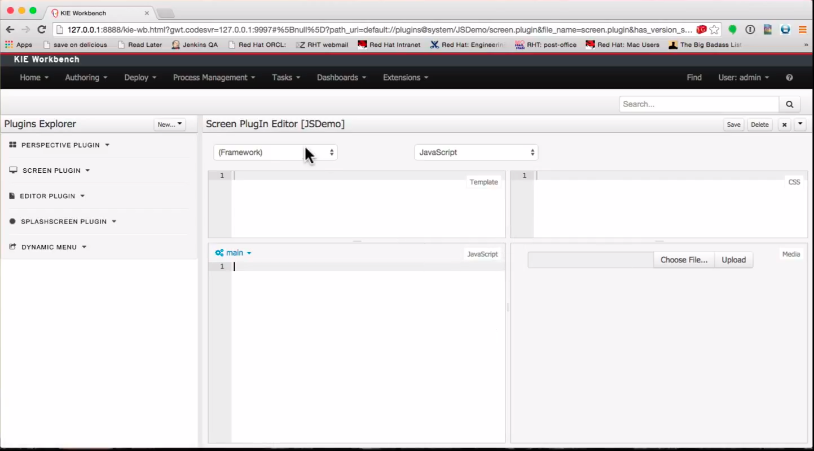
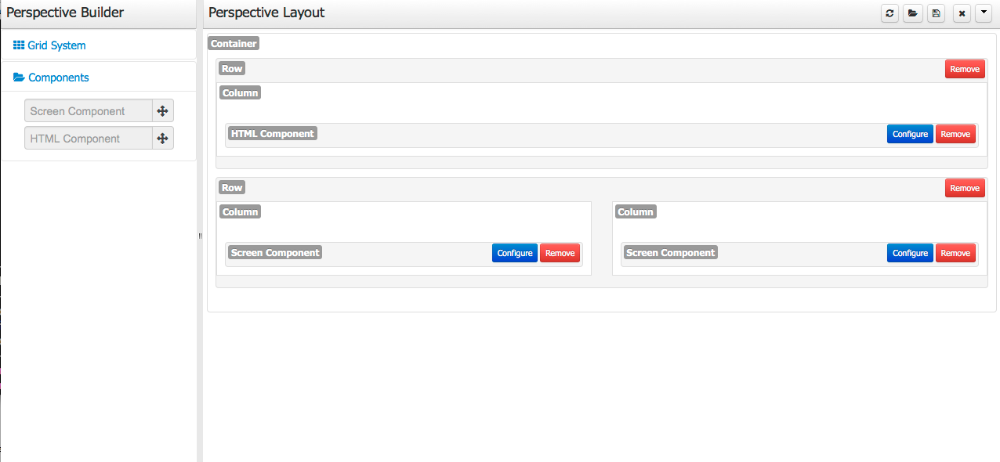

#Uberfire RAD Extensions
Uberfire RAD extensions or configurable workbench is a group of features divided in four main sections: Plugin Management, Perspective Editor, Apps and JS APIs.

##Plugin Management

Uberfire can be extended with JS and HTML in a web app. This is a very powerful feature, but can also be very complex.
The Plugin Management extension solves this issue by allowing users to create new perspectives, screens, editors, splash screens and menus using a UI inspired by [JSFiddle](http://jsfiddle.net/).

All the UI features are based on JS APIs detailed in previous sections.

###Perspective Editor

We also created a new dynamic grid builder based on the [Bootstrap Grid System](http://www.w3schools.com/bootstrap/bootstrap_grid_system.asp).
This allows users to define their own perspectives.

###Apps

Uberfire Apps will be detailed in the next section.

Her is a [video](http://youtu.be/Yhg31m4kRsM) showing this features working with DashBuilder.
