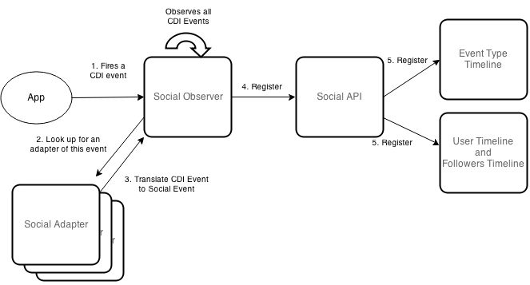
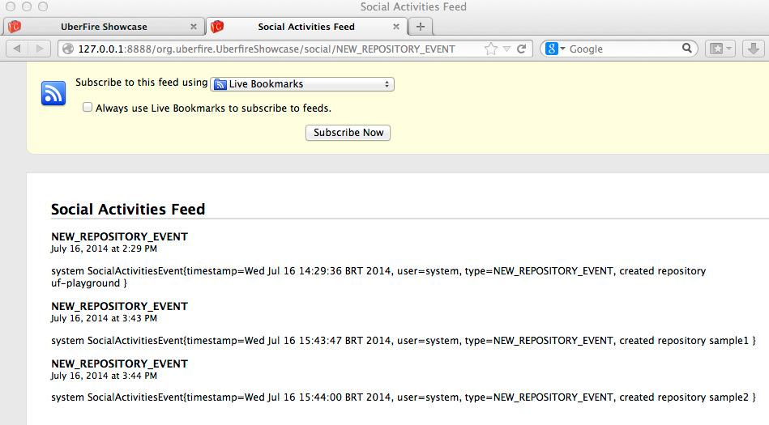
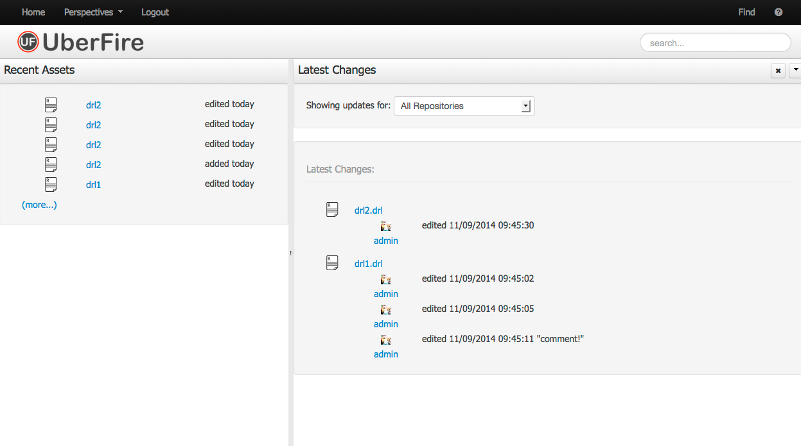
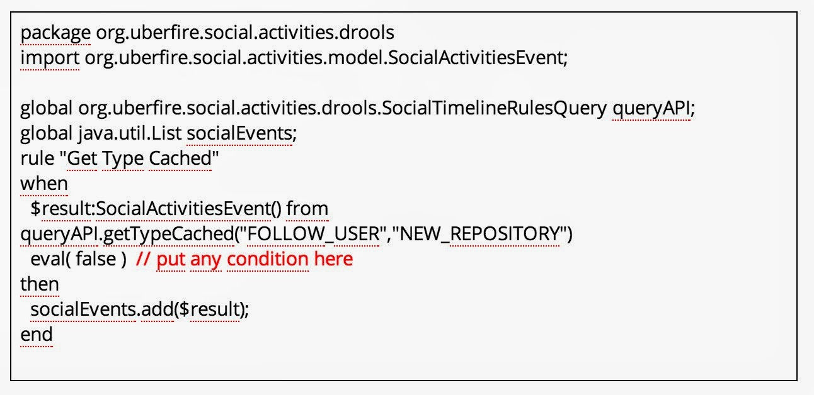
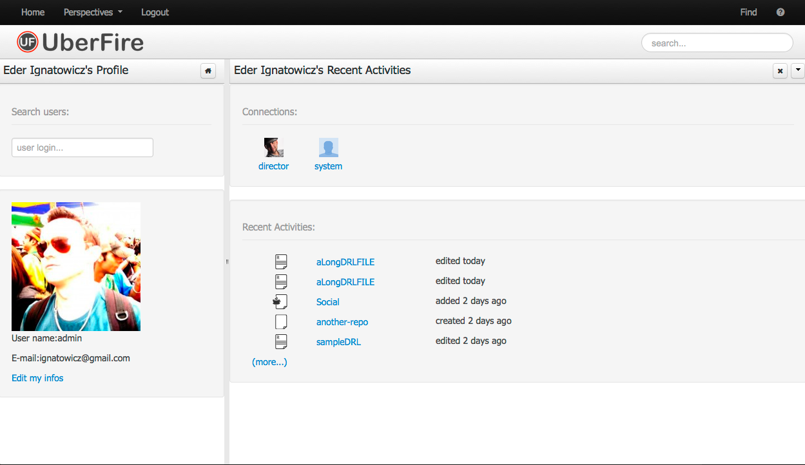
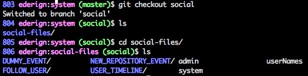
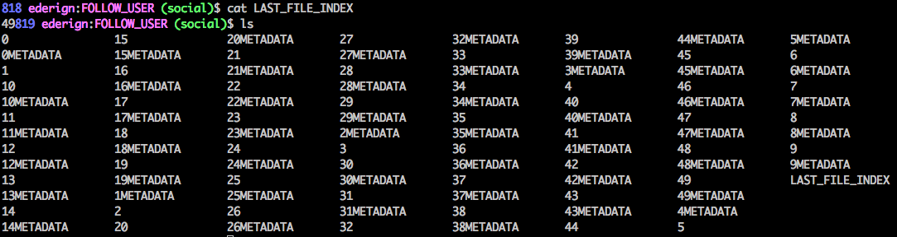

#Uberfire Social Activities
Uberfire has an extension called [Kie Uberfire Social Activities](https://github.com/droolsjbpm/kie-uberfire-extensions/tree/master/kie-uberfire-social-activities) that provides an extensible architecture to capture, handle, and present (in a timeline style) configurable types of social events.

##Basic Architecture
An event is any type of "CDI Event" which will be handled by its respective adapter. The adapter is a CDI Managed Bean, which implements the [SocialAdapter](https://github.com/droolsjbpm/kie-uberfire-extensions/blob/6a7baceeb50c756234dcbc2165cbb0c5c0ddb7b5/kie-uberfire-social-activities/kie-uberfire-social-activities-api/src/main/java/org/kie/uberfire/social/activities/service/SocialAdapter.java) interface. The main responsibility of the adapter is to translate from a CDI event to a Social Event. This social event will be captured and persisted by Kie Uberfire Social Activities in their respectives timelines (basically user and type timeline).

Here is the basic architecture and workflow of this technology:



##Timelines
There are many ways to display and interact with a timeline. This section will briefly describe each of these.

* Atom URL

Social Activities provides a custom URL for each event type. This URL is in the form of:

```
http://<PROJECT NAME>/social/<EVENT_TYPE_NAME>
```




The users timeline works in the same way; the URL having the form:
```
http://<PROJECT NAME>/social-user/<USER_NAME>
```

Another interesting feature is that an adapter can provide its own pluggable url-filters.
By implementing the method getTimelineFilters from the [SocialAdapter](https://github.com/droolsjbpm/kie-uberfire-extensions/blob/6a7baceeb50c756234dcbc2165cbb0c5c0ddb7b5/kie-uberfire-social-activities/kie-uberfire-social-activities-api/src/main/java/org/kie/uberfire/social/activities/service/SocialAdapter.java)
interface, an adapter can filter the timeline result set. These filters are accessed using query parameters with the basic URL, for example:

```
http://<PROJECT NAME>/social/<EVENT_TYPE_NAME>?max-results=1
```

##Basic Widgets

Social Activities also includes some basic (extendable) widgets. There are two types of timelines widgets: simple and regular widgets.
Here are some examples of these widgets:


The "(more...)" link is a pagination component. This can be configured using an object. For example, **SocialPaged(2)** creates a pagination with 2 items. This object allows you tocustomize your widgets using the methods canIGoBackward() and canIGoForward() to display icons, and  forward() and backward() to set the navigation direction.

The Social Activities component has basic support for avatars. If an e-mail address is provided through the API, the [gravatar](http://pt.gravatar.com/) image will be displayed in these widgets.

##Drools Query API
Another way to interact with a timeline is throught the [Social Timeline Drools Query API](https://github.com/droolsjbpm/kie-uberfire-extensions/blob/6a7baceeb50c756234dcbc2165cbb0c5c0ddb7b5/kie-uberfire-social-activities/kie-uberfire-social-activities-api/src/main/java/org/kie/uberfire/social/activities/service/SocialTimelineRulesQueryAPI.java). This API executes one or more [Drools DRLs](https://docs.jboss.org/drools/release/6.4.0.Final/drools-docs/html/ch08.html) in a Timeline for all cached events. It's a great way to merge different types of timelines.



##User Profile, Followers/Following Social Users
Each user has his own Social profile. A user can follow one or more other users. When a user triggers a social event, it is replicated in all timelines of his followers. Social Activities also provides basic widgets to:

* follow another user
* show all social users
* and display a user's followers/following list



##Persistence Architecture

The persistence architecture of Social Activities is built on two concepts: Local Cache and File Persistence. The local cache is an in-memory cache that holds all recent social events. These events are kept only in this cache until the max events threshold is reached. The size of this threshold is configured by the system property **org.uberfire.social.threshold** (default value is 100).

When the threshold is reached, the current cache is persisted into the file system (system.git repository - social branch). Inside this branch there is a social-files directory with this structure:



* userNames: file that contains all social users names
* each user has his own file (with his name), that contains JSON-formatted user data.
* a directory for each social type event
* a directory called "USER_TIMELINE" that contains specific user timelines


Each directory also has a file named "LAST_FILE_INDEX" that points to the most recent timeline file.



Inside each file, there is a persisted list of Social Events in JSON format:

```
({"timestamp":"Jul16,2014,5:04:13PM","socialUser":{"name":"stress1","followersName":[],"followingName":[]},"type":"FOLLOW_USER","adicionalInfo":["follow stress2"]})
```

Separating each JSON data block is the size in bytes (hexadecimal) of the JSON block. The file is read by Social Activities in reverse order.

The METADATA file current holds only the number of social events on that file (used for pagination support).

It is important to mention that this whole structure is transparent to the widgets and pagination. All the file structures and respective cache are MERGED to compose a timeline.

##Clustering
Kie Social Activities also supports distributed persistence when hosted in a cluster environment. Cluster sync is built on top of UberfireCluster support (Apache Zookeeper and Apache Helix).

Each node broadcasts social events to the cluster via a cluster message, **SocialClusterMessage.NEW_EVENT** which contains Social Event data. All nodes in the cluster receive the event and can store it in their own local cache. This ensures that all nodes' caches are consistent.

When a node cache reaches its threshold, the node locks the filesystem and persists its cache. Then it sends a **SOCIAL_FILE_SYSTEM_PERSISTENCE** message to the cluster notifying all the other nodes of the event.

If during the persistence process, any node receives a new event, this stale event is merged during this sync.

##Roadmap
This is an early version of Kie Uberfire Social Activities.
In upcoming versions we plan to offer the following features:

* A "Notification Center" tool, inspired by OSX notification tool (long term)
* Integration of this project with dashbuilder KPI's (long term)
* A purge tool, able to move old events from filesystem to another persistence store (near term)
* Customized templates for basic widgets (near term)
* A dashboard to group multiple social widgets (near term)

If you want start contributing to Open Source, this is a good opportunity. Feel free to contact us!

